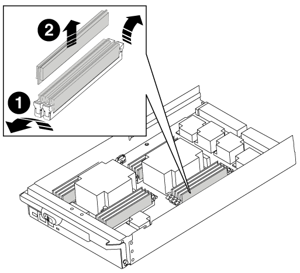

= Remplacement d'un module DIMM - AFF A700 et FAS9000
:allow-uri-read: 
:icons: font
:imagesdir: ../media/

[role="lead"]
Vous devez remplacer un module DIMM dans le module de contrôleur lorsque votre système enregistre un nombre croissant de codes de correction d'erreurs (ECC) pouvant être corrigés ; dans le cas contraire, le système risque de se trouver en panne.

Tous les autres composants du système doivent fonctionner correctement ; si ce n'est pas le cas, vous devez contacter le support technique.

Vous devez remplacer le composant défectueux par un composant FRU de remplacement que vous avez reçu de votre fournisseur.

== Étape 1 : arrêtez le contrôleur défaillant

[role="lead"]
Vous pouvez arrêter ou reprendre le contrôleur défaillant en suivant différentes procédures, en fonction de la configuration matérielle du système de stockage.

[role="tabbed-block"]
====
.Option 1 : plupart des configurations
--
[role="lead"]
Pour arrêter le contrôleur défaillant, vous devez déterminer l'état du contrôleur et, si nécessaire, prendre le contrôle de façon à ce que le contrôleur en bonne santé continue de transmettre des données provenant du stockage défaillant du contrôleur.

.Description de la tâche
* Si vous utilisez NetApp Storage Encryption, vous devez avoir réinitialisé le MSID à l'aide des instructions de la section « Retour des disques SED en mode non protégé » du _ONTAP 9 Guide d'alimentation et de cryptage NetApp_.
+
https://docs.netapp.com/ontap-9/topic/com.netapp.doc.pow-nve/home.html["Guide ONTAP 9 sur l'alimentation du cryptage NetApp"^]

* Si vous disposez d'un système SAN, vous devez avoir vérifié les messages d'événement (`event log show`) Pour la lame SCSI du contrôleur altérée.
+
Chaque processus SCSI-Blade doit se trouver au quorum avec les autres nœuds du cluster. Tout problème doit être résolu avant de procéder au remplacement.

* Si vous avez un cluster avec plus de deux nœuds, il doit être dans le quorum. Si le cluster n'est pas au quorum ou si un contrôleur en bonne santé affiche la valeur false pour l'éligibilité et la santé, vous devez corriger le problème avant de désactiver le contrôleur défaillant ; voir link:https://docs.netapp.com/us-en/ontap/system-admin/index.html["Présentation de l'administration avec l'interface de ligne de commande"^].
* Si vous disposez d'une configuration MetroCluster, vous devez avoir confirmé que l'état de configuration MetroCluster est configuré et que les nœuds sont dans un état activé et normal (`metrocluster node show`).

.Étapes
. Si AutoSupport est activé, supprimez la création automatique de dossier en invoquant un message AutoSupport : `system node autosupport invoke -node * -type all -message MAINT=number_of_hours_downh`
+
Le message AutoSupport suivant supprime la création automatique de dossiers pendant deux heures : `cluster1:*> system node autosupport invoke -node * -type all -message MAINT=2h`

. Désactiver le rétablissement automatique depuis la console du contrôleur sain : `storage failover modify –node local -auto-giveback false`
+

NOTE: Lorsque vous voyez _voulez-vous désactiver l'auto-giveback?_, entrez `y`.

. Faites passer le contrôleur douteux à l'invite DU CHARGEUR :
+
[cols="1,2"]
|===
| Si le contrôleur en état de fonctionnement s'affiche... | Alors... 

 a| 
Invite DU CHARGEUR
 a| 
Passez à la section retrait du module de contrôleur.

 a| 
Attente du retour...
 a| 
Appuyez sur Ctrl-C, puis répondez `y` lorsque vous y êtes invité.

 a| 
Invite système ou invite de mot de passe (entrer le mot de passe système)
 a| 
Prendre le contrôle défectueux ou l'arrêter à partir du contrôleur en bon état : `storage failover takeover -ofnode _impaired_node_name_`

Lorsque le contrôleur douteux s'affiche en attente de rétablissement..., appuyez sur Ctrl-C et répondez `y`.

|===

--
.Option 2 : le contrôleur est intégré à un MetroCluster à deux nœuds
--
[role="lead"]
Pour arrêter le contrôleur défaillant, vous devez déterminer l'état du contrôleur et, si nécessaire, basculer le contrôleur de sorte que ce dernier continue de transmettre des données depuis le stockage défaillant du contrôleur.

.Description de la tâche
* Si vous utilisez NetApp Storage Encryption, vous devez avoir réinitialisé le MSID à l'aide des instructions de la section « Return a FIPS drive or SED to Unprotected mode » de link:https://docs.netapp.com/us-en/ontap/encryption-at-rest/return-seds-unprotected-mode-task.html["Présentation du chiffrement NetApp avec l'interface de ligne de commande"^].
* Vous devez laisser les alimentations allumées à l'issue de cette procédure pour fournir une alimentation au contrôleur en état.

.Étapes
. Vérifiez l'état du contrôleur MetroCluster pour déterminer si le contrôleur défectueux a automatiquement basculé sur le contrôleur en bon état : `metrocluster show`
. Selon qu'un basculement automatique s'est produit, suivre le tableau suivant :
+
[cols="1,2"]
|===
| En cas de dysfonctionnement du contrôleur... | Alors... 

 a| 
A automatiquement basculé
 a| 
Passez à l'étape suivante.

 a| 
N'a pas été automatiquement commutée
 a| 
Effectuer un basculement planifié à partir du contrôleur en bon état : `metrocluster switchover`

 a| 
N'a pas été automatiquement commutée, vous avez tenté de basculer avec le `metrocluster switchover` la commande, et le basculement a été vetoté
 a| 
Examinez les messages de veto et, si possible, résolvez le problème et réessayez. Si vous ne parvenez pas à résoudre le problème, contactez le support technique.

|===
. Resynchroniser les agrégats de données en exécutant le `metrocluster heal -phase aggregates` commande provenant du cluster survivant.
+
[listing]
----
controller_A_1::> metrocluster heal -phase aggregates
[Job 130] Job succeeded: Heal Aggregates is successful.
----
+
Si la guérison est vetotée, vous avez la possibilité de réémettre le `metrocluster heal` commande avec `-override-vetoes` paramètre. Si vous utilisez ce paramètre facultatif, le système remplace tout veto logiciel qui empêche l'opération de correction.

. Vérifiez que l'opération a été terminée à l'aide de la commande MetroCluster Operation show.
+
[listing]
----
controller_A_1::> metrocluster operation show
    Operation: heal-aggregates
      State: successful
Start Time: 7/25/2016 18:45:55
   End Time: 7/25/2016 18:45:56
     Errors: -
----
. Vérifier l'état des agrégats à l'aide de `storage aggregate show` commande.
+
[listing]
----
controller_A_1::> storage aggregate show
Aggregate     Size Available Used% State   #Vols  Nodes            RAID Status
--------- -------- --------- ----- ------- ------ ---------------- ------------
...
aggr_b2    227.1GB   227.1GB    0% online       0 mcc1-a2          raid_dp, mirrored, normal...
----
. Réparez les agrégats racine à l'aide de `metrocluster heal -phase root-aggregates` commande.
+
[listing]
----
mcc1A::> metrocluster heal -phase root-aggregates
[Job 137] Job succeeded: Heal Root Aggregates is successful
----
+
Si la guérison est vetotée, vous avez la possibilité de réémettre le `metrocluster heal` commande avec le paramètre -override-vetos. Si vous utilisez ce paramètre facultatif, le système remplace tout veto logiciel qui empêche l'opération de correction.

. Vérifier que l'opération de correction est terminée en utilisant le `metrocluster operation show` commande sur le cluster destination :
+
[listing]
----

mcc1A::> metrocluster operation show
  Operation: heal-root-aggregates
      State: successful
 Start Time: 7/29/2016 20:54:41
   End Time: 7/29/2016 20:54:42
     Errors: -
----
. Sur le module de contrôleur défaillant, débranchez les blocs d'alimentation.

--
====

== Étape 2 : retirer le module de contrôleur

[role="lead"]
Pour accéder aux composants à l'intérieur du contrôleur, vous devez d'abord retirer le module de contrôleur du système, puis retirer le capot du module de contrôleur.

.Étapes
. Si vous n'êtes pas déjà mis à la terre, mettez-vous à la terre correctement.
. Débranchez les câbles du module de contrôleur défaillant et suivez l'emplacement de connexion des câbles.
. Faites glisser le bouton orange sur la poignée de came vers le bas jusqu'à ce qu'il se déverrouille.
+
image::../media/drw_9000_remove_pcm.png[drw 9000 déposer le module de commande du groupe motopropulseur]

+
|===

 a| 
image:../media/legend_icon_01.png[""]
 a| 
Bouton de déverrouillage de la poignée de came

 a| 
image:../media/legend_icon_02.png[""]
 a| 
Poignée de came

|===
. Faites pivoter la poignée de came de façon à ce qu'elle désengage complètement le module de contrôleur du châssis, puis faites glisser le module de contrôleur hors du châssis.
+
Assurez-vous de prendre en charge la partie inférieure du module de contrôleur lorsque vous le faites glisser hors du châssis.

. Placez le couvercle du module de contrôleur face vers le haut sur une surface stable et plane, appuyez sur le bouton bleu du capot, faites glisser le couvercle vers l'arrière du module de contrôleur, puis faites pivoter le couvercle vers le haut et retirez-le du module de contrôleur.
+
image::../media/drw_9000_pcm_open.png[drw 9000 pcm ouvert]

+
|===

 a| 
image:../media/legend_icon_01.png[""]
 a| 
Bouton de verrouillage du couvercle du module de commande

|===

== Étape 3 : remplacez les modules DIMM

[role="lead"]
Pour remplacer les modules DIMM, localisez-les à l'intérieur du contrôleur et suivez l'ordre des étapes.

.Étapes
. Si vous n'êtes pas déjà mis à la terre, mettez-vous à la terre correctement.
. Localisez les modules DIMM de votre module de contrôleur.

image::../media/drw_9000_dimm_map.png[carte dimm drw 9000]

. Éjectez le module DIMM de son logement en écartant lentement les deux languettes de l'éjecteur de DIMM de chaque côté du module DIMM, puis en faisant glisser le module DIMM hors de son logement.
+

NOTE: Tenez soigneusement le module DIMM par les bords pour éviter toute pression sur les composants de la carte de circuit DIMM.

+

+
[cols="1,3"]
|===

 a| 
image:../media/legend_icon_01.png[""]
 a| 
Languettes d'éjection du module DIMM

 a| 
image:../media/legend_icon_02.png[""]
 a| 
DIMM

|===
. Retirez le module DIMM de remplacement du sac d'expédition antistatique, tenez le module DIMM par les coins et alignez-le sur le logement.
+
L'encoche entre les broches du DIMM doit être alignée avec la languette du support.

. Assurez-vous que les languettes de l'éjecteur de DIMM sur le connecteur sont en position ouverte, puis insérez le module DIMM directement dans le logement.
+
Le module DIMM s'insère bien dans le logement, mais devrait être facilement installé. Si ce n'est pas le cas, réalignez le module DIMM avec le logement et réinsérez-le.

+

NOTE: Inspectez visuellement le module DIMM pour vérifier qu'il est bien aligné et complètement inséré dans le logement.

. Poussez délicatement, mais fermement, sur le bord supérieur du module DIMM jusqu'à ce que les languettes de l'éjecteur s'enclenchent sur les encoches situées aux extrémités du module DIMM.
. Fermez le capot du module de contrôleur.

== Étape 4 : installer le contrôleur

[role="lead"]
Après avoir installé les composants dans le module de contrôleur, vous devez réinstaller le module de contrôleur dans le châssis du système et démarrer le système d'exploitation.

Pour les paires haute disponibilité avec deux modules de contrôleur dans le même châssis, l'ordre dans lequel vous installez le module de contrôleur est particulièrement important, car il tente de redémarrer dès que vous le placez entièrement dans le châssis.

.Étapes
. Si vous n'êtes pas déjà mis à la terre, mettez-vous à la terre correctement.
. Si vous ne l'avez pas encore fait, remettez le capot sur le module de contrôleur.
. Alignez l'extrémité du module de contrôleur avec l'ouverture du châssis, puis poussez doucement le module de contrôleur à mi-course dans le système.
+

NOTE: N'insérez pas complètement le module de contrôleur dans le châssis tant qu'il n'y a pas été demandé.

. Reliez uniquement les ports de gestion et de console, de sorte que vous puissiez accéder au système pour effectuer les tâches décrites dans les sections ci-après.
+

NOTE: Vous connecterez le reste des câbles au module de contrôleur plus loin dans cette procédure.

. Terminez la réinstallation du module de contrôleur :
+
.. Si ce n'est déjà fait, réinstallez le périphérique de gestion des câbles.
.. Poussez fermement le module de contrôleur dans le châssis jusqu'à ce qu'il rencontre le fond de panier central et qu'il soit bien en place.
+
Les loquets de verrouillage se montent lorsque le module de contrôleur est bien en place.

+

NOTE: Ne forcez pas trop lorsque vous faites glisser le module de contrôleur dans le châssis pour éviter d'endommager les connecteurs.

+
Le module de contrôleur commence à démarrer dès qu'il est complètement inséré dans le châssis. Soyez prêt à interrompre le processus de démarrage.

.. Faites pivoter les loquets de verrouillage vers le haut, inclinez-les de manière à dégager les goupilles de verrouillage, puis abaissez-les en position verrouillée.
.. Interrompez le processus de démarrage en appuyant sur `Ctrl-C` lorsque vous voyez `Press Ctrl-C for Boot Menu`.
.. Sélectionnez l'option pour démarrer en mode maintenance dans le menu qui s'affiche.

== Étape 5 : exécutez les diagnostics au niveau du système

[role="lead"]
Après avoir installé un nouveau module DIMM, exécutez les tests de diagnostic.

Votre système doit être à l'invite DU CHARGEUR pour démarrer System Level Diagnostics.

Toutes les commandes des procédures de diagnostic sont émises depuis le nœud sur lequel le composant est remplacé.

.Étapes
. Si le nœud à réparer n'est pas à l'invite DU CHARGEUR, effectuez la procédure suivante :
+
.. Sélectionnez l'option mode Maintenance dans le menu affiché.
.. Une fois le nœud démarré en mode maintenance, arrêtez le nœud : `halt`
+
Une fois que vous avez terminé d'exécuter la commande, vous devez attendre que le système s'arrête à l'invite DU CHARGEUR.

+

NOTE: Au cours du processus de démarrage, vous pouvez répondre en toute sécurité `y` pour demander :

+
*** Avertissement : lors de la passage en mode maintenance dans une configuration HA, vous devez vous assurer que le nœud en bon état reste arrêté.

. À l'invite DU CHARGEUR, accédez aux pilotes spéciaux spécialement conçus pour les diagnostics au niveau du système afin de fonctionner correctement : `boot_diags`
+
Au cours du processus de démarrage, vous pouvez répondre en toute sécurité `y` Aux invites jusqu'à ce que l'invite du mode Maintenance (*>) s'affiche.

. Exécutez les tests de diagnostic de la mémoire système : `sldiag device run -dev mem`
. Vérifiez qu'aucun problème matériel ne provient du remplacement des modules DIMM : `sldiag device status -dev mem -long -state failed`
+
Les diagnostics au niveau du système vous renvoie à l'invite s'il n'y a pas d'échec de test ou répertorie l'état complet des échecs résultant du test du composant.

. Procédez comme suit en fonction du résultat de l'étape précédente :
+
[cols="1,2"]
|===
| Si les tests de diagnostic au niveau du système... | Alors... 

 a| 
Ont été achevés sans défaillance
 a| 
.. Effacez les journaux d'état : `sldiag device clearstatus`
.. Vérifiez que le journal a été effacé : `sldiag device status`
+
La réponse par défaut suivante est affichée :

_SLDIAG : aucun message de journal n'est présent._

.. Quitter le mode Maintenance : `halt`
+
Le nœud affiche l'invite DU CHARGEUR.

.. Démarrez le nœud depuis l'invite DU CHARGEUR : `bye`
.. Renvoie le nœud en mode de fonctionnement normal.

 a| 
Une paire haute disponibilité
 a| 
Effectuer un retour : `storage failover giveback -ofnode _replacement_node_name_`

NOTE: Si vous avez désactivé le rétablissement automatique, réactivez-le à l'aide de la commande Storage Failover modify.

 a| 
Configuration MetroCluster à deux nœuds
 a| 
Passez à l'étape suivante.

La procédure de rétablissement MetroCluster est effectuée lors de la prochaine tâche du processus de remplacement.

 a| 
Une configuration autonome
 a| 
Passez à l'étape suivante.

Aucune action n'est requise.

Vous avez terminé les diagnostics au niveau du système.

 a| 
A entraîné des échecs de test
 a| 
Déterminez la cause du problème :

.. Quitter le mode Maintenance : `halt`
+
Une fois que vous avez terminé d'exécuter la commande, attendez que le système s'arrête à l'invite DU CHARGEUR.

.. Mettez les blocs d'alimentation hors tension ou laissez-les hors tension, en fonction du nombre de modules de contrôleur présents dans le châssis :
+
*** Si le châssis comporte deux modules de contrôleur, laissez les blocs d'alimentation sous tension afin de fournir l'alimentation à l'autre module de contrôleur.
*** Si le châssis comporte un module de contrôleur, mettez les blocs d'alimentation hors tension et débranchez-les des sources d'alimentation.

.. Vérifier que vous avez bien remarqué tous les facteurs à prendre en compte pour l'exécution des diagnostics au niveau du système, que les câbles sont correctement connectés et que les composants matériels sont correctement installés dans le système de stockage.
.. Démarrez le module de contrôleur que vous effectuez le service, interrompant le démarrage en appuyant sur `Ctrl-C` Lorsque vous êtes invité à accéder au menu de démarrage :
+
*** Si le châssis comporte deux modules de contrôleur, asseoir complètement le module de contrôleur que vous effectuez l'entretien dans le châssis.
+
Le module de contrôleur s'amorce lorsqu'il est bien en place.

*** Si vous avez un module de contrôleur dans le châssis, connectez les blocs d'alimentation, puis mettez-les sous tension.

.. Dans le menu, sélectionnez Boot to maintenance mode.
.. Quittez le mode maintenance en saisissant la commande suivante : `halt`
+
Une fois que vous avez terminé d'exécuter la commande, attendez que le système s'arrête à l'invite DU CHARGEUR.

.. Exécutez à nouveau le test de diagnostic au niveau du système.

|===

== Étape 6 : retournez les agrégats via une configuration MetroCluster à deux nœuds

[role="lead"]
Après avoir terminé le remplacement des unités remplaçables sur site dans une configuration MetroCluster à deux nœuds, vous pouvez exécuter l'opération de rétablissement MetroCluster. Cette configuration renvoie la configuration à son état de fonctionnement normal, avec les SVM (Storage Virtual machines) source et sur le site précédemment douteux actifs et peuvent accéder aux données des pools de disques locaux.

Cette tâche s'applique uniquement aux configurations MetroCluster à deux nœuds.

.Étapes
. Vérifiez que tous les nœuds sont dans le `enabled` état : `metrocluster node show`
+
[listing]
----
cluster_B::>  metrocluster node show

DR                           Configuration  DR
Group Cluster Node           State          Mirroring Mode
----- ------- -------------- -------------- --------- --------------------
1     cluster_A
              controller_A_1 configured     enabled   heal roots completed
      cluster_B
              controller_B_1 configured     enabled   waiting for switchback recovery
2 entries were displayed.
----
. Vérifier que la resynchronisation est terminée sur tous les SVM : `metrocluster vserver show`
. Vérifier que toutes les migrations LIF automatiques effectuées par les opérations de correction ont été effectuées correctement : `metrocluster check lif show`
. Effectuez le rétablissement en utilisant le `metrocluster switchback` utilisez une commande à partir d'un nœud du cluster survivant.
. Vérifiez que l'opération de rétablissement est terminée : `metrocluster show`
+
L'opération de rétablissement s'exécute toujours lorsqu'un cluster est dans `waiting-for-switchback` état :

+
[listing]
----
cluster_B::> metrocluster show
Cluster              Configuration State    Mode
--------------------	------------------- 	---------
 Local: cluster_B configured       	switchover
Remote: cluster_A configured       	waiting-for-switchback
----
+
Le rétablissement est terminé une fois les clusters dans `normal` état :

+
[listing]
----
cluster_B::> metrocluster show
Cluster              Configuration State    Mode
--------------------	------------------- 	---------
 Local: cluster_B configured      		normal
Remote: cluster_A configured      		normal
----
+
Si un rétablissement prend beaucoup de temps, vous pouvez vérifier l'état des lignes de base en cours en utilisant le `metrocluster config-replication resync-status show` commande.

. Rétablir toutes les configurations SnapMirror ou SnapVault.

== Étape 7 : renvoyer la pièce défaillante à NetApp

[role="lead"]
Retournez la pièce défectueuse à NetApp, tel que décrit dans les instructions RMA (retour de matériel) fournies avec le kit. Voir la https://mysupport.netapp.com/site/info/rma["Retour de pièce et amp ; remplacements"] pour plus d'informations.
