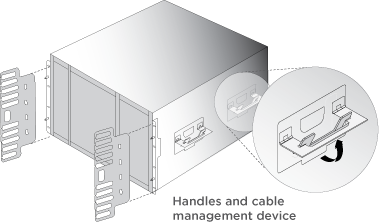
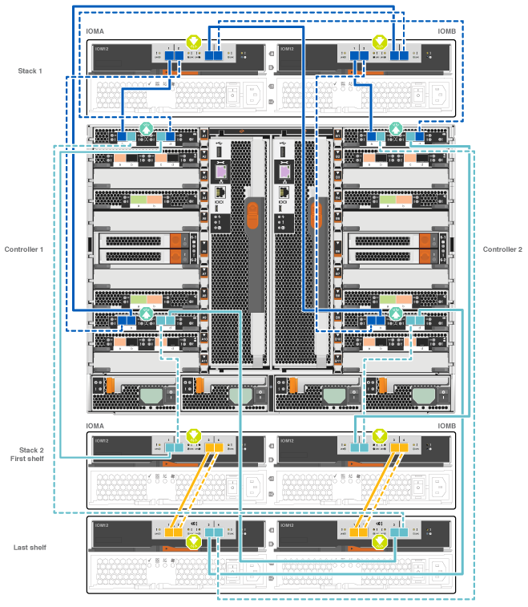

= Guide détaillé - FAS9000
:allow-uri-read: 
:icons: font
:imagesdir: ../media/

[role="lead"]
Ce guide fournit des instructions détaillées vous permettant d'installer un système NetApp classique. Utilisez ce guide si vous souhaitez obtenir des instructions d'installation plus détaillées.

== Étape 1 : préparer l'installation

Pour installer votre système, vous devez créer un compte sur le site de support NetApp, enregistrer votre système et obtenir les clés de licence. Vous devez également inventorier le nombre et le type de câbles appropriés pour votre système et collecter des informations réseau spécifiques.

.Avant de commencer
Pour obtenir des informations sur les conditions requises par le site ainsi que des informations supplémentaires sur le système configuré, accédez au Hardware Universe. Pour plus d'informations sur ce système, vous pouvez également accéder aux notes de version de votre version de ONTAP.

https://hwu.netapp.com["NetApp Hardware Universe"]

http://mysupport.netapp.com/documentation/productlibrary/index.html?productID=62286["Retrouvez les notes de mise à jour de votre version de ONTAP 9"]

Vous devez fournir les informations suivantes sur votre site :

* Espace rack pour le système de stockage
* Tournevis Phillips n°2
* Câbles réseau supplémentaires pour connecter votre système à votre commutateur réseau et à votre ordinateur portable ou console avec un navigateur Web

.Étapes
. Déballez le contenu de toutes les boîtes.
. Notez le numéro de série du système depuis les contrôleurs.
+
image::../media/drw_ssn_label.png[Exemple de numéro de série du système indiquant l'emplacement du numéro]

. Faites un inventaire et notez le nombre et le type de câbles que vous avez reçus.
+
Le tableau suivant identifie les types de câbles que vous pouvez recevoir. Si vous recevez un câble non répertorié dans le tableau, reportez-vous à la Hardware Universe pour localiser le câble et identifier son utilisation.

+
https://hwu.netapp.com["NetApp Hardware Universe"]

+
[cols="1,2,1,2"]
|===
| Type de câble... | Numéro de pièce et longueur | Type de connecteur | Pour... 

 a| 
Câble réseau 10 GbE
 a| 
X6566B-2-R6, (112-00299), 2 m

X6566B-3-R6, 112-00300, 3 m

X6566B-5-R6 , 112-00301, 5 m
 a| 
image:../media/oie_cable_sfp_gbe_copper.png["Connecteur en cuivre SFP GbE"]
 a| 
Câble réseau

 a| 
Câble réseau 40 GbE

Interconnexion de cluster 40 GbE
 a| 
X66100-1,112-00542, 1 m

X66100-3,112-00543, 3 m
 a| 
image:../media/oie_cable100_gbe_qsfp28.png["Connecteur QSFP28 100 GbE"]
 a| 
Réseau 40 GbE

Interconnexion de cluster

 a| 
Câble réseau 100 GbE

Câble de stockage 100 GbE
 a| 
X66211A-05 (112-00595), 0,5 m

X66211A-1 (112-00573), 1 m

X66211A-2 (112-00574), 2 M.

X66211A-5 (112-00574), 5 m
 a| 
image:../media/oie_cable100_gbe_qsfp28.png["Connecteur QSFP28 100 GbE"]
 a| 
Câble réseau

Câble de stockage

NOTE: Ce câble s'applique uniquement à AFF A700.

 a| 
Câbles de réseau optique (selon la commande)
 a| 
X6553-R6 (112-00188), 2 M.

X6536-R6 (112-00090), 5 m
 a| 
image:../media/oie_cable_fiber_lc_connector.png["Illustration montrant un connecteur LC à fibre optique"]
 a| 
Réseau hôte FC

 a| 
Cat 6, RJ-45 (selon la commande)
 a| 
Références X6585-R6 (112-00291), 3 m

X6562-R6 (112-00196), 5 m
 a| 
image:../media/oie_cable_rj45.png["Connecteur de câble RJ-45"]
 a| 
Réseau de gestion et données Ethernet

 a| 
Stockage
 a| 
X66031A (112-00436), 1 m

X66032A (112-00437), 2 M.

X66033A (112-00438), 3 M.
 a| 
image:../media/oie_cable_mini_sas_hd_to_mini_sas_hd.png["Connecteur mini-SAS vers mini-SAS"]
 a| 
Stockage

 a| 
Câble de console micro-USB
 a| 
Sans objet
 a| 
image:../media/oie_cable_micro_usb.png["Illustration montrant un connecteur micro USB"]
 a| 
Connexion de la console pendant la configuration du logiciel sur un ordinateur portable/console autre que Windows ou Mac

 a| 
Câbles d'alimentation
 a| 
Sans objet
 a| 
image:../media/oie_cable_power.png["Câbles d'alimentation"]
 a| 
Mise sous tension du système

|===
. Consultez le _Guide de configuration du ONTAP NetApp_ et collectez les informations requises indiquées dans ce guide.
+
https://library.netapp.com/ecm/ecm_download_file/ECMLP2862613["Guide de configuration de ONTAP"]

== Étape 2 : installer le matériel de fixation

Vous devez installer votre système sur un rack de 4 montants ou une armoire système NetApp, le cas échéant.

.Étapes
. Installez les kits de rails, au besoin.
. Installez et sécurisez votre système en suivant les instructions fournies avec le kit de rails.
+

NOTE: Vous devez être conscient des problèmes de sécurité associés au poids du système.

+
image::../media/drw_9000_lifting_icon.png[icône de levage drw 9000]

NOTE: L'étiquette de gauche indique un châssis vide, tandis que l'étiquette de droite indique un système plein.

. Fixez les dispositifs de gestion des câbles (comme illustré).
+

. Placez le panneau à l'avant du système.

== Étape 3 : connectez les câbles des contrôleurs à votre réseau

Vous pouvez connecter les contrôleurs à votre réseau en utilisant la méthode de cluster sans commutateur à deux nœuds ou en utilisant le réseau d'interconnexion de cluster.

=== Option 1 : cluster à 2 nœuds sans commutateur

Le réseau de gestion, le réseau de données et les ports de gestion des contrôleurs sont connectés aux commutateurs. Les ports d'interconnexion de cluster sont câblés sur les deux contrôleurs.

Vous devez avoir contacté votre administrateur réseau pour obtenir des informations sur la connexion du système aux commutateurs.

Veillez à vérifier le sens des languettes de fixation du câble lors de l'insertion des câbles dans les orifices. Les languettes de fixation des câbles sont destinées à tous les ports de module réseau.

image::../media/oie_cable_pull_tab_up.png[Connecteur de câble avec languette de traction sur le dessus]

NOTE: Lorsque vous insérez le connecteur, vous devez le sentir en place ; si vous ne le sentez pas, retirez-le, tournez-le et réessayez.

.Étapes
. Utilisez l'animation ou l'illustration pour terminer le câblage entre les contrôleurs et les commutateurs :
+
.Animation : câblé à un cluster sans commutateur à deux nœuds
video::7a55b98a-e8b8-41d5-821f-ac5b0032ead0[panopto]

image::../media/drw_9000_TNSC_composite_cabling.png[Câblage composite TNSC drw 9000]

. Accédez à <<Étape 4 : câblage des contrôleurs aux tiroirs disques>> pour obtenir les instructions de câblage du tiroir disque.

=== Option 2 : cluster commuté

Le réseau de gestion, le réseau de données et les ports de gestion des contrôleurs sont connectés aux commutateurs. Les ports d'interconnexion de cluster et haute disponibilité sont câblés sur le commutateur de cluster/haute disponibilité.

Vous devez avoir contacté votre administrateur réseau pour obtenir des informations sur la connexion du système aux commutateurs.

Veillez à vérifier le sens des languettes de fixation du câble lors de l'insertion des câbles dans les orifices. Les languettes de fixation des câbles sont destinées à tous les ports de module réseau.

image::../media/oie_cable_pull_tab_up.png[Connecteur de câble avec languette de traction sur le dessus]

NOTE: Lorsque vous insérez le connecteur, vous devez le sentir en place ; si vous ne le sentez pas, retirez-le, tournez-le et réessayez.

.Étapes
. Utilisez l'animation ou l'illustration pour terminer le câblage entre les contrôleurs et les commutateurs :
+
.Animation - câblage commuté du cluster
video::6381b3f1-4ce5-4805-bd0a-ac5b0032f51d[panopto]

image:../media/drw_9000_switched_cluster_cabling.png[""]

. Accédez à <<Étape 4 : câblage des contrôleurs aux tiroirs disques>> pour obtenir les instructions de câblage du tiroir disque.

== Étape 4 : câblage des contrôleurs aux tiroirs disques

Il est possible de connecter les câbles du nouveau système aux tiroirs DS212C, DS224C ou NS224, selon qu'il s'agit d'un système AFF ou FAS.

=== Option 1 : branchement des contrôleurs aux tiroirs disques DS212C ou DS224C

Il est nécessaire de connecter le tiroir à tiroir, puis de connecter les deux contrôleurs aux tiroirs disques DS212C ou DS224C.

Les câbles sont insérés dans le tiroir disque, les languettes de retrait étant orientées vers le bas, tandis que l'autre extrémité du câble est insérée dans les modules de stockage du contrôleur, les languettes de retrait étant orientées vers le haut.

image::../media/oie_cable_pull_tab_down.png[Connecteur de câble avec languette de traction en bas]

image::../media/oie_cable_pull_tab_up.png[Connecteur de câble avec languette de traction sur le dessus]

.Étapes
. Utilisez les animations ou les illustrations suivantes pour connecter les tiroirs disques aux contrôleurs.
+

NOTE: Les exemples utilisent les étagères DS224C. Le câblage est similaire à celui d'autres tiroirs disques SAS pris en charge.

+
** Câblage des tiroirs SAS dans les systèmes FAS9000, AFF A700 et ASA AFF A700, ONTAP 9.7 et versions antérieures :

+
.Animation - stockage SAS par câble - ONTAP 9.7 et versions antérieures
video::a312e09e-df56-47b3-9b5e-ab2300477f67[panopto]
+
image:../media/SAS_storage_ONTAP_9.7_and_earlier.png["Câblage de stockage SAS pour ONTAP 9.7 et versions antérieures"]

+
** Câblage des tiroirs SAS dans FAS9000, AFF A700 et ASA AFF A700, ONTAP 9.8 et versions ultérieures :

+
.Animation - stockage SAS par câble - ONTAP 9.8 et versions ultérieures
video::61d23302-9526-4a2b-9335-ac5b0032eafd[panopto]
+
image:../media/SAS_storage_ONTAP_9.8_and_later.png["Câblage du stockage SAS pour ONTAP 9.8 et versions ultérieures"]

+

NOTE: Si vous disposez de plusieurs tiroirs disques, reportez-vous au _Guide d'installation et de câblage_ correspondant à votre type de tiroir disque.

+
https://docs.netapp.com/us-en/ontap-systems/sas3/install-new-system.html["Installez les tiroirs et reliez-les à une nouvelle installation du système, à savoir les tiroirs dotés de modules IOM12"]

+

. Accédez à <<Étape 5 : installation et configuration complètes du système>> pour terminer l'installation et la configuration du système.

=== Option 2 : connectez les contrôleurs à un seul tiroir NS224 dans les systèmes ASA AFF A700 exécutant ONTAP 9.8 et versions ultérieures uniquement

Vous devez connecter chaque contrôleur aux modules NSM du tiroir disque NS224 sur un système AFF A700 ou ASA AFF A700 qui exécute ONTAP 9.8 ou une version ultérieure.

* Cette tâche s'applique uniquement à ASA AFF A700 exécutant ONTAP 9.8 ou une version ultérieure.
* Les systèmes doivent comporter au moins un module X91148A installé dans les logements 3 et/ou 7 pour chaque contrôleur. L'animation ou les illustrations montrent ce module installé dans les emplacements 3 et 7.
* Assurez-vous de vérifier que la flèche de l'illustration indique l'orientation correcte du connecteur de câble à languette. La languette de retrait des câbles des modules de stockage est vers le haut, tandis que les languettes de retrait des étagères sont vers le bas.
+
image::../media/oie_cable_pull_tab_up.png[Connecteur de câble avec languette de traction sur le dessus]

+
image::../media/oie_cable_pull_tab_down.png[Connecteur de câble avec languette de traction en bas]

+

NOTE: Lorsque vous insérez le connecteur, vous devez le sentir en place ; si vous ne le sentez pas, retirez-le, tournez-le et réessayez.

.Étapes
. Utilisez l'animation ou les illustrations suivantes pour raccorder vos contrôleurs avec deux modules de stockage X91148A à un seul tiroir de disque NS224, ou utilisez le schéma pour raccorder vos contrôleurs avec un module de stockage X91148A à un seul tiroir de disque NS224.
+
.Animation - câble d'un seul tiroir NS224 - ONTAP 9.8 et versions ultérieures
video::6520eb01-87b3-4520-9109-ac5b0032ea4e[panopto]
+
image::../media/drw_ns224_a700_1shelf.png[Câblage d'une paire haute disponibilité sur un tiroir disque]

+
image::../media/single_NS224_shelf.png[Câblage à un seul tiroir]

. Accédez à <<Étape 5 : installation et configuration complètes du système>> pour terminer l'installation et la configuration du système.

=== Option 3 : connectez les contrôleurs à deux tiroirs disques NS224 dans les systèmes ASA AFF A700 exécutant ONTAP 9.8 et versions ultérieures uniquement

Vous devez connecter chaque contrôleur aux modules NSM des tiroirs disques NS224 sur un système AFF A700 ou ASA AFF A700 qui exécute le système ONTAP 9.8 ou version ultérieure.

* Cette tâche s'applique uniquement à ASA AFF A700 exécutant ONTAP 9.8 ou une version ultérieure.
* Les systèmes doivent comporter deux modules X91148A, par contrôleur, installés dans les logements 3 et 7.
* Assurez-vous de vérifier que la flèche de l'illustration indique l'orientation correcte du connecteur de câble à languette. La languette de retrait des câbles des modules de stockage est vers le haut, tandis que les languettes de retrait des étagères sont vers le bas.
+
image::../media/oie_cable_pull_tab_up.png[Connecteur de câble avec languette de traction sur le dessus]

+
image::../media/oie_cable_pull_tab_down.png[Connecteur de câble avec languette de traction en bas]

+

NOTE: Lorsque vous insérez le connecteur, vous devez le sentir en place ; si vous ne le sentez pas, retirez-le, tournez-le et réessayez.

.Étapes
. Utilisez l'animation ou les illustrations suivantes pour connecter les câbles du contrôleur à deux tiroirs disques NS224.
+
.Animation - câble de deux clayettes NS224 - ONTAP 9.8 et versions ultérieures
video::34098e39-73ad-45de-9af7-ac5b0032ea9a[panopto]
+
image::../media/drw_ns224_a700_2shelves.png[Câblage d'une paire haute disponibilité vers deux tiroirs disques]

+
image::../media/two_NS224_shelves.png[Câblage à deux tiroirs]

. Accédez à <<Étape 5 : installation et configuration complètes du système>> pour terminer l'installation et la configuration du système.

== Étape 5 : installation et configuration complètes du système

Vous pouvez effectuer la configuration et l'installation du système en utilisant la découverte de cluster uniquement avec une connexion au commutateur et à l'ordinateur portable, ou en vous connectant directement à un contrôleur du système, puis en vous connectant au commutateur de gestion.

=== Option 1 : fin de la configuration et de la configuration du système si la détection du réseau est activée

Si la détection réseau est activée sur votre ordinateur portable, vous pouvez effectuer l'installation et la configuration du système à l'aide de la détection automatique des clusters.

.Étapes
. Utilisez l'animation suivante pour définir un ou plusieurs ID de tiroir disque :
+
Si votre système est équipé de tiroirs disques NS224, les tiroirs sont prédéfinis pour les ID de tiroir 00 et 01. Si vous souhaitez modifier les ID de tiroir, vous devez créer un outil pour les insérer dans le trou où se trouve le bouton.

+
.Animation : définissez les ID de tiroirs de disques SAS ou NVMe
video::95a29da1-faa3-4ceb-8a0b-ac7600675aa6[panopto]
. Branchez les câbles d'alimentation aux alimentations du contrôleur, puis connectez-les à des sources d'alimentation de différents circuits.
. Mettez les boutons marche/arrêt sur les deux nœuds.
+
.Animation : mettez les contrôleurs sous tension
video::bb04eb23-aa0c-4821-a87d-ab2300477f8b[panopto]
+

NOTE: Le démarrage initial peut prendre jusqu'à huit minutes.

. Assurez-vous que la détection réseau de votre ordinateur portable est activée.
+
Consultez l'aide en ligne de votre ordinateur portable pour plus d'informations.

. Utilisez l'animation suivante pour connecter votre ordinateur portable au commutateur de gestion.
+
.Animation : connectez votre ordinateur portable au commutateur de gestion
video::d61f983e-f911-4b76-8b3a-ab1b0066909b[panopto]
. Sélectionnez une icône ONTAP pour découvrir :
+
image::../media/drw_autodiscovery_controler_select.png[Sélectionnez une icône ONTAP]

+
.. Ouvrez l'Explorateur de fichiers.
.. Cliquez sur réseau dans le volet gauche.
.. Cliquez avec le bouton droit de la souris et sélectionnez Actualiser.
.. Double-cliquez sur l'une des icônes ONTAP et acceptez les certificats affichés à l'écran.
+

NOTE: XXXXX est le numéro de série du système du nœud cible.

+
System Manager s'ouvre.

. Utilisez la configuration assistée de System Manager pour configurer votre système à l'aide des données collectées dans le _guide de configuration ONTAP_ de NetApp.
+
https://library.netapp.com/ecm/ecm_download_file/ECMLP2862613["Guide de configuration de ONTAP"]

. Configurez votre compte et téléchargez Active IQ Config Advisor :
+
.. Connectez-vous à votre compte existant ou créez un compte.
+
https://mysupport.netapp.com/eservice/public/now.do["Inscription au support NetApp"]

.. Enregistrez votre système.
+
https://mysupport.netapp.com/eservice/registerSNoAction.do?moduleName=RegisterMyProduct["Enregistrement de produit NetApp"]

.. Téléchargez Active IQ Config Advisor.
+
https://mysupport.netapp.com/site/tools/tool-eula/activeiq-configadvisor["Téléchargement NetApp : Config Advisor"]

. Vérifiez l'état de santé de votre système en exécutant Config Advisor.
. Une fois la configuration initiale terminée, passez à la https://www.netapp.com/data-management/oncommand-system-documentation/["ONTAP  ; Ressources de documentation ONTAP System Manager"] Pour plus d'informations sur la configuration de fonctionnalités supplémentaires dans ONTAP.

=== Option 2 : fin de la configuration et de la configuration du système si la détection du réseau n'est pas activée

Si la détection réseau n'est pas activée sur votre ordinateur portable, vous devez effectuer la configuration et la configuration à l'aide de cette tâche.

.Étapes
. Branchez et configurez votre ordinateur portable ou votre console :
+
.. Définissez le port de console de l'ordinateur portable ou de la console sur 115,200 bauds avec N-8-1.
+

NOTE: Consultez l'aide en ligne de votre ordinateur portable ou de votre console pour savoir comment configurer le port de console.

.. Connectez le câble de la console à l'ordinateur portable ou à la console à l'aide du câble de console fourni avec le système, puis connectez l'ordinateur portable au commutateur de gestion du sous-réseau de gestion .
+
image::../media/drw_9000_cable_console_switch_controller.png[Câblage de la console]

.. Attribuez une adresse TCP/IP à l'ordinateur portable ou à la console à l'aide d'une adresse située sur le sous-réseau de gestion.

. Utilisez l'animation suivante pour définir un ou plusieurs ID de tiroir disque :
+
Si votre système est équipé de tiroirs disques NS224, les tiroirs sont prédéfinis pour les ID de tiroir 00 et 01. Si vous souhaitez modifier les ID de tiroir, vous devez créer un outil pour les insérer dans le trou où se trouve le bouton.

+
.Animation : définissez les ID de tiroirs de disques SAS ou NVMe
video::95a29da1-faa3-4ceb-8a0b-ac7600675aa6[panopto]
. Branchez les câbles d'alimentation aux alimentations du contrôleur, puis connectez-les à des sources d'alimentation de différents circuits.
. Mettez les boutons marche/arrêt sur les deux nœuds.
+
.Animation : mettez les contrôleurs sous tension
video::bb04eb23-aa0c-4821-a87d-ab2300477f8b[panopto]
+

NOTE: Le démarrage initial peut prendre jusqu'à huit minutes.

. Attribuez une adresse IP initiale de gestion des nœuds à l'un des nœuds.
+
[cols="1,3"]
|===
| Si le réseau de gestion dispose de DHCP... | Alors... 

 a| 
Configuré
 a| 
Notez l'adresse IP attribuée aux nouveaux contrôleurs.

 a| 
Non configuré
 a| 
.. Ouvrez une session de console à l'aide de PuTTY, d'un serveur de terminal ou de l'équivalent pour votre environnement.
+

NOTE: Consultez l'aide en ligne de votre ordinateur portable ou de votre console si vous ne savez pas comment configurer PuTTY.

.. Saisissez l'adresse IP de gestion lorsque le script vous y invite.

|===
. Utilisez System Manager sur votre ordinateur portable ou sur la console pour configurer votre cluster :
+
.. Indiquez l'adresse IP de gestion des nœuds dans votre navigateur.
+

NOTE: Le format de l'adresse est +https://x.x.x.x.+

.. Configurez le système à l'aide des données collectées dans le _NetApp ONTAP Configuration guide_.
+
https://library.netapp.com/ecm/ecm_download_file/ECMLP2862613["Guide de configuration de ONTAP"]

. Configurez votre compte et téléchargez Active IQ Config Advisor :
+
.. Connectez-vous à votre compte existant ou créez un compte.
+
https://mysupport.netapp.com/eservice/public/now.do["Inscription au support NetApp"]

.. Enregistrez votre système.
+
https://mysupport.netapp.com/eservice/registerSNoAction.do?moduleName=RegisterMyProduct["Enregistrement de produit NetApp"]

.. Téléchargez Active IQ Config Advisor.
+
https://mysupport.netapp.com/site/tools/tool-eula/activeiq-configadvisor["Téléchargement NetApp : Config Advisor"]

. Vérifiez l'état de santé de votre système en exécutant Config Advisor.
. Une fois la configuration initiale terminée, passez à la https://www.netapp.com/data-management/oncommand-system-documentation/["ONTAP  ; Ressources de documentation ONTAP System Manager"] Pour plus d'informations sur la configuration de fonctionnalités supplémentaires dans ONTAP.

