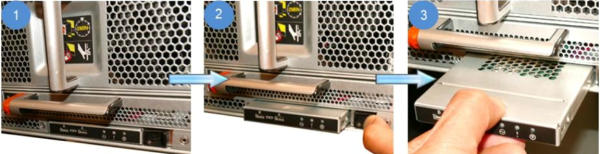

= Remplacement d'un module USB à LED - AFF A700 et FAS9000
:allow-uri-read: 
:icons: font
:imagesdir: ../media/

[role="lead"]
Vous pouvez remplacer un module USB à LED sans interrompre l'entretien.

Le module USB à LED FAS9000 ou AFF A700 assure la connectivité aux ports console et à l'état du système. Le remplacement de ce module ne nécessite pas d'outils.

.Étapes
. Retirez l'ancien module USB à LED :
+

+
.. Le panneau étant retiré, repérez le module USB à LED à l'avant du châssis, sur le côté inférieur gauche.
.. Faites glisser le loquet pour éjecter partiellement le module.
.. Tirez le module hors de la baie pour le déconnecter du fond de panier central. Ne laissez pas la fente vide.

. Installez le nouveau module USB à LED :
+
image::../media/led_4.png[led 4]

+
.. Alignez le module sur la baie avec l'encoche située dans le coin du module, près du loquet coulissant du châssis. La baie vous évite d'installer le module à l'envers.
.. Poussez le module dans la baie jusqu'à ce qu'il soit bien en place dans le châssis.
+
Un déclic se produit lorsque le module est sécurisé et connecté au fond de panier central.

== Renvoyez la pièce défectueuse à NetApp

Retournez la pièce défectueuse à NetApp, tel que décrit dans les instructions RMA (retour de matériel) fournies avec le kit. Voir la https://mysupport.netapp.com/site/info/rma["Retour de pièce et amp ; remplacements"] pour plus d'informations.
