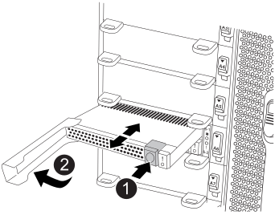

= Remplacez à chaud un module de cache - FAS9500
:allow-uri-read: 
:icons: font
:imagesdir: ../media/

[role="lead"]
Les modules SSD Flash cache (Flash cache ou modules de mise en cache) sont situés à l'avant du module NVRAM11, dans l'emplacement 6 des systèmes FAS9500. Vous pouvez remplacer à chaud le module de cache de même capacité par un fournisseur pris en charge par un autre ou par un même fournisseur.

NOTE: Si vous avez besoin ou souhaitez remplacer à froid le module Flash cache, suivez les procédures indiquées ci-dessous pour remplacer un module d'E/S.

.Avant de commencer
Votre système de stockage doit répondre à certains critères en fonction de votre situation :

* Il doit disposer du système d'exploitation approprié pour le module de cache que vous installez.
* Le module de cache doit fonctionner suffisamment bien pour être vu par le système. Si le module de cache ne fonctionne pas depuis le dernier démarrage, vous ne pouvez pas utiliser cette procédure et devez utiliser la procédure de remplacement à froid.
* Il doit prendre en charge la capacité de mise en cache.
* Le module de mise en cache de remplacement doit avoir la même capacité que le module de mise en cache défaillant, mais peut être proposé par un autre fournisseur pris en charge.
* Tous les autres composants du système de stockage doivent fonctionner correctement. Si ce n'est pas le cas, vous devez contacter le support technique.

.Étapes
. Si vous n'êtes pas déjà mis à la terre, mettez-vous à la terre correctement.
. Localisez le module de cache défectueux, dans le logement 6, par le voyant d'avertissement orange allumé à l'avant du module de cache.
. Préparez le logement du module de cache pour le remplacement comme suit :
+
.. Notez la capacité du module de cache, le numéro de référence et le numéro de série sur le nœud cible : `system node run local sysconfig -av 6`
.. Au niveau des privilèges admin, préparer le slot NVMe cible pour la suppression, répondant `y` lorsque vous êtes invité à continuer : `system controller slot module remove -node node_name -slot slot_number` La commande suivante prépare le slot 6-1 sur le nœud 1 pour la suppression et affiche un message qu'il est sûr de supprimer :
+
[listing]
----
::> system controller slot module remove -node node1 -slot 6-1

Warning: SSD module in slot 6-1 of the node node1 will be powered off for removal.
Do you want to continue? (y|n): `y`

The module has been successfully removed from service and powered off. It can now be safely removed.
----
.. Affiche l'état du slot avec le `system controller slot module show` commande.
+
L'état du slot NVMe s'affiche `powered-off` dans la sortie d'écran du module de cache qui doit être remplacé.

+

NOTE: Voir la https://docs.netapp.com/us-en/ontap-cli-9121/["Pages de manuel sur les commandes"^] Pour plus d'informations, consultez votre version de ONTAP.

. Retirez le module de mise en cache :
+

+
[cols="20%,80%"]
|===

 a| 
image::../media/legend_icon_01.svg[icône de légende 01]
 a| 
Bouton de déverrouillage Terra Cotta.

 a| 
image::../media/legend_icon_02.svg[icône de légende 02]
 a| 
Poignée de came du module de cache.

|===
+
.. Appuyez sur le bouton de déverrouillage en terre cuite situé à l'avant du module de mise en cache.
+

NOTE: N'utilisez pas le loquet de came d'E/S numéroté et à lettres pour éjecter le module de mise en cache. Le verrou de came d'E/S numéroté et gravé éjecte tout le module NVRAM11 et non le module de cache.

.. Faites tourner la poignée de came jusqu'à ce que le module de cache commence à glisser hors du module NVRAM11.
.. Tirez doucement la poignée de came vers vous pour retirer le module de cache du module NVRAM11.
+
Assurez-vous de soutenir le module de mise en cache lorsque vous le retirez du module NVRAM11.

. Installez le module de mise en cache :
+
.. Alignez les bords du module de cache avec l'ouverture du module NVRAM11.
.. Poussez doucement le module de cache dans la baie jusqu'à ce que la poignée de came s'enclenche.
.. Tourner la poignée de came jusqu'à ce qu'elle s'enclenche.

. Mettre le module de cache de remplacement en ligne à l'aide du `system controller slot module insert` commande comme suit :
+
La commande suivante prépare le slot 6-1 sur le nœud 1 pour la mise sous tension et affiche un message qu'il est mis sous tension :

+
[listing]
----
::> system controller slot module insert -node node1 -slot 6-1

Warning: NVMe module in slot 6-1 of the node localhost will be powered on and initialized.
Do you want to continue? (y|n): `y`

The module has been successfully powered on, initialized and placed into service.
----
. Vérifiez l'état du logement à l'aide du `system controller slot module show` commande.
+
Assurez-vous que la sortie de commande indique l'état pour le sous-système `powered-on` et prêt à l'emploi.

. Vérifiez que le module de mise en cache de remplacement est en ligne et reconnu, puis vérifiez visuellement que le voyant d'avertissement orange n'est pas allumé : `sysconfig -av slot_number`
+

NOTE: Si vous remplacez le module de cache par un module de cache d'un autre fournisseur, le nom du nouveau fournisseur est affiché dans la sortie de la commande.

. Retournez la pièce défectueuse à NetApp, tel que décrit dans les instructions RMA (retour de matériel) fournies avec le kit. Voir la https://mysupport.netapp.com/site/info/rma["Retour de pièces et remplacements"^] page pour plus d'informations.

