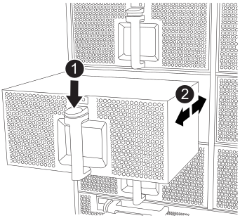

= Remplacez un ventilateur - FAS9500
:allow-uri-read: 
:icons: font
:imagesdir: ../media/

[role="lead"]
Pour remplacer un module de ventilation sans interrompre le service, vous devez effectuer une séquence spécifique de tâches.

IMPORTANT: Il est recommandé de remplacer le bloc d'alimentation dans les deux minutes qui suivent le retrait du châssis. Le système continue de fonctionner, mais ONTAP envoie des messages à la console concernant l'alimentation défectueuse jusqu'à ce que le bloc d'alimentation soit remplacé.

.Étapes
. Si vous n'êtes pas déjà mis à la terre, mettez-vous à la terre correctement.
. Retirez le cadre (si nécessaire) à deux mains, en saisissant les ouvertures de chaque côté du cadre, puis en le tirant vers vous jusqu'à ce que le cadre se dégage des goujons à rotule du châssis.
. Identifiez le module de ventilation que vous devez remplacer en vérifiant les messages d'erreur de la console et en regardant le voyant d'avertissement de chaque module de ventilation.
. Appuyez sur le bouton en terre cuite du module de ventilation et tirez le module de ventilation hors du châssis en vous assurant de le soutenir avec votre main libre.
+

IMPORTANT: Les modules de ventilation sont courts. Soutenez toujours la partie inférieure du module de ventilation avec votre main libre pour qu'il ne tombe pas brusquement du châssis et vous blesse.

+
.Animation - Supprimer/installer le ventilateur
video::86b0ed39-1083-4b3a-9e9c-ae78004c2ffc[panopto]
+

+
[cols="20%,80%"]
|===

 a| 
image::../media/legend_icon_01.svg[icône de légende 01]
 a| 
Bouton de déverrouillage Terra Cotta

 a| 
image::../media/legend_icon_02.svg[icône de légende 02]
 a| 
Faire glisser le ventilateur vers l'intérieur/l'extérieur du châssis

|===
. Mettez le module de ventilation de côté.
. Alignez les bords du module de ventilateur de remplacement avec l'ouverture du châssis, puis faites-le glisser dans le châssis jusqu'à ce qu'il s'enclenche.
+
Lorsqu'il est inséré dans un système sous tension, le voyant d'avertissement orange clignote quatre fois lorsque le module de ventilation est correctement inséré dans le châssis.

. Alignez le cadre avec les goujons à rotule, puis poussez doucement le cadre sur les goujons à rotule.
. Retournez la pièce défectueuse à NetApp, tel que décrit dans les instructions RMA (retour de matériel) fournies avec le kit. Voir la https://mysupport.netapp.com/site/info/rma["Retour de pièces et remplacements"^] page pour plus d'informations.

