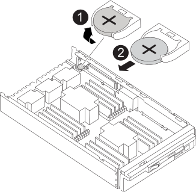

= Remplacez la pile de l'horloge en temps réel - FAS9500
:allow-uri-read: 
:icons: font
:imagesdir: ../media/

[role="lead"]
Vous remplacez la batterie de l'horloge temps réel (RTC) dans le module de contrôleur afin que les services et applications de votre système qui dépendent d'une synchronisation précise de l'heure continuent de fonctionner.

* Cette procédure peut être utilisée avec toutes les versions de ONTAP prises en charge par votre système
* Tous les autres composants du système doivent fonctionner correctement ; si ce n'est pas le cas, vous devez contacter le support technique.

== Étape 1 : arrêtez le nœud douteux

Pour arrêter le contrôleur défaillant, vous devez déterminer l'état du contrôleur et, si nécessaire, prendre le contrôle de façon à ce que le contrôleur en bonne santé continue de transmettre des données provenant du stockage défaillant du contrôleur.

.Description de la tâche
* Si vous utilisez NetApp Storage Encryption, vous devez avoir réinitialisé le MSID en suivant les instructions de la section link:https://docs.netapp.com/us-en/ontap/encryption-at-rest/return-seds-unprotected-mode-task.html["Retour des disques SED en mode non protégé"].
* Si vous disposez d'un système SAN, vous devez avoir vérifié les messages d'événement  `cluster kernel-service show`) Pour la lame SCSI du contrôleur altérée. Le `cluster kernel-service show` commande affiche le nom du nœud, l'état quorum du nœud concerné, l'état de disponibilité de ce nœud et l'état opérationnel de ce nœud.
+
Chaque processus SCSI-Blade doit se trouver au quorum avec les autres nœuds du cluster. Tout problème doit être résolu avant de procéder au remplacement.

* Si vous avez un cluster avec plus de deux nœuds, il doit être dans le quorum. Si le cluster n'est pas au quorum ou si un contrôleur en bonne santé affiche la valeur false pour l'éligibilité et la santé, vous devez corriger le problème avant de désactiver le contrôleur défaillant ; voir link:https://docs.netapp.com/us-en/ontap/system-admin/synchronize-node-cluster-task.html?q=Quorum["Synchroniser un nœud avec le cluster"^].

.Étapes
. Si AutoSupport est activé, supprimez la création automatique de dossier en invoquant un message AutoSupport : `system node autosupport invoke -node * -type all -message MAINT=number_of_hours_downh`
+
Le message AutoSupport suivant supprime la création automatique de dossiers pendant deux heures : `cluster1:> system node autosupport invoke -node * -type all -message MAINT=2h`

. Désactiver le rétablissement automatique depuis la console du contrôleur sain : `storage failover modify –node local -auto-giveback false`
+

NOTE: Lorsque vous voyez _voulez-vous désactiver l'auto-giveback?_, entrez `y`.

. Faites passer le contrôleur douteux à l'invite DU CHARGEUR :
+
[cols="1,2"]
|===
| Si le contrôleur en état de fonctionnement s'affiche... | Alors... 

 a| 
Invite DU CHARGEUR
 a| 
Passez à la section retrait du module de contrôleur.

 a| 
Attente du retour...
 a| 
Appuyez sur Ctrl-C, puis répondez `y` lorsque vous y êtes invité.

 a| 
Invite système ou invite de mot de passe
 a| 
Prendre le contrôle défectueux ou l'arrêter à partir du contrôleur en bon état : `storage failover takeover -ofnode _impaired_node_name_`

Lorsque le contrôleur douteux s'affiche en attente de rétablissement..., appuyez sur Ctrl-C et répondez `y`.

|===

== Étape 2 : retirer le contrôleur

Pour accéder aux composants à l'intérieur du contrôleur, vous devez d'abord retirer le module de contrôleur du système, puis retirer le capot du module de contrôleur.

. Si vous n'êtes pas déjà mis à la terre, mettez-vous à la terre correctement.
. Débranchez les câbles du module de contrôleur défaillant et suivez l'emplacement de connexion des câbles.
. Faites glisser le bouton en terre cuite de la poignée de came vers le bas jusqu'à ce qu'il se déverrouille.
+
.Animation - retirez le module de contrôleur
video::5e029a19-8acc-4fa1-be5d-ae78004b365a[panopto]
+
image::../media/drw_9500_remove_PCM.svg[drw 9500 déposer le module de commande du groupe motopropulseur]

+
[cols="20%,80%"]
|===

 a| 
image::../media/legend_icon_01.svg[icône de légende 01]
 a| 
Bouton de déverrouillage de la poignée de came

 a| 
image::../media/legend_icon_02.svg[icône de légende 02]
 a| 
Poignée de came

|===
. Faites pivoter la poignée de came de façon à ce qu'elle désengage complètement le module de contrôleur du châssis, puis faites glisser le module de contrôleur hors du châssis.
+
Assurez-vous de prendre en charge la partie inférieure du module de contrôleur lorsque vous le faites glisser hors du châssis.

. Placez le couvercle du module de contrôleur face vers le haut sur une surface stable et plane, appuyez sur le bouton bleu du capot, faites glisser le couvercle vers l'arrière du module de contrôleur, puis faites pivoter le couvercle vers le haut et retirez-le du module de contrôleur.

image::../media/drw_9500_PCM_open.svg[drw 9500 PCM ouvert]

[cols="20%,80%"]
|===

 a| 
image::../media/legend_icon_01.svg[icône de légende 01]
 a| 
Bouton de verrouillage du couvercle du module de commande

|===

== Étape 3 : remplacer la batterie RTC

Pour remplacer la batterie RTC, vous devez localiser la batterie défectueuse dans le module de contrôleur, la retirer du support, puis installer la batterie de rechange dans le support.

. Si vous n'êtes pas déjà mis à la terre, mettez-vous à la terre correctement.
. Localisez la batterie RTC.
+
.Animation - remplacer la batterie RTC
video::3b977f96-3ebb-4b11-9703-ae78004b4add[panopto]
+

+
[cols="20%,80%"]
|===

 a| 
image::../media/legend_icon_01.svg[icône de légende 01]
 a| 
Faites pivoter la batterie vers le haut

 a| 
image::../media/legend_icon_02.svg[icône de légende 02]
 a| 
Faire glisser la batterie hors du boîtier

|===
. Poussez doucement la batterie hors du support, faites-la pivoter pour l'éloigner du support, puis retirez-la du support.
+

NOTE: Notez la polarité de la batterie lorsque vous la retirez du support. La batterie est signalée par un signe plus et doit être correctement positionnée dans le support. Un signe plus près du support indique comment la batterie doit être positionnée.

. Retirez la batterie de rechange du sac d'expédition antistatique.
. Localisez le support de batterie vide dans le module de contrôleur.
. Notez la polarité de la batterie RTC, puis insérez-la dans le support en inclinant la batterie et en la poussant vers le bas.
. Inspectez visuellement la batterie pour vous assurer qu'elle est complètement installée dans le support et que la polarité est correcte.
. Réinstallez le capot du module de contrôleur.

== Étape 4 : réinstallez le module de contrôleur et définissez l'heure/la date

Après avoir remplacé la batterie RTC, vous devez réinstaller le module de contrôleur. Si la batterie RTC a été laissée hors du module de contrôleur pendant plus de 10 minutes, il peut être nécessaire de réinitialiser l'heure et la date.

. Si ce n'est déjà fait, fermez le conduit d'air ou le couvercle du module de commande.
. Alignez l'extrémité du module de contrôleur avec l'ouverture du châssis, puis poussez doucement le module de contrôleur à mi-course dans le système.
+
N'insérez pas complètement le module de contrôleur dans le châssis tant qu'il n'y a pas été demandé.

. Recâblage du système, selon les besoins.
+
Si vous avez retiré les convertisseurs de support (QSFP ou SFP), n'oubliez pas de les réinstaller si vous utilisez des câbles à fibre optique.

. Si les blocs d'alimentation ont été débranchés, rebranchez-les et réinstallez les dispositifs de retenue du câble d'alimentation.
. Terminez la réinstallation du module de contrôleur :
+
.. Avec la poignée de came en position ouverte, poussez fermement le module de contrôleur jusqu'à ce qu'il rencontre le fond de panier et soit bien en place, puis fermez la poignée de came en position verrouillée.
+

IMPORTANT: Ne forcez pas trop lorsque vous faites glisser le module de contrôleur dans le châssis pour éviter d'endommager les connecteurs.

.. Si ce n'est déjà fait, réinstallez le périphérique de gestion des câbles.
.. Fixez les câbles au dispositif de gestion des câbles à l'aide du crochet et de la sangle de boucle.
.. Rebranchez les câbles d'alimentation aux blocs d'alimentation et aux sources d'alimentation, puis mettez le système sous tension pour démarrer le processus d'amorçage.
.. Arrêtez le contrôleur à l'invite DU CHARGEUR.

NOTE: Si votre système s'arrête au menu de démarrage, sélectionnez l'option « redémarrer le nœud » et répondez y à l'invite, puis démarrez le CHARGEUR en appuyant sur `Ctrl-C`.

. Réinitialiser l'heure et la date sur le contrôleur :
+
.. Vérifiez la date et l'heure sur le nœud sain avec le `show date` commande.
.. À l'invite DU CHARGEUR sur le nœud cible, vérifiez l'heure et la date.
.. Si nécessaire, modifiez la date avec le `set date mm/dd/yyyy` commande.
.. Si nécessaire, réglez l'heure, en GMT, à l'aide du `set time hh:mm:ss` commande.
.. Confirmez la date et l'heure sur le nœud cible.

. À l'invite DU CHARGEUR, entrez `bye` Pour réinitialiser les cartes PCIe et d'autres composants et laisser le nœud redémarrer.
. Rétablir le fonctionnement normal du nœud en renvoie son espace de stockage : `storage failover giveback -ofnode impaired_node_name`
. Si le retour automatique a été désactivé, réactivez-le : `storage failover modify -node local -auto-giveback true`

== Étape 5 : renvoyer la pièce défaillante à NetApp

Retournez la pièce défectueuse à NetApp, tel que décrit dans les instructions RMA (retour de matériel) fournies avec le kit. Voir la https://["Retour de pièce et amp ; remplacements"] pour plus d'informations.
