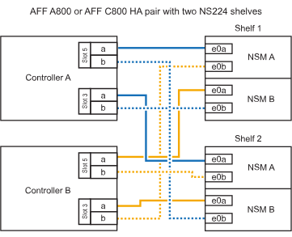

= Connectez le tiroir aux systèmes AFF - tiroirs NS224
:allow-uri-read: 
:icons: font
:imagesdir: ../media/

[role="lead"]
Vous câblez chaque tiroir NS224 que vous ajoutez à chaud de sorte que chaque tiroir dispose de deux connexions à chaque contrôleur de la paire haute disponibilité.

.Description de la tâche
Votre système matériel peut être compatible avec les tiroirs NS224 avec les modules NSM100 et les tiroirs NS224 avec les modules NSM100B. Pour vérifier la compatibilité et le nom des ports de votre matériel et de vos tiroirs, consultez le https://hwu.netapp.com["NetApp Hardware Universe"].

.Eclayette pour câble à AFF A1K
[%collapsible]
====
Vous pouvez ajouter à chaud jusqu'à trois tiroirs NS224 supplémentaires (pour un total de quatre tiroirs) à une paire HA AFF A1K.

.Avant de commencer
* Vous devez avoir examiné le link:requirements-hot-add-shelf.html["exigences et bonnes pratiques à ajouter à chaud"].
* Vous devez avoir effectué les procédures applicables dans link:prepare-hot-add-shelf.html["Préparez-vous à ajouter une étagère à chaud"].
* Vous devez avoir installé les tiroirs, les mettre sous tension et définir les ID de tiroir comme décrit dans la section link:prepare-hot-add-shelf.html["Installation d'un tiroir pour ajouter à chaud"].

.Description de la tâche
* Pour effectuer cette procédure, vous devez dans une paire haute disponibilité disposer d'au moins un tiroir NS224 existant.
* Cette procédure concerne les scénarios d'ajout à chaud suivants :
+
** Ajout à chaud d'un second tiroir à une paire haute disponibilité avec deux modules d'E/S compatibles RoCE dans chaque contrôleur. (Vous avez installé un deuxième module d'E/S et recâbler le premier tiroir sur les deux modules d'E/S ou le premier tiroir sur deux modules d'E/S. Vous connectez le second tiroir aux deux modules d'E/S).
** Ajout à chaud d'un troisième tiroir à une paire haute disponibilité avec trois modules d'E/S compatibles RoCE dans chaque contrôleur. (Vous avez installé un troisième module d'E/S et câblerez le troisième tiroir au troisième module d'E/S uniquement).
** Ajout à chaud d'un troisième tiroir à une paire haute disponibilité avec quatre modules d'E/S compatibles RoCE dans chaque contrôleur. (Vous avez installé un troisième et un quatrième module d'E/S et vous allez relier le troisième tiroir aux troisième et quatrième modules d'E/S).
** Ajout à chaud d'un quatrième tiroir à une paire haute disponibilité avec quatre modules d'E/S compatibles RoCE dans chaque contrôleur. (Vous avez installé un quatrième module d'E/S et avez remplacé le troisième tiroir par le troisième et le quatrième module d'E/S, ou vous avez déjà relié le troisième tiroir aux troisième et quatrième modules d'E/S. Vous connectez le quatrième tiroir au troisième et au quatrième module d'E/S).

.Étapes
. Si le tiroir NS224 que vous ajoutez à chaud sera le deuxième tiroir NS224 de la paire haute disponibilité, effectuez les opérations suivantes.
+
Dans le cas contraire, passez à l'étape suivante.

+
.. Reliez le port E0a du NSM A du tiroir du contrôleur à l'emplacement 10 port a (e10a).
.. Tiroir de câbles port NSM A e0b sur le connecteur B du contrôleur 11 port b (e11b).
.. Reliez le port e0a du NSM B du contrôleur B au connecteur 10 port a (e10a) du contrôleur.
.. Port e0b du tiroir de câbles NSM B vers le connecteur A du contrôleur 11 port b (e11b).
+
L'illustration suivante met en avant le câblage du second tiroir de la paire haute disponibilité avec deux modules d'E/S compatibles RoCE dans chaque contrôleur :

+
image::../media/drw_ns224_vino_m_2shelves_2cards_ieops-1642.svg[Câblage pour AFF/ASA A1K avec deux tiroirs et deux modules d'E/S.]

. Si le tiroir NS224 que vous ajoutez à chaud sera le troisième tiroir NS224 de la paire haute disponibilité avec trois modules d'E/S compatibles RoCE dans chaque contrôleur, procédez comme suit. Dans le cas contraire, passez à l'étape suivante.
+
.. Reliez le port E0a À l'emplacement 9 du port a (e9a) du contrôleur A.
.. Connectez le port E0b du tiroir NSM A au connecteur 9 b (e9b) du contrôleur B.
.. Connectez le port e0a à la fente 9 a (e9a) du contrôleur B du tiroir NSM B.
.. Reliez le port B e0b du tiroir NSM au connecteur 9 b (e9b) du contrôleur A.
+
L'illustration suivante met en avant le câblage du troisième tiroir de la paire haute disponibilité avec trois modules d'E/S compatibles RoCE dans chaque contrôleur :

+
image::../media/drw_ns224_vino_m_3shelves_3cards_ieops-1643.svg[Câblage pour AFF/ASA A1K avec trois tiroirs et trois modules d'E/S.]

. Si le tiroir NS224 que vous ajoutez à chaud sera le troisième tiroir NS224 de la paire haute disponibilité avec quatre modules d'E/S compatibles RoCE dans chaque contrôleur, procédez comme suit. Dans le cas contraire, passez à l'étape suivante.
+
.. Reliez le port E0a À l'emplacement 9 du port a (e9a) du contrôleur A.
.. Connectez le port E0b du tiroir NSM A au connecteur 8 b (e8b) du contrôleur B.
.. Connectez le port e0a à la fente 9 a (e9a) du contrôleur B du tiroir NSM B.
.. Reliez le port B e0b du tiroir NSM au connecteur 8 b (e8b) du contrôleur A.
+
L'illustration suivante met en avant le câblage du troisième tiroir de la paire haute disponibilité avec quatre modules d'E/S compatibles RoCE dans chaque contrôleur :

+
image::../media/drw_ns224_vino_m_3shelves_4cards_ieops-1644.svg[Câblage pour AFF/ASA A1K avec trois tiroirs et quatre modules d'E/S.]

. Si le tiroir NS224 que vous ajoutez à chaud sera le quatrième tiroir NS224 de la paire haute disponibilité avec quatre modules d'E/S compatibles RoCE dans chaque contrôleur, effectuez les étapes suivantes.
+
.. Reliez le port E0a À l'emplacement 8 du port a (e8a) du contrôleur A.
.. Connectez le port E0b du tiroir NSM A au connecteur 9 b (e9b) du contrôleur B.
.. Connectez le port e0a à la fente 8 a (e8a) du contrôleur B du tiroir NSM B.
.. Reliez le port B e0b du tiroir NSM au connecteur 9 b (e9b) du contrôleur A.
+
L'illustration suivante met en avant le câblage du quatrième tiroir de la paire haute disponibilité avec quatre modules d'E/S compatibles RoCE dans chaque contrôleur :

+
image::../media/drw_ns224_vino_m_4shelves_4cards_ieops-1645.svg[Câblage pour AFF/ASA A1K avec quatre tiroirs et quatre modules d'E/S.]

. Vérifiez que le tiroir ajouté à chaud est correctement câblé à l'aide de https://mysupport.netapp.com/site/tools/tool-eula/activeiq-configadvisor["Active IQ Config Advisor"^].
+
Si des erreurs de câblage sont générées, suivez les actions correctives fournies.

.Et la suite ?
Si vous avez désactivé l'affectation automatique de disque dans le cadre de votre préparation, vous devez attribuer manuellement la propriété des disques, puis réactiver l'affectation automatique de disque, si nécessaire. Allez à link:complete-hot-add-shelf.html["Terminez l'ajout à chaud"].

Sinon, vous effectuez l'ajout à chaud d'un tiroir.

====
.Chemin de câbles vers AFF A20
[%collapsible]
====
Vous pouvez ajouter à chaud un tiroir NS224 à une paire HA AFF A20 lorsque du stockage supplémentaire (dans le tiroir interne) est nécessaire.

.Avant de commencer
* Vous devez avoir examiné le link:requirements-hot-add-shelf.html["exigences et bonnes pratiques à ajouter à chaud"].
* Vous devez avoir effectué les procédures applicables dans link:prepare-hot-add-shelf.html["Préparez l'ajout à chaud d'une étagère"].
* Vous devez avoir installé les tiroirs, les mettre sous tension et définir les ID de tiroir comme décrit dans la section link:prepare-hot-add-shelf.html["Installation d'un tiroir pour ajouter à chaud"].

.Description de la tâche
* Pour cette procédure, vous devez dans un premier temps ajouter à chaud un tiroir supplémentaire à votre paire haute disponibilité disposant uniquement d'un stockage interne (pas de tiroirs externes).
* Cette procédure concerne les scénarios d'ajout à chaud suivants :
+
** Ajout à chaud du premier tiroir à une paire haute disponibilité avec un module d'E/S compatible RoCE dans chaque contrôleur.
** Ajout à chaud du premier tiroir à une paire haute disponibilité avec deux modules d'E/S compatibles RoCE dans chaque contrôleur.

* Ces systèmes sont compatibles avec les tiroirs NS224 avec les modules NSM100 et les tiroirs NS224 avec les modules NSM100B. Pour vous assurer que vous connectez les contrôleurs aux ports appropriés, remplacez le « X » de chaque schéma par le numéro de port correct pour votre module :
+
[cols="1,4"]
|===
| Type de module | Étiquetage des ports 

 a| 
NSM100
 a| 
« 0 »

ex. e0a

 a| 
NSM100B
 a| 
« 1 »

ex. e1a

|===

.Étapes
. Si vous ajoutez un tiroir à chaud à l'aide d'un ensemble de ports compatibles RoCE (un module d'E/S compatible RoCE) dans chaque module de contrôleur, et qu'il s'agit du seul tiroir NS224 de votre paire haute disponibilité, procédez comme suit.
+
Dans le cas contraire, passez à l'étape suivante.

+

NOTE: Cette étape suppose que vous avez installé le module d'E/S compatible RoCE dans le logement 3.

+
.. Armoire de câbles NSM A, port EXA, vers le connecteur 3 a (e3a) du contrôleur A.
.. Chemin de câbles du port EXB NSM A vers le port b (e3b) du connecteur 3 du contrôleur B.
.. Connecteur EXA du NSM B de l'étagère de câbles vers le port a (e3a) du connecteur 3 du contrôleur B.
.. Chemin de câbles du port EXB NSM B vers le port b (e3b) du connecteur 3 du contrôleur A.
+
L'illustration suivante montre le câblage d'un tiroir ajouté à chaud avec un module d'E/S compatible RoCE dans chaque module de contrôleur :

+
image::../media/drw_ns224_g_1shelf_1card_ieops-2002.svg[Câblage pour AFF/ASA A20 avec un tiroir et un module d'E/S.]

. Si vous ajoutez un tiroir à chaud en utilisant deux ensembles de ports compatibles RoCE (deux modules d'E/S compatibles RoCE) dans chaque module de contrôleur, procédez comme suit.
+
.. Reliez le port EXA du NSM A au port A (e3a) du contrôleur a 3.
.. Reliez le port EXB du NSM A au port b (e1b) de l'emplacement 1 du contrôleur B.
.. Reliez le port EXA du NSM B au port a (e3a) de l'emplacement 3 du contrôleur B.
.. Reliez le port EXB du NSM B au port b (e1b) de l'emplacement 1 du contrôleur A.

L'illustration suivante montre le câblage d'un tiroir à ajout à chaud utilisant deux modules d'E/S compatibles RoCE dans chaque module de contrôleur :

image::../media/drw_ns224_g_1shelf_2card_ieops-2005.svg[Câblage pour AFF/ASA A20 avec un tiroir et deux modules d'E/S.]

. Vérifiez que le tiroir ajouté à chaud est correctement câblé à l'aide de https://mysupport.netapp.com/site/tools/tool-eula/activeiq-configadvisor["Active IQ Config Advisor"^].
+
Si des erreurs de câblage sont générées, suivez les actions correctives fournies.

.Et la suite ?
Si vous avez désactivé l'affectation automatique de disque dans le cadre de votre préparation, vous devez attribuer manuellement la propriété des disques, puis réactiver l'affectation automatique de disque, si nécessaire. Allez à link:complete-hot-add-shelf.html["Terminez l'ajout à chaud"].

Sinon, vous effectuez l'ajout à chaud d'un tiroir.

====
.Etagère de câbles pour AFF A30, AFF A50, AFF C30 ou AFF C60
[%collapsible]
====
Vous pouvez ajouter à chaud jusqu'à deux tiroirs NS224 à une paire HA AFF A30, AFF C30, AFF A50 ou AFF C60 lorsque du stockage supplémentaire (sur le tiroir interne) est nécessaire.

.Avant de commencer
* Vous devez avoir examiné le link:requirements-hot-add-shelf.html["exigences et bonnes pratiques à ajouter à chaud"].
* Vous devez avoir effectué les procédures applicables dans link:prepare-hot-add-shelf.html["Préparez l'ajout à chaud d'une étagère"].
* Vous devez avoir installé les tiroirs, les mettre sous tension et définir les ID de tiroir comme décrit dans la section link:prepare-hot-add-shelf.html["Installation d'un tiroir pour ajouter à chaud"].

.Description de la tâche
* Cette procédure suppose que votre paire haute disponibilité ne dispose que d'un stockage interne (pas de tiroirs externes) et que vous ajoutez à chaud jusqu'à deux tiroirs supplémentaires et deux modules d'E/S compatibles RoCE dans chaque contrôleur.
* Cette procédure concerne les scénarios d'ajout à chaud suivants :
+
** Ajout à chaud du premier tiroir à une paire haute disponibilité avec un module d'E/S compatible RoCE dans chaque contrôleur.
** Ajout à chaud du premier tiroir à une paire haute disponibilité avec deux modules d'E/S compatibles RoCE dans chaque contrôleur.
** Ajout à chaud du second tiroir à une paire haute disponibilité avec deux modules d'E/S compatibles RoCE dans chaque contrôleur.

* Ces systèmes sont compatibles avec les tiroirs NS224 avec les modules NSM100 et les tiroirs NS224 avec les modules NSM100B. Pour vous assurer que vous connectez les contrôleurs aux ports appropriés, remplacez le « X » de chaque schéma par le numéro de port correct pour votre module :
+
[cols="1,4"]
|===
| Type de module | Étiquetage des ports 

 a| 
NSM100
 a| 
« 0 »

ex. e0a

 a| 
NSM100B
 a| 
« 1 »

ex. e1a

|===

.Étapes
. Si vous ajoutez un tiroir à chaud à l'aide d'un ensemble de ports compatibles RoCE (un module d'E/S compatible RoCE) dans chaque module de contrôleur, et qu'il s'agit du seul tiroir NS224 de votre paire haute disponibilité, procédez comme suit.
+
Dans le cas contraire, passez à l'étape suivante.

+

NOTE: Cette étape suppose que vous avez installé le module d'E/S compatible RoCE dans le logement 3.

+
.. Armoire de câbles NSM A, port EXA, vers le connecteur 3 a (e3a) du contrôleur A.
.. Chemin de câbles du port EXB NSM A vers le port b (e3b) du connecteur 3 du contrôleur B.
.. Connecteur EXA du NSM B de l'étagère de câbles vers le port a (e3a) du connecteur 3 du contrôleur B.
.. Chemin de câbles du port EXB NSM B vers le port b (e3b) du connecteur 3 du contrôleur A.
+
L'illustration suivante montre le câblage d'un tiroir ajouté à chaud avec un module d'E/S compatible RoCE dans chaque module de contrôleur :

+
image::../media/drw_ns224_g_1shelf_1card_ieops-2002.svg[Câblage pour AFF/ASA A30,452px,AFF/ASA A50]

. Si vous ajoutez un ou deux tiroirs à chaud avec deux ensembles de ports compatibles RoCE (deux modules d'E/S compatibles RoCE) dans chaque module de contrôleur, procédez aux sous-étapes applicables.
+

NOTE: Cette étape suppose que vous avez installé les modules d'E/S compatibles RoCE dans les connecteurs 3 et 1.

+
[cols="1,3"]
|===
| Tiroirs | Câblage 

 a| 
Etagère 1
 a| 
.. Reliez le port EXA du NSM A au port A (e3a) du contrôleur a 3.
.. Reliez le port EXB du NSM A au port b (e1b) de l'emplacement 1 du contrôleur B.
.. Reliez le port EXA du NSM B au port a (e3a) de l'emplacement 3 du contrôleur B.
.. Reliez le port EXB du NSM B au port b (e1b) de l'emplacement 1 du contrôleur A.
.. Si vous ajoutez une deuxième étagère à chaud, suivez les sous-étapes « Étagère 2 » ; sinon, passez à l’étape suivante.

L'illustration suivante montre le câblage d'un tiroir à ajout à chaud utilisant deux modules d'E/S compatibles RoCE dans chaque module de contrôleur :

image::../media/drw_ns224_g_1shelf_2card_ieops-2005.svg[Câblage pour AFF/ASA A30,452px,AFF/ASA A50]

 a| 
Etagère 2
 a| 
.. Reliez le port EXA du NSM A au port A du contrôleur a 1 (e1a).
.. Reliez le port EXB du NSM A au port b (e3b) du connecteur 3 du contrôleur B.
.. Reliez le port EXA du NSM B au port a (e1a) de l'emplacement 1 du contrôleur B.
.. Reliez le port EXB du NSM B au port b (e3b) du connecteur 3 du contrôleur A.
.. Passez à l'étape suivante.

L'illustration suivante montre le câblage de deux tiroirs à ajout à chaud utilisant deux modules d'E/S compatibles RoCE dans chaque module de contrôleur :

image::../media/drw_ns224_g_2shelf_2card_ieops-2003.svg[Câblage pour AFF A30/ASA,452px,AFF/ASA A50]

|===
. Vérifiez que le tiroir ajouté à chaud est correctement câblé à l'aide de https://mysupport.netapp.com/site/tools/tool-eula/activeiq-configadvisor["Active IQ Config Advisor"^].
+
Si des erreurs de câblage sont générées, suivez les actions correctives fournies.

.Et la suite ?
Si vous avez désactivé l'affectation automatique de disque dans le cadre de votre préparation, vous devez attribuer manuellement la propriété des disques, puis réactiver l'affectation automatique de disque, si nécessaire. Allez à link:complete-hot-add-shelf.html["Terminez l'ajout à chaud"].

Sinon, vous effectuez l'ajout à chaud d'un tiroir.

====
.Câblez le tiroir à AFF A70, AFF A90 ou AFF C80
[%collapsible]
====
Vous pouvez ajouter à chaud jusqu'à deux tiroirs NS224 à une paire haute disponibilité AFF A70, AFF A90 ou AFF C80 lorsque du stockage supplémentaire (dans le tiroir interne) est nécessaire.

.Avant de commencer
* Vous devez avoir examiné le link:requirements-hot-add-shelf.html["exigences et bonnes pratiques à ajouter à chaud"].
* Vous devez avoir effectué les procédures applicables dans link:prepare-hot-add-shelf.html["Préparez l'ajout à chaud d'une étagère"].
* Vous devez avoir installé les tiroirs, les mettre sous tension et définir les ID de tiroir comme décrit dans la section link:prepare-hot-add-shelf.html["Installation d'un tiroir pour ajouter à chaud"].

.Description de la tâche
* Cette procédure suppose que votre paire haute disponibilité ne dispose que d'un stockage interne (pas de tiroirs externes) et que vous ajoutez jusqu'à deux tiroirs supplémentaires et deux modules d'E/S compatibles RoCE dans chaque contrôleur.
* Cette procédure concerne les scénarios d'ajout à chaud suivants :
+
** Ajout à chaud du premier tiroir à une paire haute disponibilité avec un module d'E/S compatible RoCE dans chaque contrôleur.
** Ajout à chaud du premier tiroir à une paire haute disponibilité avec deux modules d'E/S compatibles RoCE dans chaque contrôleur.
** Ajout à chaud du second tiroir à une paire haute disponibilité avec deux modules d'E/S compatibles RoCE dans chaque contrôleur.

.Étapes
. Si vous ajoutez un tiroir à chaud à l'aide d'un ensemble de ports compatibles RoCE (un module d'E/S compatible RoCE) dans chaque module de contrôleur, et qu'il s'agit du seul tiroir NS224 de votre paire haute disponibilité, procédez comme suit.
+
Dans le cas contraire, passez à l'étape suivante.

+

NOTE: Cette étape suppose que vous avez installé le module d'E/S compatible RoCE dans le logement 11.

+
.. Reliez le port E0a du NSM A du tiroir du contrôleur à l'emplacement 11 port a (e11a).
.. Tiroir de câbles port NSM A e0b sur le connecteur B du contrôleur 11 port b (e11b).
.. Reliez le port e0a du NSM B du tiroir du contrôleur B au connecteur 11 du port a (e11a).
.. Port e0b du tiroir de câbles NSM B vers le connecteur A du contrôleur 11 port b (e11b).
+
L'illustration suivante montre le câblage d'un tiroir ajouté à chaud avec un module d'E/S compatible RoCE dans chaque module de contrôleur :

+
image::../media/drw_ns224_vino_i_1shelf_1card_ieops-1639.svg[Câblage pour AFF/ASA A70 ou A90 avec un tiroir et un module d'E/S.]

. Si vous ajoutez un ou deux tiroirs à chaud avec deux ensembles de ports compatibles RoCE (deux modules d'E/S compatibles RoCE) dans chaque module de contrôleur, procédez aux sous-étapes applicables.
+

NOTE: Cette étape suppose que vous avez installé les modules d'E/S compatibles RoCE dans les connecteurs 11 et 8.

+
[cols="1,3"]
|===
| Tiroirs | Câblage 

 a| 
Etagère 1
 a| 
.. Reliez le port e0a du NSM A au port a (e11a) du contrôleur A, emplacement 11.
.. Reliez le port NSM A e0b au connecteur 8 b (e8b) du contrôleur B.
.. Reliez le port e0a du NSM B au port a (e11a) du connecteur 11 du contrôleur B.
.. Reliez le port B NSM e0b au connecteur 8 b (e8b) du contrôleur A.
.. Si vous ajoutez une deuxième étagère à chaud, suivez les sous-étapes « Étagère 2 » ; sinon, passez à l’étape suivante.

L'illustration suivante montre le câblage d'un tiroir à ajout à chaud utilisant deux modules d'E/S compatibles RoCE dans chaque module de contrôleur :

image::../media/drw_ns224_vino_i_1shelf_2cards_ieops-1640.svg[Câblage pour AFF/ASA A70 ou A90 avec un tiroir et deux modules d'E/S.]

 a| 
Etagère 2
 a| 
.. Reliez le port e0a du NSM A au port a (e8a) du contrôleur A, emplacement 8.
.. Reliez le port NSM A e0b au connecteur 11 b (e11b) du contrôleur B.
.. Reliez le port e0a du NSM B au port a (e8a) du connecteur 8 du contrôleur B.
.. Reliez le port B NSM e0b au connecteur 11 b (e11b) du contrôleur A.
.. Passez à l'étape suivante.

L'illustration suivante montre le câblage de deux tiroirs à ajout à chaud utilisant deux modules d'E/S compatibles RoCE dans chaque module de contrôleur :

image::../media/drw_ns224_vino_i_2shelves_2cards_ieops-1641.svg[Câblage pour AFF/ASA A70 ou A90 avec deux tiroirs et deux modules d'E/S.]

|===
. Vérifiez que le tiroir ajouté à chaud est correctement câblé à l'aide de https://mysupport.netapp.com/site/tools/tool-eula/activeiq-configadvisor["Active IQ Config Advisor"^].
+
Si des erreurs de câblage sont générées, suivez les actions correctives fournies.

.Et la suite ?
Si vous avez désactivé l'affectation automatique de disque dans le cadre de votre préparation, vous devez attribuer manuellement la propriété des disques, puis réactiver l'affectation automatique de disque, si nécessaire. Allez à link:complete-hot-add-shelf.html["Terminez l'ajout à chaud"].

Sinon, vous effectuez l'ajout à chaud d'un tiroir.

====
.Cable shelf to AFF A250 ou AFF C250
[%collapsible]
====
Lorsque du stockage supplémentaire est nécessaire, vous pouvez ajouter à chaud un maximum d'un tiroir NS224 à une paire haute disponibilité AFF A250 ou AFF C250.

.Avant de commencer
* Vous devez avoir examiné le link:requirements-hot-add-shelf.html["exigences et bonnes pratiques à ajouter à chaud"].
* Vous devez avoir effectué les procédures applicables dans link:prepare-hot-add-shelf.html["Préparez l'ajout à chaud d'une étagère"].
* Vous devez avoir installé les tiroirs, les mettre sous tension et définir les ID de tiroir comme décrit dans la section link:prepare-hot-add-shelf.html["Installation d'un tiroir pour ajouter à chaud"].

.Description de la tâche
Vu de l'arrière du châssis de la plateforme, le port de la carte compatible RoCE sur la gauche est le port « a » (e1a) et le port de droite est le port « b » (e1b).

.Étapes
. Connectez les câbles du tiroir :
+
.. Reliez le port E0a du NSM A du tiroir du contrôleur à l'emplacement 1 du port a (e1a).
.. Reliez le port e0b du tiroir NSM A au port 1 b du contrôleur B (e1b).
.. Reliez le port e0a du NSM B du tiroir du contrôleur B au port a (e1a) du connecteur 1 du contrôleur.
.. Reliez le port e0b du tiroir NSM B au port b (e1b) du contrôleur A. + l'illustration suivante montre le câblage du tiroir une fois l'opération terminée.
+
image::../media/drw_ns224_a250_c250_f500f_1shelf_ieops-1824.svg[Câblage d'un AFF/ASA A250 C250 ou d'un FAS500f avec un tiroir NS224 et un jeu de ports de carte PCIe]

. Vérifiez que le tiroir ajouté à chaud est correctement câblé à l'aide de https://mysupport.netapp.com/site/tools/tool-eula/activeiq-configadvisor["Active IQ Config Advisor"^].
+
Si des erreurs de câblage sont générées, suivez les actions correctives fournies.

.Et la suite ?
Si vous avez désactivé l'affectation automatique de disque dans le cadre de votre préparation, vous devez attribuer manuellement la propriété des disques, puis réactiver l'affectation automatique de disque, si nécessaire. Allez à link:complete-hot-add-shelf.html["Terminez l'ajout à chaud"].

Sinon, vous effectuez l'ajout à chaud d'un tiroir.

====
.Connectez le tiroir de câblage à AFF A400 ou AFF C400
[%collapsible]
====
La procédure de câblage d'un tiroir NS224 pour effectuer un ajout à chaud dépend de la paire haute disponibilité AFF A400 ou AFF C400.

.Avant de commencer
* Vous devez avoir examiné le link:requirements-hot-add-shelf.html["exigences et bonnes pratiques à ajouter à chaud"].
* Vous devez avoir effectué les procédures applicables dans link:prepare-hot-add-shelf.html["Préparez l'ajout à chaud d'une étagère"].
* Vous devez avoir installé les tiroirs, les mettre sous tension et définir les ID de tiroir comme décrit dans la section link:prepare-hot-add-shelf.html["Installation d'un tiroir pour ajouter à chaud"].

*Etagère pour câble à une paire HA AFF A400*

Dans le cas d'une paire HA AFF A400, vous pouvez ajouter à chaud jusqu'à deux tiroirs et utiliser les ports e0c/e0d et les ports du slot 5 en fonction des besoins.

.Étapes
. Si vous ajoutez un tiroir à chaud en utilisant un ensemble de ports compatibles RoCE (ports intégrés compatibles RoCE) sur chaque contrôleur, et qu'il s'agit du seul tiroir NS224 de votre paire haute disponibilité, procédez comme suit.
+
Dans le cas contraire, passez à l'étape suivante.

+
.. Reliez le port E0A du tiroir NSM A au port e0c du contrôleur.
.. Reliez le port e0b du tiroir NSM A au port e0d du contrôleur B.
.. Reliez le port e0a du tiroir NSM B au port e0c du contrôleur B.
.. Reliez le port e0b du tiroir NSM B au port e0d du contrôleur A.
+
L'illustration suivante montre le câblage d'un tiroir à ajout à chaud utilisant un ensemble de ports compatibles RoCE sur chaque contrôleur :

+
image::../media/drw_ns224_a400_1shelf.png[Câblage d'un AFF/ASA A400 avec un tiroir NS224 et un ensemble de ports intégrés]

. Si vous ajoutez à chaud un ou deux tiroirs à l'aide de deux ensembles de ports compatibles RoCE (ports intégrés et compatibles RoCE avec la carte PCIe) sur chaque contrôleur, procédez comme suit.
+
[cols="1,3"]
|===
| Tiroirs | Câblage 

 a| 
Etagère 1
 a| 
.. Reliez le port E0A du NSM A au port e0c du contrôleur.
.. Reliez le port NSM A e0b au connecteur 5 2 (e5b) du contrôleur B.
.. Reliez le port E0A du NSM B au port e0c du contrôleur B.
.. Reliez le port B NSM e0b au connecteur 5 2 (e5b) du contrôleur A.
.. Si vous ajoutez une deuxième étagère à chaud, suivez les sous-étapes « Étagère 2 » ; sinon, passez à l’étape suivante.

 a| 
Etagère 2
 a| 
.. Reliez le port e0a du NSM A au port 1 (e5a) du connecteur 5 du contrôleur A.
.. Reliez le port e0b du NSM A au port e0d du contrôleur B.
.. Reliez le port e0a du NSM B au port 1 (e5a) du connecteur 5 du contrôleur B.
.. Reliez le port e0b du NSM B au port e0d du contrôleur A.
.. Passez à l'étape suivante.

|===
+
L'illustration suivante montre le câblage de deux tiroirs à chaud :

+
image::../media/drw_ns224_a400_2shelves_IEOPS-983.svg[Câblage d'un /ASA A400 avec deux tiroirs NS224, un jeu de ports intégrés et un jeu de ports sur les cartes PCIe]

. Vérifiez que le tiroir ajouté à chaud est correctement câblé à l'aide de https://mysupport.netapp.com/site/tools/tool-eula/activeiq-configadvisor["Active IQ Config Advisor"^].
+
Si des erreurs de câblage sont générées, suivez les actions correctives fournies.

. Si vous avez désactivé l'affectation automatique de disques dans le cadre de la préparation de cette procédure, vous devez attribuer manuellement la propriété du disque, puis réactiver l'affectation automatique de disques, si nécessaire. Voir link:complete-hot-add-shelf.html["Terminez l'ajout à chaud"].
+
Sinon, cette procédure est effectuée.

*Etagère de câble à une paire haute disponibilité AFF C400*

Pour une paire HA AFF C400, vous pouvez ajouter à chaud jusqu'à deux tiroirs et utiliser les ports des emplacements 4 et 5 selon les besoins.

.Étapes
. Si vous ajoutez un tiroir à chaud en utilisant un ensemble de ports compatibles RoCE sur chaque contrôleur et qu'il s'agit du seul tiroir NS224 de votre paire haute disponibilité, procédez comme suit.
+
Dans le cas contraire, passez à l'étape suivante.

+
.. Connectez le port E0a À l'emplacement 4 du contrôleur A (e4a) du tiroir NSM A.
.. Connectez le port E0b du tiroir NSM A au port 2 (e4b) du connecteur 4 du contrôleur B.
.. Connectez le port B e0a à la fente 4 du contrôleur B 1 (e4a) du tiroir de câblage NSM.
.. Connectez le port B e0b du tiroir NSM au port 2 (e4b) du contrôleur A 4.
+
L'illustration suivante montre le câblage d'un tiroir à ajout à chaud utilisant un ensemble de ports compatibles RoCE sur chaque contrôleur :

+
image::../media/drw_ns224_c400_1shelf_IEOPS-985.svg[Câblage d'un AFF/ASA C400 avec un tiroir NS224 et un ensemble de ports de carte PCIe]

. Si vous ajoutez à chaud un ou deux tiroirs à l'aide de deux ensembles de ports compatibles RoCE sur chaque contrôleur, procédez comme suit.
+
[cols="1,3"]
|===
| Tiroirs | Câblage 

 a| 
Etagère 1
 a| 
.. Reliez le port e0a du NSM A au port 1 (e4a) du connecteur 4 du contrôleur A.
.. Reliez le port NSM A e0b au connecteur 5 2 (e5b) du contrôleur B.
.. Reliez le port e0a du NSM B au port 1 (e4a) du port 4 du contrôleur B.
.. Reliez le port B NSM e0b au connecteur 5 2 (e5b) du contrôleur A.
.. Si vous ajoutez une deuxième étagère à chaud, suivez les sous-étapes « Étagère 2 » ; sinon, passez à l’étape suivante.

 a| 
Etagère 2
 a| 
.. Reliez le port e0a du NSM A au port 1 (e5a) du connecteur 5 du contrôleur A.
.. Reliez le port Nsm A e0b au port 2 (e4b) du connecteur 4 du contrôleur B.
.. Reliez le port e0a du NSM B au port 1 (e5a) du connecteur 5 du contrôleur B.
.. Reliez le port B NSM e0b au connecteur 4 2 (e4b) du contrôleur A.
.. Passez à l'étape suivante.

|===
+
L'illustration suivante montre le câblage de deux tiroirs à chaud :

+
image::../media/drw_ns224_c400_2shelves_IEOPS-984.svg[Câblage d'un AFF/ASA C400 avec deux tiroirs NS224 et deux jeux de ports de carte PCIe]

. Vérifiez que le tiroir ajouté à chaud est correctement câblé à l'aide de https://mysupport.netapp.com/site/tools/tool-eula/activeiq-configadvisor["Active IQ Config Advisor"^].
+
Si des erreurs de câblage sont générées, suivez les actions correctives fournies.

.Et la suite ?
Si vous avez désactivé l'affectation automatique de disque dans le cadre de votre préparation, vous devez attribuer manuellement la propriété des disques, puis réactiver l'affectation automatique de disque, si nécessaire. Allez à link:complete-hot-add-shelf.html["Terminez l'ajout à chaud"].

Sinon, vous effectuez l'ajout à chaud d'un tiroir.

====
.Connectez le tiroir de câbles à AFF A800 ou AFF C800
[%collapsible]
====
Le câblage des tiroirs NS224 dans une paire HA AFF A800 ou AFF C800 dépend du nombre de tiroirs à ajouter à chaud et du nombre de ports compatibles RoCE (un ou deux) utilisés sur les contrôleurs.

.Avant de commencer
* Vous devez avoir examiné le link:requirements-hot-add-shelf.html["exigences et bonnes pratiques à ajouter à chaud"].
* Vous devez avoir effectué les procédures applicables dans link:prepare-hot-add-shelf.html["Préparez l'ajout à chaud d'une étagère"].
* Vous devez avoir installé les tiroirs, les mettre sous tension et définir les ID de tiroir comme décrit dans la section link:prepare-hot-add-shelf.html["Installation d'un tiroir pour ajouter à chaud"].

.Étapes
. Si vous ajoutez un tiroir à chaud en utilisant un ensemble de ports compatibles RoCE (une carte PCIe compatible RoCE) sur chaque contrôleur, et qu'il s'agit du seul tiroir NS224 de votre paire haute disponibilité, procédez comme suit.
+
Dans le cas contraire, passez à l'étape suivante.

+

NOTE: Cette étape suppose que vous avez installé la carte PCIe compatible RoCE dans l'emplacement 5.

+
.. Reliez le port E0a À l'emplacement 5 du port a (e5a) du contrôleur A.
.. Connectez le port E0b du tiroir NSM A au connecteur 5 b (e5b) du contrôleur B.
.. Connectez le port e0a à la fente 5 a (e5a) du contrôleur B du tiroir NSM B.
.. Reliez le port B e0b du tiroir NSM au connecteur 5 b (e5b) du contrôleur A.
+
L'illustration suivante montre le câblage d'un tiroir à chaud utilisant une carte PCIe compatible RoCE sur chaque contrôleur :

+
image::../media/drw_ns224_a800_c800_1shelf_IEOPS-964.svg[Câblage d'un AFF/ASA A800 ou d'un AFF/ASA C800 avec un tiroir NS224 et une carte PCIe]

. Si vous ajoutez à chaud un ou deux tiroirs à l'aide de deux ensembles de ports compatibles RoCE (deux cartes PCIe compatibles RoCE) sur chaque contrôleur, suivez les sous-étapes applicables.
+

NOTE: Cette étape suppose que vous avez installé les cartes PCIe compatibles RoCE dans l'emplacement 5 et l'emplacement 3.

+
[cols="1,3"]
|===
| Tiroirs | Câblage 

 a| 
Etagère 1
 a| 

NOTE: Dans ces sous-étapes, vous commencez le câblage en câbler le port du tiroir e0a vers la carte PCIe compatible RoCE dans le connecteur 5, au lieu du connecteur 3.

.. Reliez le port e0a du NSM A au port a (e5a) du contrôleur A, situé à 5.
.. Reliez le port NSM A e0b au connecteur 3 b (e3b) du contrôleur B.
.. Reliez le port e0a du NSM B au port a (e5a) du connecteur 5 du contrôleur B.
.. Reliez le port B NSM e0b au connecteur 3 b (e3b) du contrôleur A.
.. Si vous ajoutez une deuxième étagère à chaud, suivez les sous-étapes « Étagère 2 » ; sinon, passez à l’étape suivante.

 a| 
Etagère 2
 a| 

NOTE: Ces sous-étapes supposent que vous commencez le câblage en câbler le port du tiroir e0a vers la carte PCIe compatible RoCE dans le connecteur 3, au lieu du connecteur 5 (qui correspond aux sous-étapes de câblage du tiroir 1).

.. Reliez le port e0a du NSM A au port a (e3a) du contrôleur A, emplacement 3.
.. Reliez le port NSM A e0b au connecteur 5 b (e5b) du contrôleur B.
.. Reliez le port e0a du NSM B au port a (e3a) du connecteur 3 du contrôleur B.
.. Reliez le port B NSM e0b au connecteur 5 b (e5b) du contrôleur A.
.. Passez à l'étape suivante.

|===
+
L'illustration suivante montre le câblage de deux tiroirs à chaud :

+

. Vérifiez que le tiroir ajouté à chaud est correctement câblé à l'aide de https://mysupport.netapp.com/site/tools/tool-eula/activeiq-configadvisor["Active IQ Config Advisor"^].
+
Si des erreurs de câblage sont générées, suivez les actions correctives fournies.

.Et la suite ?
Si vous avez désactivé l'affectation automatique de disque dans le cadre de votre préparation, vous devez attribuer manuellement la propriété des disques, puis réactiver l'affectation automatique de disque, si nécessaire. Allez à link:complete-hot-add-shelf.html["Terminez l'ajout à chaud"].

Sinon, vous effectuez l'ajout à chaud d'un tiroir.

====
.Cable shelf vers AFF A900
[%collapsible]
====
Lorsque du stockage supplémentaire est nécessaire, vous pouvez ajouter à chaud trois tiroirs disques NS224 supplémentaires (quatre tiroirs au total) à une paire haute disponibilité AFF A900.

.Avant de commencer
* Vous devez avoir examiné le link:requirements-hot-add-shelf.html["exigences et bonnes pratiques à ajouter à chaud"].
* Vous devez avoir effectué les procédures applicables dans link:prepare-hot-add-shelf.html["Préparez l'ajout à chaud d'une étagère"].
* Vous devez avoir installé les tiroirs, les mettre sous tension et définir les ID de tiroir comme décrit dans la section link:prepare-hot-add-shelf.html["Installation d'un tiroir pour ajouter à chaud"].

.Description de la tâche
* Cette procédure suppose que votre paire haute disponibilité dispose d'au moins un tiroir NS224 existant et que vous ajoutez à chaud trois tiroirs supplémentaires.
* Si votre paire haute disponibilité ne possède qu'un seul tiroir NS224, cette procédure suppose que le tiroir est câblé sur deux modules d'E/S 100 GbE compatibles RoCE sur chaque contrôleur.

.Étapes
. Si le tiroir NS224 que vous ajoutez à chaud sera le deuxième tiroir NS224 de la paire haute disponibilité, effectuez les opérations suivantes.
+
Dans le cas contraire, passez à l'étape suivante.

+
.. Reliez le port E0a du NSM A du tiroir du contrôleur à l'emplacement 10 port a (e10a).
.. Reliez le port e0b du tiroir NSM A au connecteur B du contrôleur B 2 ports b (e2b).
.. Reliez le port e0a du NSM B du contrôleur B au connecteur 10 port a (e10a) du contrôleur.
.. Reliez le port e0b du tiroir NSM B au connecteur A du contrôleur A, port b (e2b).
+
L'illustration suivante montre le câblage du second tiroir (et le premier tiroir).

+
image::../media/drw_ns224_a900_2shelves.png[Câblage d'un AFF/ASA A900 avec deux tiroirs NS224 et deux modules d'E/S.]

. Si le tiroir NS224 que vous ajoutez à chaud sera le troisième tiroir NS224 de la paire haute disponibilité, procédez comme suit.
+
Dans le cas contraire, passez à l'étape suivante.

+
.. Reliez le port E0a du NSM A du tiroir du contrôleur à l'emplacement 1 du port a (e1a).
.. Tiroir de câbles port NSM A e0b sur le connecteur B du contrôleur 11 port b (e11b).
.. Reliez le port e0a du NSM B du tiroir du contrôleur B au port a (e1a) du connecteur 1 du contrôleur.
.. Port e0b du tiroir de câbles NSM B vers le connecteur A du contrôleur 11 port b (e11b).
+
L'illustration suivante montre le câblage du troisième tiroir.

+
image::../media/drw_ns224_a900_3shelves.png[Câblage d'un AFF/ASA A900 avec trois tiroirs NS224 et quatre modules d'E/S.]

. Si le tiroir NS224 que vous ajoutez à chaud sera le quatrième tiroir NS224 de la paire haute disponibilité, procédez comme suit.
+
Dans le cas contraire, passez à l'étape suivante.

+
.. Reliez le port E0a du NSM A du tiroir du contrôleur à l'emplacement 11 port a (e11a).
.. Reliez le port e0b du tiroir NSM A au port 1 b du contrôleur B (e1b).
.. Reliez le port e0a du NSM B du tiroir du contrôleur B au connecteur 11 du port a (e11a).
.. Reliez le port e0b du tiroir NSM B au port b (e1b) du contrôleur A.
+
L'illustration suivante montre le câblage du quatrième tiroir.

+
image::../media/drw_ns224_a900_4shelves.png[Câblage d'un AFF/ASA A900 avec quatre tiroirs NS224 et quatre modules d'E/S.]

. Vérifiez que le tiroir ajouté à chaud est correctement câblé à l'aide de https://mysupport.netapp.com/site/tools/tool-eula/activeiq-configadvisor["Active IQ Config Advisor"^].
+
Si des erreurs de câblage sont générées, suivez les actions correctives fournies.

.Et la suite ?
Si vous avez désactivé l'affectation automatique de disque dans le cadre de votre préparation, vous devez attribuer manuellement la propriété des disques, puis réactiver l'affectation automatique de disque, si nécessaire. Allez à link:complete-hot-add-shelf.html["Terminez l'ajout à chaud"].

Sinon, vous effectuez l'ajout à chaud d'un tiroir.

====