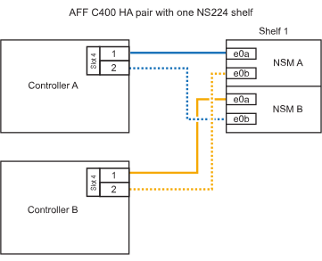

= Connectez un châssis NS224 à votre système AFF A400 ou AFF C400
:allow-uri-read: 
:icons: font
:imagesdir: ../media/

[role="lead"]
Câblez votre étagère NS224 à votre système AFF A400 ou AFF C400 de sorte que chaque étagère dispose de deux connexions à chaque contrôleur de la paire haute disponibilité.

== Câbler l'étagère à une paire haute disponibilité A400

Pour une paire haute disponibilité A400, vous pouvez ajouter à chaud jusqu'à deux étagères et utiliser les ports intégrés e0c/e0d et les ports de l'emplacement 5 selon les besoins.

.Étapes
. Si vous ajoutez un tiroir à chaud en utilisant un ensemble de ports compatibles RoCE (ports intégrés compatibles RoCE) sur chaque contrôleur, et qu'il s'agit du seul tiroir NS224 de votre paire haute disponibilité, procédez comme suit.
+
Dans le cas contraire, passez à l'étape suivante.

+
.. Reliez le port E0A du tiroir NSM A au port e0c du contrôleur.
.. Reliez le port e0b du tiroir NSM A au port e0d du contrôleur B.
.. Reliez le port e0a du tiroir NSM B au port e0c du contrôleur B.
.. Reliez le port e0b du tiroir NSM B au port e0d du contrôleur A.
+
L'illustration suivante montre le câblage d'un tiroir à ajout à chaud utilisant un ensemble de ports compatibles RoCE sur chaque contrôleur :

+
image::../media/drw_ns224_a400_1shelf.png[Câblage d'un AFF/ASA A400 avec un tiroir NS224 et un ensemble de ports intégrés]

. Si vous ajoutez à chaud un ou deux tiroirs à l'aide de deux ensembles de ports compatibles RoCE (ports intégrés et compatibles RoCE avec la carte PCIe) sur chaque contrôleur, procédez comme suit.
+
[cols="1,3"]
|===
| Tiroirs | Câblage 

 a| 
Etagère 1
 a| 
.. Reliez le port E0A du NSM A au port e0c du contrôleur.
.. Reliez le port NSM A e0b au connecteur 5 2 (e5b) du contrôleur B.
.. Reliez le port E0A du NSM B au port e0c du contrôleur B.
.. Reliez le port B NSM e0b au connecteur 5 2 (e5b) du contrôleur A.
.. Si vous ajoutez une deuxième étagère à chaud, suivez les sous-étapes « Étagère 2 » ; sinon, passez à l’étape suivante.

 a| 
Etagère 2
 a| 
.. Reliez le port e0a du NSM A au port 1 (e5a) du connecteur 5 du contrôleur A.
.. Reliez le port e0b du NSM A au port e0d du contrôleur B.
.. Reliez le port e0a du NSM B au port 1 (e5a) du connecteur 5 du contrôleur B.
.. Reliez le port e0b du NSM B au port e0d du contrôleur A.
.. Passez à l'étape suivante.

|===
+
L'illustration suivante montre le câblage de deux tiroirs à chaud :

+
image::../media/drw_ns224_a400_2shelves_IEOPS-983.svg[Câblage d'un /ASA A400 avec deux tiroirs NS224, un jeu de ports intégrés et un jeu de ports sur les cartes PCIe]

. Vérifiez que le tiroir ajouté à chaud est correctement câblé à l'aide de https://mysupport.netapp.com/site/tools/tool-eula/activeiq-configadvisor["Active IQ Config Advisor"^].
+
Si des erreurs de câblage sont générées, suivez les actions correctives fournies.

== Câbler l'étagère à une paire haute disponibilité C400

Pour une paire haute disponibilité C400, vous pouvez ajouter à chaud jusqu'à deux étagères et utiliser les ports des emplacements 4 et 5 selon vos besoins.

.Étapes
. Si vous ajoutez un tiroir à chaud en utilisant un ensemble de ports compatibles RoCE sur chaque contrôleur et qu'il s'agit du seul tiroir NS224 de votre paire haute disponibilité, procédez comme suit.
+
Dans le cas contraire, passez à l'étape suivante.

+
.. Connectez le port E0a À l'emplacement 4 du contrôleur A (e4a) du tiroir NSM A.
.. Connectez le port E0b du tiroir NSM A au port 2 (e4b) du connecteur 4 du contrôleur B.
.. Connectez le port B e0a à la fente 4 du contrôleur B 1 (e4a) du tiroir de câblage NSM.
.. Connectez le port B e0b du tiroir NSM au port 2 (e4b) du contrôleur A 4.
+
L'illustration suivante montre le câblage d'un tiroir à ajout à chaud utilisant un ensemble de ports compatibles RoCE sur chaque contrôleur :

+

. Si vous ajoutez à chaud un ou deux tiroirs à l'aide de deux ensembles de ports compatibles RoCE sur chaque contrôleur, procédez comme suit.
+
[cols="1,3"]
|===
| Tiroirs | Câblage 

 a| 
Etagère 1
 a| 
.. Reliez le port e0a du NSM A au port 1 (e4a) du connecteur 4 du contrôleur A.
.. Reliez le port NSM A e0b au connecteur 5 2 (e5b) du contrôleur B.
.. Reliez le port e0a du NSM B au port 1 (e4a) du port 4 du contrôleur B.
.. Reliez le port B NSM e0b au connecteur 5 2 (e5b) du contrôleur A.
.. Si vous ajoutez une deuxième étagère à chaud, suivez les sous-étapes « Étagère 2 » ; sinon, passez à l’étape suivante.

 a| 
Etagère 2
 a| 
.. Reliez le port e0a du NSM A au port 1 (e5a) du connecteur 5 du contrôleur A.
.. Reliez le port Nsm A e0b au port 2 (e4b) du connecteur 4 du contrôleur B.
.. Reliez le port e0a du NSM B au port 1 (e5a) du connecteur 5 du contrôleur B.
.. Reliez le port B NSM e0b au connecteur 4 2 (e4b) du contrôleur A.
.. Passez à l'étape suivante.

|===
+
L'illustration suivante montre le câblage de deux tiroirs à chaud :

+
image::../media/drw_ns224_c400_2shelves_IEOPS-984.svg[Câblage d'un AFF/ASA C400 avec deux tiroirs NS224 et deux jeux de ports de carte PCIe]

. Vérifiez que le tiroir ajouté à chaud est correctement câblé à l'aide de https://mysupport.netapp.com/site/tools/tool-eula/activeiq-configadvisor["Active IQ Config Advisor"^].
+
Si des erreurs de câblage sont générées, suivez les actions correctives fournies.

.Et la suite
Si vous avez désactivé l'attribution automatique des lecteurs lors de la préparation de cette procédure, vous devez attribuer manuellement la propriété du lecteur, puis réactiver l'attribution automatique si nécessaire. Accédez à link:hot-add-aff-complete.html["Terminez l'ajout à chaud"].

Sinon, vous effectuez l'ajout à chaud d'un tiroir.
