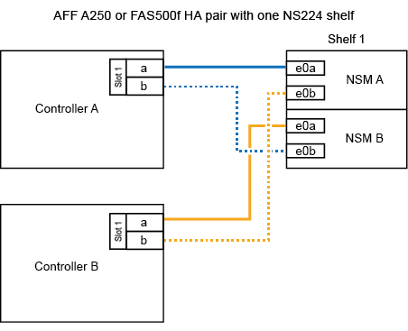
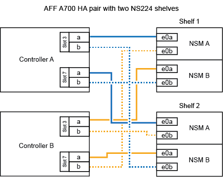
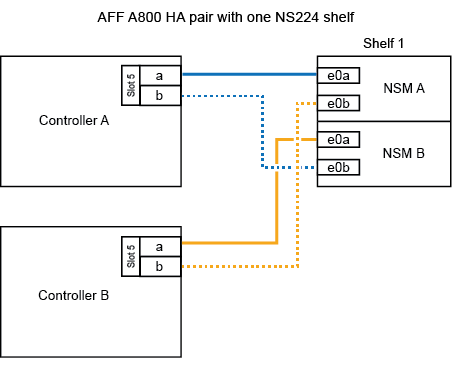

= Ajouter à chaud une étagère - NS224 étagères
:allow-uri-read: 
:icons: font
:imagesdir: ../media/

[role="lead"]
Vous pouvez ajouter à chaud un tiroir disque NS224 une fois que votre paire haute disponibilité satisfait à certaines exigences, et une fois les tâches de préparation applicables à votre paire haute disponibilité terminées.

== Conditions requises pour un ajout à chaud

[role="lead"]
Votre paire haute disponibilité doit respecter certaines exigences avant d'ajouter à chaud un tiroir disque NS224.

* Votre modèle de plateforme et votre version de ONTAP doivent prendre en charge le tiroir NS224 et les disques que vous ajoutez à chaud.
+
https://hwu.netapp.com["NetApp Hardware Universe"^]

* Vous devez disposer du nombre et du type de câbles appropriés pour connecter le shelf.
+
https://hwu.netapp.com["NetApp Hardware Universe"^]

* Votre paire haute disponibilité doit disposer de suffisamment de ports compatibles RoCE disponibles pour prendre en charge le nombre de tiroirs que vous ajoutez à chaud.
+
Pour chaque tiroir que vous ajoutez à chaud, vous devez disposer d'au moins deux ports compatibles RoCE sur chaque contrôleur. Ces ports peuvent intégrer les contrôleurs, sur des cartes PCIe compatibles RoCE, une combinaison des deux ou des modules d'E/S compatibles RoCE, comme pris en charge par votre modèle de plateforme.

+
Si votre paire haute disponibilité ne dispose pas de suffisamment de ports compatibles RoCE et si votre modèle de plateforme prend en charge l'utilisation de cartes PCIe ou de modules d'E/S compatibles RoCE, vous devez avoir installé les cartes ou modules d'E/S supplémentaires dans les connecteurs de contrôleur appropriés, comme pris en charge par votre modèle de plateforme.

+
https://hwu.netapp.com["NetApp Hardware Universe"^]

+
[NOTE]
====
Les ports non dédiés compatibles RoCE doivent être configurés pour le stockage (et non pour l'utilisation de la mise en réseau).

<<Préparez les ports non dédiés compatibles RoCE à des fins d'ajout à chaud>>

====
* Si vous disposez d'une paire haute disponibilité AFF A700 et que vous ajoutez à chaud le tiroir de disque NS224 initial (il n'existe pas de tiroir de disque NS224 dans votre paire haute disponibilité), vous devez avoir installé un module de dump principal (X9170A, SSD NVMe 1 To) dans chaque contrôleur afin de prendre en charge les « core dumps » (stocker les fichiers « core »).
+
link:../fas9000/caching-module-and-core-dump-module-replace.html["Remplacez le module de mise en cache ou ajoutez/remplacez un module « core dump » - AFF A700 et FAS9000"^]

* Votre paire haute disponibilité doit avoir moins de tiroirs que le nombre maximal pris en charge, d'au moins en raison du nombre de tiroirs que vous envisagez d'ajouter à chaud.
+
Vous ne pouvez pas avoir dépassé le nombre maximal de tiroirs pris en charge par votre paire haute disponibilité après l'ajout de tiroirs à chaud.

+
https://hwu.netapp.com["NetApp Hardware Universe"^]

* Si vous ajoutez un tiroir à chaud à une paire haute disponibilité déjà équipée d'un tiroir NS224, votre paire haute disponibilité ne peut pas afficher de messages d'erreur relatifs au câblage du stockage, et il doit être câblé en tant que haute disponibilité multivoie.
+
Vous pouvez exécuter Active IQ Config Advisor pour afficher tous les messages d'erreur de câblage du stockage et les actions correctives que vous devez effectuer.

+
https://mysupport.netapp.com/site/tools/tool-eula/activeiq-configadvisor["Téléchargement NetApp : Config Advisor"^]

* Vous avez besoin d'un trombone avec un côté redressé ou d'un stylo à bille à pointe étroite.
+
Pour modifier l'ID de tablette, utilisez le trombone ou le stylo à bille pour accéder au bouton d'identification de tablette situé derrière le panneau de l'écran de l'opérateur (ODP).

== Considérations relatives à un ajout à chaud

[role="lead"]
Vous devez vous familiariser avec les meilleures pratiques et les aspects à ce sujet avant d'ajouter à chaud un tiroir disque NS224.

* Si vous disposez d'une paire ASA HA prenant en charge des tiroirs NS224, vous pouvez suivre cette procédure.
* *Meilleure pratique :* la meilleure pratique consiste à installer la version la plus récente du Disk qualification Package (DQP) avant d'ajouter à chaud un shelf.
+
Une fois la version actuelle du DQP installée, votre système peut reconnaître et utiliser de nouveaux lecteurs qualifiés. Cela permet d'éviter que les messages d'événement du système ne soient pas à jour sur les disques et évite le partitionnement de disque car les disques ne sont pas reconnus. Le DQP vous informe également de la non-mise à jour du firmware du disque.

+
https://mysupport.netapp.com/site/downloads/firmware/disk-drive-firmware/download/DISKQUAL/ALL/qual_devices.zip["Téléchargements NetApp : pack de qualification des disques"^]

* *Meilleure pratique :* la meilleure pratique consiste à exécuter Active IQ Config Advisor avant et après l'ajout à chaud d'une étagère.
+
L'exécution de Active IQ Config Advisor avant l'ajout à chaud d'un tiroir procure une capture d'écran de la connectivité Ethernet du tiroir (ENET) existante, vérifie les versions de firmware du module de tiroir NVMe (NSM) et vous permet de vérifier l'ID de tiroir déjà utilisé dans la paire haute disponibilité. Une fois Active IQ Config Advisor le tiroir ajouté à chaud, vous pouvez vérifier que les tiroirs sont correctement câblés et que leurs ID sont uniques dans la paire haute disponibilité.

+
https://mysupport.netapp.com/site/tools/tool-eula/activeiq-configadvisor["Téléchargement NetApp : Config Advisor"^]

* *Meilleure pratique :* avant d'ajouter un nouveau tiroir, il est recommandé d'utiliser les versions les plus récentes du firmware NSM (module de tiroir NVMe) et du firmware de lecteur sur votre système.
+
https://mysupport.netapp.com/site/downloads/firmware/disk-shelf-firmware["Téléchargements NetApp : firmware des tiroirs disques"^]

+
https://mysupport.netapp.com/site/downloads/firmware/disk-drive-firmware["Téléchargements NetApp : firmware de disque"^]

+

NOTE: Ne rétablissez pas le firmware en tant que version qui ne prend pas en charge votre tiroir et ses composants.

* Une fois le câblage d'un tiroir ajouté à chaud, ONTAP reconnaît ce dernier :
+
** La propriété du disque est attribuée si l'affectation automatique du disque est activée.
** Le firmware des disques et du firmware des tiroirs NSM doivent être mis à jour automatiquement, si nécessaire.
+

NOTE: Les mises à jour du micrologiciel peuvent prendre jusqu'à 30 minutes.

== Préparez-vous à un ajout à chaud

[role="lead"]
Vous devez effectuer les tâches de préparation applicables à votre paire haute disponibilité avant d'ajouter à chaud un tiroir disque NS224.

=== Préparez les ports non dédiés compatibles RoCE à des fins d'ajout à chaud

Si votre paire haute disponibilité possède des ports non dédiés compatibles RoCE que vous utilisez pour ajouter à chaud un tiroir de disque NS224, vous devez vous assurer que les ports sont configurés pour le stockage (pas d'utilisation réseau). Selon le modèle de votre plateforme, les ports compatibles RoCE sont intégrés aux contrôleurs, sur des cartes PCIe compatibles RoCE, ou sur des modules d'E/S compatibles RoCE.

.Avant de commencer
Vous devez avoir satisfait à la configuration système requise.

<<Conditions requises pour un ajout à chaud>>

.Description de la tâche
* Pour certains modèles de plateforme, lorsqu'une carte PCIe compatible RoCE ou un module d'E/S est installé dans un slot pris en charge sur un contrôleur, les ports par défaut sont automatiquement utilisés pour le stockage (au lieu de la mise en réseau). Cependant, il est recommandé de suivre cette procédure pour vérifier que les ports compatibles RoCE sont configurés pour le stockage.
* Si vous déterminez que les ports non dédiés compatibles RoCE dans votre paire haute disponibilité ne sont pas configurés pour l'utilisation du stockage, il s'agit d'une procédure de configuration sans interruption.
+

NOTE: Si votre paire haute disponibilité exécute une version de ONTAP 9.6, vous devez redémarrer les contrôleurs, un à la fois.

+

NOTE: Si votre paire haute disponibilité exécute ONTAP 9.7 ou version ultérieure, vous n'avez pas besoin de redémarrer les contrôleurs, sauf si un ou les deux contrôleurs sont en mode de maintenance. Cette procédure suppose que ni le contrôleur n'est en mode de maintenance.

.Étapes
. Vérifier si les ports non dédiés de la paire haute disponibilité sont configurés pour l'utilisation du stockage : `storage port show`
+
Vous pouvez saisir la commande sur un ou deux modules de contrôleur.

+
Si votre paire haute disponibilité exécute ONTAP 9.8 ou une version ultérieure, les ports non dédiés s'affichent `storage` dans le `Mode` colonne.

+
Si votre paire haute disponibilité exécute ONTAP 9.7 ou 9.6, les ports non dédiés qui s'affichent `false` dans le `Is Dedicated?` s'affiche également `enabled` dans le `State` colonne.

. Si les ports non dédiés sont configurés pour le stockage, cette procédure est effectuée.
+
Sinon, vous devez configurer les ports en effectuant les étapes 3 à 6.

+
[NOTE]
====
Lorsque les ports non dédiés ne sont pas configurés pour l'utilisation du stockage, la sortie de la commande affiche les éléments suivants :

Si votre paire haute disponibilité exécute ONTAP 9.8 ou une version ultérieure, les ports non dédiés s'affichent `network` dans le `Mode` colonne.

Si votre paire haute disponibilité exécute ONTAP 9.7 ou 9.6, les ports non dédiés qui s'affichent `false` dans le `Is Dedicated?`` s'affiche également `disabled` dans le `State` colonne.

====
. Configurer les ports non dédiés pour l'utilisation du stockage sur l'un des modules de contrôleur :
+
Vous devez répéter la commande applicable pour chaque port que vous configurez.

+
[cols="1,3"]
|===
| Si votre paire haute disponibilité est en cours d'exécution... | Alors... 

 a| 
ONTAP 9.8 ou version ultérieure
 a| 
`storage port modify -node node name -port port name -mode storage`

 a| 
ONTAP 9.7 ou 9.6
 a| 
`storage port enable -node node name -port port name`

|===
. Si votre paire haute disponibilité exécute ONTAP 9.6, redémarrez le module de contrôleur afin que les modifications de port prennent effet : `system node reboot -node node name -reason reason for the reboot`
+
Dans le cas contraire, passez à l'étape suivante.

+

NOTE: Le redémarrage peut prendre jusqu'à 15 minutes.

. Répétez les étapes pour le second module de contrôleur :
+
[cols="1,3"]
|===
| Si votre paire haute disponibilité est en cours d'exécution... | Alors... 

 a| 
ONTAP 9.7 ou version ultérieure
 a| 
.. Répétez l'étape 3.
.. Passez à l'étape 6.

 a| 
ONTAP 9.6
 a| 
.. Répétez les étapes 3 et 4.
+

NOTE: Le premier contrôleur doit déjà avoir terminé son redémarrage.

.. Passez à l'étape 6.

|===
. Vérifier que les ports non dédiés des deux modules de contrôleur sont configurés pour le stockage : `storage port show`
+
Vous pouvez saisir la commande sur un ou deux modules de contrôleur.

+
Si votre paire haute disponibilité exécute ONTAP 9.8 ou une version ultérieure, les ports non dédiés s'affichent `storage` dans le `Mode` colonne.

+
Si votre paire haute disponibilité exécute ONTAP 9.7 ou 9.6, les ports non dédiés qui s'affichent `false` dans le `Is Dedicated?` s'affiche également `enabled` dans le `State` colonne.

=== Préparez une paire HA AFF A700, AFF A800 ou AFF A400 à chaud en ajoutant un second tiroir

Si vous disposez d'une paire haute disponibilité AFF A700, AFF A800 ou AFF A400 avec un tiroir de disque NS224 câblé à un ensemble de ports compatibles RoCE sur chaque contrôleur, vous devez le recâter (après avoir installé les cartes PCIe ou modules d'E/S supplémentaires compatibles RoCE). sur les deux ensembles de ports de chaque contrôleur, avant d'ajouter le second tiroir à chaud.

.Avant de commencer
* Vous devez avoir satisfait à la configuration système requise.
+
<<Conditions requises pour un ajout à chaud>>

* Vous devez avoir activé les ports sur les cartes PCIe compatibles RoCE ou les modules d'E/S que vous avez installés.
+
<<Préparez les ports non dédiés compatibles RoCE à des fins d'ajout à chaud>>

.Description de la tâche
* La désactivation des connexions des ports s'effectue sans interruption lorsque votre tiroir est doté d'une connectivité multivoie haute disponibilité.
+
Vous pouvez recâblage du premier tiroir dans les deux ensembles de ports de chaque contrôleur de sorte que, lorsque vous ajoutez le second tiroir à chaud, les deux tiroirs bénéficient d'une connectivité plus résiliente.

* Déplacez un câble à la fois afin de maintenir la connectivité au tiroir à tout moment au cours de cette procédure.

.Étapes
. Recâblage des connexions du tiroir existant entre les deux ensembles de ports de chaque contrôleur, selon le modèle de votre plateforme.
+

NOTE: Le déplacement d'un câble ne nécessite pas de temps d'attente entre le débranchement du câble d'un port et le branchement sur un autre port.

+
[cols="1,3"]
|===
| Si vous avez un... | Alors... 

 a| 
PAIRE HA AFF A700
 a| 

NOTE: Les sous-étapes supposent que le tiroir existant est câblé aux modules d'E/S compatibles RoCE dans le connecteur 3 de chaque contrôleur.

[NOTE]
====
Si nécessaire, vous pouvez faire référence aux schémas de câblage montrant un seul tiroir existant et le « tiroir » à tiroir « recâblage, dans une configuration à deux tiroirs ».

<<Connectez un tiroir à chaud pour une paire HA AFF A700>>

====
.. Sur le contrôleur A, déplacer le câble du connecteur 3, port b (e3b), vers le connecteur 7, port b (e7b).
.. Répétez le même déplacement de câble sur le contrôleur B.

 a| 
PAIRE HA AFF A800
 a| 

NOTE: Les sous-étapes supposent que le tiroir existant est câblé aux cartes PCIe compatibles RoCE dans le connecteur 5 de chaque contrôleur.

[NOTE]
====
Si nécessaire, vous pouvez faire référence aux schémas de câblage montrant un seul tiroir existant et le « tiroir » à tiroir « recâblage, dans une configuration à deux tiroirs ».

<<Connectez les câbles d'un tiroir d'extension à chaud pour une paire HA AFF A800>>

====
.. Sur le contrôleur A, déplacer le câble du connecteur 5 port b (e5b) vers le connecteur 3 port b (e3b).
.. Répétez le même déplacement de câble sur le contrôleur B.

 a| 
PAIRE HA AFF A400
 a| 
[NOTE]
====
Si nécessaire, vous pouvez faire référence aux schémas de câblage montrant un seul tiroir existant et le « tiroir » à tiroir « recâblage, dans une configuration à deux tiroirs ».

<<Connectez un tiroir d'extension à chaud pour une paire haute disponibilité AFF A400>>

====
.. Sur le contrôleur A, déplacer le câble du port e0d vers le connecteur 5 Port b (e5b).
.. Répétez le même déplacement de câble sur le contrôleur B.

|===
. Vérifier que le tiroir à tiroir à tiroir recâblé est correctement câblé.
+
Si des erreurs de câblage sont générées, suivez les actions correctives fournies.

+
https://mysupport.netapp.com/site/tools/tool-eula/activeiq-configadvisor["Téléchargement NetApp : Config Advisor"^]

=== Préparez-vous à attribuer manuellement la propriété du disque pour un ajout à chaud

Si vous attribuez manuellement la propriété du lecteur pour le tiroir de disque NS224 que vous ajoutez à chaud, vous devez désactiver l'affectation automatique du disque s'il est activé.

.Avant de commencer
Vous devez avoir satisfait à la configuration système requise.

<<Conditions requises pour un ajout à chaud>>

.Description de la tâche
Vous devez attribuer manuellement la propriété des disques si les disques du tiroir seront détenus par les deux modules de contrôleur dans la paire haute disponibilité.

.Étapes
. Vérifiez si l'affectation automatique des disques est activée : `storage disk option show`
+
Vous pouvez saisir la commande sur un ou deux modules de contrôleur.

+
Si l'affectation automatique de l'entraînement est activée, la sortie affiche `on` dans le `Auto Assign` colonne (pour chaque module de contrôleur).

. Si l'affectation automatique des disques est activée, désactivez-la : `storage disk option modify -node node_name -autoassign off`
+
Vous devez désactiver l'affectation automatique des disques sur les deux modules de contrôleur.

== Installez un tiroir disque pour un ajout à chaud

[role="lead"]
L'installation d'un nouveau tiroir de disque NS224 implique l'installation du tiroir dans un rack ou une armoire, le branchement des câbles d'alimentation (qui met automatiquement le tiroir sous tension), puis la configuration de l'ID de tiroir.

.Avant de commencer
* Vous devez avoir satisfait à la configuration système requise.
+
<<Conditions requises pour un ajout à chaud>>

* Vous devez avoir terminé les procédures de préparation applicables.
+
<<Préparez-vous à un ajout à chaud>>

.Étapes
. Installez le kit de montage sur rail fourni avec votre tiroir en utilisant la Flyer d'installation fourni avec le kit.
+

NOTE: Ne montez pas la tablette à bride.

. Installez et fixez le shelf sur les supports et le rack ou armoire en utilisant la brochure d'installation.
+

NOTE: Une tablette NS224 entièrement chargée peut peser jusqu'à 30.29 kg (66.78 lb) et doit être levée par deux personnes ou utiliser un relevage hydraulique. Évitez de retirer les composants des étagères (à l'avant ou à l'arrière du shelf) afin de réduire le poids des étagères car le poids des étagères ne sera pas équilibré.

. Branchez les cordons d'alimentation au tiroir, fixez-les à l'aide de la pièce de retenue du cordon d'alimentation, puis branchez les câbles d'alimentation à différentes sources d'alimentation pour assurer la résilience.
+
Une étagère se met sous tension lorsqu'elle est connectée à une source d'alimentation ; elle n'a pas de commutateurs d'alimentation. Lorsqu'elle fonctionne correctement, la LED bicolore d'un bloc d'alimentation s'allume en vert.

. Définissez l'ID du tiroir sur un nombre unique dans la paire HA :
+
Des instructions plus détaillées sont disponibles :

+
link:change-shelf-id.html["Modifiez l'ID de tiroir NS224"^]

+
.. Déposer le capuchon d'extrémité gauche et localiser le petit trou à droite des LED.
.. Insérez l'extrémité d'un trombone ou d'un outil similaire dans le petit trou pour atteindre le bouton d'identification de la tablette.
.. Appuyez sur le bouton et maintenez-le enfoncé (jusqu'à 15 secondes) jusqu'à ce que le premier chiffre de l'écran numérique clignote, puis relâchez le bouton.
+

NOTE: Si l'ID prend plus de 15 secondes pour clignoter, appuyez de nouveau sur le bouton et maintenez-le enfoncé, en veillant à l'appuyer complètement.

.. Appuyez sur le bouton et relâchez-le pour faire avancer le chiffre jusqu'à ce que vous atteiez le chiffre souhaité de 0 à 9.
.. Répétez les sous-étapes 4c et 4d pour définir le second numéro de l'ID de tablette.
+
Le chiffre peut clignoter pendant trois secondes au lieu de 15 secondes.

.. Appuyez sur le bouton et maintenez-le enfoncé jusqu'à ce que le second chiffre ne clignote plus.
+
Au bout de cinq secondes environ, les deux chiffres commencent à clignoter et le voyant orange s'allume sur le ODP.

.. Mettez le tiroir hors tension puis sous tension afin de valider l'ID.
+
Vous devez débrancher les deux cordons d'alimentation du shelf, attendre 10 secondes, puis les rebrancher.

+
Lorsque l'alimentation est rétablie, les LED bicolores s'allument en vert.

== Reliez un tiroir de disque pour un ajout à chaud

[role="lead"]
Vous connectez chaque tiroir de disque NS224 à chaud, de sorte que chaque tiroir possède deux connexions à chaque module de contrôleur de la paire haute disponibilité. En fonction du nombre de tiroirs que vous ajoutez à chaud et de votre modèle de plateforme, vous utilisez les ports compatibles RoCE sur les contrôleurs, sur les cartes PCIe compatibles RoCE, une combinaison des deux ou sur des modules d'E/S compatibles RoCE.

=== Considérations relatives au câblage d'un ajout à chaud

Se familiariser avec l'orientation correcte du connecteur de câble et l'emplacement et l'étiquetage des ports sur les modules de tiroir de lecteur NS224 peuvent être utiles avant de raccorder votre étagère à chaud.

* Les câbles sont insérés avec la languette de retrait du connecteur orientée vers le haut.
+
Lorsqu'un câble est inséré correctement, il s'enclenche.

+
Une fois que vous avez connecté les deux extrémités du câble, les LED vertes du tiroir et du port du contrôleur LNK s'allument. Si le voyant LNK d'un port ne s'allume pas, réinstallez le câble.

+
image::../media/oie_cable_pull_tab_up.png[tirer la languette du câble de l'oie vers le haut]

* Vous pouvez utiliser l'illustration suivante pour vous aider à identifier physiquement les ports NSM des tiroirs, e0a et e0b :
+
image::../media/drw_ns224_back_ports.png[ports arrière drw ns224]

=== Reliez un tiroir à chaud pour une paire haute disponibilité AFF A900

Lorsque du stockage supplémentaire est nécessaire, vous pouvez ajouter à chaud trois tiroirs disques NS224 supplémentaires (quatre tiroirs au total) à une paire haute disponibilité AFF A900.

.Avant de commencer
* Vous devez avoir satisfait à la configuration système requise.
+
<<Conditions requises pour un ajout à chaud>>

* Vous devez avoir terminé les procédures de préparation applicables.
+
<<Préparez-vous à un ajout à chaud>>

* Vous devez avoir installé les tiroirs, mis-les sous tension et définir les identifiants de tiroirs.
+
<<Installez un tiroir disque pour un ajout à chaud>>

.Description de la tâche
* Cette procédure suppose que votre paire haute disponibilité dispose d'au moins un tiroir NS224 existant et que vous ajoutez à chaud trois tiroirs supplémentaires.
* Si votre paire haute disponibilité ne possède qu'un seul tiroir NS224, cette procédure suppose que le tiroir est câblé sur deux modules d'E/S 100 GbE compatibles RoCE sur chaque contrôleur.

.Étapes
. Si le tiroir NS224 que vous ajoutez à chaud sera le deuxième tiroir NS224 de la paire haute disponibilité, effectuez les opérations suivantes.
+
Dans le cas contraire, passez à l'étape suivante.

+
.. Reliez le port E0a du NSM A du tiroir du contrôleur à l'emplacement 10 port a (e10a).
.. Reliez le port e0b du tiroir NSM A au connecteur B du contrôleur B 2 ports b (e2b).
.. Reliez le port e0a du NSM B du contrôleur B au connecteur 10 port a (e10a) du contrôleur.
.. Reliez le port e0b du tiroir NSM B au connecteur A du contrôleur A, port b (e2b).

+
L'illustration suivante montre le câblage du second tiroir (et le premier tiroir).

+
image::../media/drw_ns224_a900_2shelves.png[drw ns224 a900 2 clayettes]

. Si le tiroir NS224 que vous ajoutez à chaud sera le troisième tiroir NS224 de la paire haute disponibilité, procédez comme suit.
+
Dans le cas contraire, passez à l'étape suivante.

+
.. Reliez le port E0a du NSM A du tiroir du contrôleur à l'emplacement 1 du port a (e1a).
.. Tiroir de câbles port NSM A e0b sur le connecteur B du contrôleur 11 port b (e11b).
.. Reliez le port e0a du NSM B du tiroir du contrôleur B au port a (e1a) du connecteur 1 du contrôleur.
.. Port e0b du tiroir de câbles NSM B vers le connecteur A du contrôleur 11 port b (e11b).
+
L'illustration suivante montre le câblage du troisième tiroir.

+
image::../media/drw_ns224_a900_3shelves.png[drw ns224 a900 3 étagères]

. Si le tiroir NS224 que vous ajoutez à chaud sera le quatrième tiroir NS224 de la paire haute disponibilité, procédez comme suit.
+
Dans le cas contraire, passez à l'étape suivante.

+
.. Reliez le port E0a du NSM A du tiroir du contrôleur à l'emplacement 11 port a (e11a).
.. Reliez le port e0b du tiroir NSM A au port 1 b du contrôleur B (e1b).
.. Reliez le port e0a du NSM B du tiroir du contrôleur B au connecteur 11 du port a (e11a).
.. Reliez le port e0b du tiroir NSM B au port b (e1b) du contrôleur A.
+
L'illustration suivante montre le câblage du quatrième tiroir.

+
image::../media/drw_ns224_a900_4shelves.png[drw ns224 a900 4clayettes]

. Vérifiez que le tiroir à chaud est correctement câblé.
+
Si des erreurs de câblage sont générées, suivez les actions correctives fournies.

+
https://mysupport.netapp.com/site/tools/tool-eula/activeiq-configadvisor["Téléchargement NetApp : Config Advisor"]

. Si vous avez désactivé l'affectation automatique de disque dans le cadre de votre préparation, vous devez attribuer manuellement la propriété des disques, puis réactiver l'affectation automatique de disque, si nécessaire.
+
Sinon, cette procédure est effectuée.

+
<<Terminez l'ajout à chaud>>

=== Reliez un tiroir d'ajout à chaud pour une paire haute disponibilité FAS500f ou AFF A250

[role="lead"]
Lorsque du stockage supplémentaire est nécessaire, vous pouvez ajouter à chaud un tiroir disque NS224 à une paire haute disponibilité FAS500f ou AFF A250.

.Avant de commencer
* Vous devez avoir satisfait à la configuration système requise.
+
<<Conditions requises pour un ajout à chaud>>

* Vous devez avoir terminé les procédures de préparation applicables.
+
<<Préparez-vous à un ajout à chaud>>

* Vous devez avoir installé les tiroirs, mis-les sous tension et définir les identifiants de tiroirs.
+
<<Installez un tiroir disque pour un ajout à chaud>>

.Description de la tâche
Vu de l'arrière du châssis de la plateforme, le port de la carte compatible RoCE sur la gauche est le port « a » (e1a) et le port de droite est le port « b » (e1b).

.Étapes
. Connectez les câbles du tiroir :
+
.. Reliez le port E0a du NSM A du tiroir du contrôleur à l'emplacement 1 du port a (e1a).
.. Reliez le port e0b du tiroir NSM A au port 1 b du contrôleur B (e1b).
.. Reliez le port e0a du NSM B du tiroir du contrôleur B au port a (e1a) du connecteur 1 du contrôleur.
.. Reliez le port e0b du tiroir NSM B au port b (e1b) du contrôleur A. + l'illustration suivante montre le câblage du tiroir une fois l'opération terminée.
+

. Vérifiez que le tiroir à chaud est correctement câblé.
+
Si des erreurs de câblage sont générées, suivez les actions correctives fournies.

+
https://mysupport.netapp.com/site/tools/tool-eula/activeiq-configadvisor["Téléchargement NetApp : Config Advisor"^]

. Si vous avez désactivé l'affectation automatique de disque dans le cadre de votre préparation, vous devez attribuer manuellement la propriété des disques, puis réactiver l'affectation automatique de disque, si nécessaire.
+
Sinon, cette procédure est effectuée.

+
<<Terminez l'ajout à chaud>>

=== Connectez un tiroir à chaud pour une paire HA AFF A700

Le branchement des câbles d'un tiroir de disques NS224 dans une paire HA AFF A700 dépend du nombre de tiroirs que vous ajoutez à chaud et du nombre de jeux de ports compatibles RoCE (un ou deux) que vous utilisez sur les modules de contrôleur.

.Avant de commencer
* Vous devez avoir satisfait à la configuration système requise.
+
<<Conditions requises pour un ajout à chaud>>

* Vous devez avoir terminé les procédures de préparation applicables.
+
<<Préparez-vous à un ajout à chaud>>

* Vous devez avoir installé les tiroirs, mis-les sous tension et définir les identifiants de tiroirs.
+
<<Installez un tiroir disque pour un ajout à chaud>>

.Étapes
. Si vous ajoutez un tiroir à chaud avec un ensemble de ports compatibles RoCE (un module d'E/S compatible RoCE) sur chaque module de contrôleur. Il s'agit du seul tiroir NS224 de votre paire haute disponibilité, suivez les étapes ci-dessous.
+
Dans le cas contraire, passez à l'étape suivante.

+

NOTE: Cette étape suppose que vous avez installé le module d'E/S compatible RoCE dans l'emplacement 3 au lieu de l'emplacement 7 sur chaque module de contrôleur.

+
.. Reliez le port E0a du NSM A du tiroir au contrôleur A slot 3 port a.
.. Port e0b du tiroir de câbles NSM A vers le connecteur 3 du contrôleur B b.
.. Reliez le port e0a du NSM B de la tablette au connecteur 3 du contrôleur B
.. Port e0b du tiroir de câbles NSM B vers le connecteur 3 du contrôleur A, port b.
+
L'illustration suivante montre le câblage d'un tiroir ajouté à chaud avec un module d'E/S compatible RoCE dans chaque module de contrôleur :

+
image::../media/drw_ns224_a700_1shelf.png[drw ns224 a700 1 étagère]

. Si vous ajoutez un ou deux tiroirs à chaud avec deux ensembles de ports compatibles RoCE (deux modules d'E/S compatibles RoCE) dans chaque module de contrôleur, procédez aux sous-étapes applicables.
+
[cols="1,3"]
|===
| Tiroirs | Câblage 

 a| 
Etagère 1
 a| 

NOTE: Ces sous-étapes supposent que le câblage commence par le câblage du port de tiroir e0a du module d'E/S compatible RoCE dans le connecteur 3, au lieu du connecteur 7.

.. Reliez le port E0A du NSM A au contrôleur A slot 3 port a.
.. Reliez le port e0b NSM A au connecteur B du contrôleur 7, port b.
.. Reliez le port E0A du NSM B au connecteur 3 du contrôleur B
.. Reliez le port e0b du NSM B au connecteur 7 du contrôleur A b.
.. Si vous ajoutez à chaud une deuxième étagère, complétez les sous-étapes "shellf 2" ; sinon, passez à l'étape 3.

 a| 
Etagère 2
 a| 

NOTE: Ces sous-étapes supposent que vous commencez le câblage en câbler le port de tiroir e0a au module d'E/S compatible RoCE dans le slot 7, au lieu du slot 3 (qui correspond aux sous-étapes de câblage du tiroir 1).

.. Reliez le port E0A du NSM A au contrôleur A slot 7 port a.
.. Reliez le port e0b NSM A au connecteur B du contrôleur 3, port b.
.. Reliez le port E0A du NSM B au connecteur 7 du contrôleur B
.. Reliez le port e0b du NSM B au connecteur 3 du contrôleur A b.
.. Passez à l'étape 3.

|===
+
L'illustration suivante présente le câblage des premier et second tiroirs ajoutés à chaud :

+

. Vérifiez que le tiroir à chaud est correctement câblé.
+
Si des erreurs de câblage sont générées, suivez les actions correctives fournies.

+
https://mysupport.netapp.com/site/tools/tool-eula/activeiq-configadvisor["Téléchargement NetApp : Config Advisor"^]

. Si vous avez désactivé l'affectation automatique de disque dans le cadre de votre préparation, vous devez attribuer manuellement la propriété des disques, puis réactiver l'affectation automatique de disque, si nécessaire.
+
Sinon, cette procédure est effectuée.

+
<<Terminez l'ajout à chaud>>

=== Connectez les câbles d'un tiroir d'extension à chaud pour une paire HA AFF A800

Le branchement des câbles d'un tiroir de disques NS224 dans une paire HA AFF A800 dépend du nombre de tiroirs que vous ajoutez à chaud et du nombre de jeux de ports compatibles RoCE (un ou deux) que vous utilisez sur les modules de contrôleur.

.Avant de commencer
* Vous devez avoir satisfait à la configuration système requise.
+
<<Conditions requises pour un ajout à chaud>>

* Vous devez avoir terminé les procédures de préparation applicables.
+
<<Préparez-vous à un ajout à chaud>>

* Vous devez avoir installé les tiroirs, mis-les sous tension et définir les identifiants de tiroirs.
+
<<Installez un tiroir disque pour un ajout à chaud>>

.Étapes
. Si vous ajoutez un tiroir à chaud avec un ensemble de ports compatibles RoCE (une carte PCIe compatible RoCE) sur chaque module de contrôleur. Il s'agit du seul tiroir NS224 de votre paire haute disponibilité, effectuez les sous-étapes suivantes.
+
Dans le cas contraire, passez à l'étape suivante.

+

NOTE: Cette étape suppose que vous avez installé la carte PCIe compatible RoCE dans l'emplacement 5.

+
.. Reliez le port E0a du NSM A du tiroir au contrôleur A slot 5 port a.
.. Port e0b du tiroir de câbles NSM A vers le connecteur 5 du contrôleur B b.
.. Reliez le port e0a du NSM B de la tablette au connecteur 5 du contrôleur B
.. Port e0b du tiroir de câbles NSM B vers le connecteur 5 du contrôleur A, port b.
+
L'illustration suivante montre le câblage d'un tiroir ajouté à chaud avec une carte PCIe compatible RoCE sur chaque module de contrôleur :

+

. Si vous ajoutez un ou deux tiroirs à chaud avec deux jeux de ports compatibles RoCE (deux cartes PCIe compatibles RoCE) sur chaque module de contrôleur, effectuez les sous-étapes applicables.
+

NOTE: Cette étape suppose que vous avez installé les cartes PCIe compatibles RoCE dans l'emplacement 5 et l'emplacement 3.

+
[cols="1,3"]
|===
| Tiroirs | Câblage 

 a| 
Etagère 1
 a| 

NOTE: Dans ces sous-étapes, vous commencez le câblage en câbler le port du tiroir e0a vers la carte PCIe compatible RoCE dans le connecteur 5, au lieu du connecteur 3.

.. Reliez le port E0A du NSM A au contrôleur A slot 5 port a.
.. Reliez le port e0b NSM A au connecteur B du contrôleur 3, port b.
.. Reliez le port E0A du NSM B au connecteur 5 du contrôleur B
.. Reliez le port e0b du NSM B au connecteur 3 du contrôleur A b.
.. Si vous ajoutez à chaud une deuxième étagère, complétez les sous-étapes "shellf 2" ; sinon, passez à l'étape 3.

 a| 
Etagère 2
 a| 

NOTE: Ces sous-étapes supposent que vous commencez le câblage en câbler le port du tiroir e0a vers la carte PCIe compatible RoCE dans le connecteur 3, au lieu du connecteur 5 (qui correspond aux sous-étapes de câblage du tiroir 1).

.. Reliez le port E0A du NSM A au contrôleur A slot 3 port a.
.. Reliez le port e0b NSM A au connecteur B du contrôleur 5, port b.
.. Reliez le port E0A du NSM B au connecteur 3 du contrôleur B
.. Reliez le port e0b du NSM B au connecteur 5 du contrôleur A b.
.. Passez à l'étape 3.

|===
+
L'illustration suivante montre le câblage de deux tiroirs à chaud :

+
image::../media/drw_ns224_a800_2shelves.png[drw ns224 a800 2 étagères]

. Vérifiez que le tiroir à chaud est correctement câblé.
+
Si des erreurs de câblage sont générées, suivez les actions correctives fournies.

+
https://mysupport.netapp.com/site/tools/tool-eula/activeiq-configadvisor["Téléchargement NetApp : Config Advisor"^]

. Si vous avez désactivé l'affectation automatique de disque dans le cadre de votre préparation, vous devez attribuer manuellement la propriété des disques, puis réactiver l'affectation automatique de disque, si nécessaire.
+
Sinon, cette procédure est effectuée.

+
<<Terminez l'ajout à chaud>>

=== Connectez un tiroir d'extension à chaud pour une paire haute disponibilité AFF A400

Le câblage d'un tiroir de disques NS224 dans une paire haute disponibilité AFF A400 dépend du nombre de tiroirs que vous ajoutez à chaud et du nombre de jeux de ports compatibles RoCE (un ou deux) que vous utilisez sur les modules de contrôleur.

.Avant de commencer
* Vous devez avoir satisfait à la configuration système requise.
+
<<Conditions requises pour un ajout à chaud>>

* Vous devez avoir terminé les procédures de préparation applicables.
+
<<Préparez-vous à un ajout à chaud>>

* Vous devez avoir installé les tiroirs, mis-les sous tension et définir les identifiants de tiroirs.
+
<<Installez un tiroir disque pour un ajout à chaud>>

.Étapes
. Si vous ajoutez un tiroir à chaud avec un ensemble de ports compatibles RoCE (ports intégrés compatibles RoCE) sur chaque module de contrôleur. Il s'agit du seul tiroir NS224 de votre paire haute disponibilité, effectuez les sous-étapes suivantes.
+
Dans le cas contraire, passez à l'étape suivante.

+
.. Reliez le port E0A du tiroir NSM A au port e0c du contrôleur.
.. Reliez le port e0b du tiroir NSM A au port e0d du contrôleur B.
.. Reliez le port e0a du tiroir NSM B au port e0c du contrôleur B.
.. Reliez le port e0b du tiroir NSM B au port e0d du contrôleur A.
+
L'illustration suivante montre le câblage d'un tiroir à chaud utilisant un ensemble de ports compatibles RoCE sur chaque module de contrôleur :

+
image::../media/drw_ns224_a400_1shelf.png[drw ns224 a400 1 étagère]

. Si vous ajoutez un ou deux tiroirs à chaud avec deux jeux de ports compatibles RoCE (ports intégrés et ports compatibles RoCE avec la carte PCIe) sur chaque module de contrôleur, procédez comme suit.
+
[cols="1,3"]
|===
| Tiroirs | Câblage 

 a| 
Etagère 1
 a| 
.. Reliez le port E0A du NSM A au port e0c du contrôleur.
.. Reliez le port e0b NSM A au connecteur B du contrôleur 5, port b.
.. Reliez le port E0A du NSM B au port e0c du contrôleur B.
.. Reliez le port e0b du NSM B au connecteur 5 du contrôleur A b.
.. Si vous ajoutez à chaud une deuxième étagère, complétez les sous-étapes "shellf 2" ; sinon, passez à l'étape 3.

 a| 
Etagère 2
 a| 
.. Reliez le port E0A du NSM A au contrôleur A slot 5 port a.
.. Reliez le port e0b du NSM A au port e0d du contrôleur B.
.. Reliez le port E0A du NSM B au connecteur 5 du contrôleur B
.. Reliez le port e0b du NSM B au port e0d du contrôleur A.
.. Passez à l'étape 3.

|===
+
L'illustration suivante montre le câblage de deux tiroirs à chaud :

+
image::../media/drw_ns224_a400_2shelves.png[drw ns224 a400 2 étagères]

. Vérifiez que le tiroir à chaud est correctement câblé.
+
Si des erreurs de câblage sont générées, suivez les actions correctives fournies.

+
https://mysupport.netapp.com/site/tools/tool-eula/activeiq-configadvisor["Téléchargement NetApp : Config Advisor"^]

. Si vous avez désactivé l'affectation automatique de disques dans le cadre de la préparation de cette procédure, vous devez attribuer manuellement la propriété du disque, puis réactiver l'affectation automatique de disques, si nécessaire.
+
Sinon, cette procédure est effectuée.

+
<<Terminez l'ajout à chaud>>

=== Connectez un tiroir à chaud pour une paire haute disponibilité AFF A320

Lorsqu'un stockage supplémentaire est nécessaire, vous connectez un second tiroir disque NS224 à une paire haute disponibilité existante.

.Avant de commencer
* Vous devez avoir satisfait à la configuration système requise.
+
<<Conditions requises pour un ajout à chaud>>

* Vous devez avoir terminé les procédures de préparation applicables.
+
<<Préparez-vous à un ajout à chaud>>

* Vous devez avoir installé les tiroirs, mis-les sous tension et définir les identifiants de tiroirs.
+
<<Installez un tiroir disque pour un ajout à chaud>>

.Description de la tâche
Cette procédure suppose que votre paire HA AFF A320 dispose d'un tiroir NS224 et que vous ajoutez à chaud un second tiroir.

.Étapes
. Reliez le tiroir aux modules de contrôleur.
+
.. Reliez le port E0A du NSM A au port e0e du contrôleur.
.. Câble port A NSM e0b sur le port B du contrôleur e0b.
.. Reliez le port E0A du NSM B au port e0e du contrôleur B.
.. Reliez le port B du NSM e0b au port De contrôleur A e0b. + l'illustration suivante montre le câblage du tiroir à chaud (tiroir 2) :
+
image::../media/drw_ns224_a320_2shelves_direct_attached.png[drw ns224 a320 2 étagères directement connectées]

. Vérifiez que le tiroir à chaud est correctement câblé.
+
Si des erreurs de câblage sont générées, suivez les actions correctives fournies.

+
https://mysupport.netapp.com/site/tools/tool-eula/activeiq-configadvisor["Téléchargement NetApp : Config Advisor"^]

. Si vous avez désactivé l'affectation automatique de disques dans le cadre de la préparation de cette procédure, vous devez attribuer manuellement la propriété du disque, puis réactiver l'affectation automatique de disques, si nécessaire.
+
Sinon, cette procédure est effectuée.

+
<<Terminez l'ajout à chaud>>

== Terminez l'ajout à chaud

[role="lead"]
Si vous avez désactivé l'affectation automatique de disque dans le cadre de la préparation du tiroir disque NS224 à chaud, vous devez attribuer manuellement la propriété des disques, puis réactiver l'affectation automatique de disque, si nécessaire.

.Avant de commencer
Vous devez avoir déjà câblé votre tiroir selon les instructions de la paire haute disponibilité.

<<Reliez un tiroir de disque pour un ajout à chaud>>

.Étapes
. Afficher tous les disques non propriétaires : `storage disk show -container-type unassigned`
+
Vous pouvez saisir la commande sur un ou deux modules de contrôleur.

. Affectez chaque disque : `storage disk assign -disk disk_name -owner owner_name`
+
Vous pouvez saisir la commande sur un ou deux modules de contrôleur.

+
Vous pouvez utiliser le caractère générique pour attribuer plusieurs lecteurs à la fois.

. Réactivez l'affectation automatique des disques si nécessaire : `storage disk option modify -node node_name -autoassign on`
+
Vous devez réactiver l'affectation automatique des disques sur les deux modules de contrôleur.

