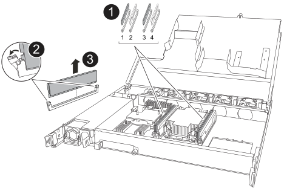

= Remplacez les étagères NSM - NS224
:allow-uri-read: 
:icons: font
:imagesdir: ../media/

[role="lead"]
Vous pouvez remplacer un module de tiroir NVMe (NSM) endommagé, sans interruption dans un tiroir disque NS224 sous tension, et pendant que les E/S sont en cours.

.Avant de commencer
* Le NSM partenaire du tiroir doit être opérationnel et câblé correctement pour que votre tiroir conserve la connectivité lorsque vous retirez le NSM défectueux.
+
https://mysupport.netapp.com/site/tools/tool-eula/activeiq-configadvisor["Téléchargement NetApp : Config Advisor"^]

* Tous les autres composants du système doivent fonctionner correctement.

.Description de la tâche
* Le remplacement du NSM implique le déplacement des éléments suivants :
+
** *Modules NSM100* : modules DIMM, ventilateurs et alimentation de la NSM altérée à la NSM de remplacement.
** *Modules NSM100B* : modules DIMM, ventilateurs, support de démarrage, module d'E/S et alimentation du NSM défectueux au NSM de remplacement.
+
Vous ne déplacez pas la batterie de l'horloge en temps réel (RTC). Ils sont préinstallés dans le NSM de remplacement.

* Laissez un délai d'au moins 70 secondes entre le retrait et l'installation du module de tiroir NVMe (NSM).
+
Cela laisse suffisamment de temps à ONTAP pour traiter l'événement de suppression NSM.

* *Meilleure pratique :* la meilleure pratique consiste à installer sur votre système les versions les plus récentes du firmware du module de tiroir NVMe (NSM) et du firmware du lecteur avant de remplacer les composants FRU.
+
https://mysupport.netapp.com/site/downloads/firmware/disk-shelf-firmware["Téléchargements NetApp : firmware des tiroirs disques"^]

+
https://mysupport.netapp.com/site/downloads/firmware/disk-drive-firmware["Téléchargements NetApp : firmware de disque"^]

+
[NOTE]
====
Ne rétablissez pas le firmware en tant que version qui ne prend pas en charge votre tiroir et ses composants.

====
* Le micrologiciel de tiroir (NSM) est automatiquement mis à jour (sans interruption) sur un nouveau NSM doté d'une version de micrologiciel non à jour.
+
Les vérifications du micrologiciel NSM sont effectuées toutes les 10 minutes. Une mise à jour du micrologiciel NSM peut prendre jusqu'à 30 minutes.

* Si nécessaire, vous pouvez allumer les LED situées à l'emplacement des tiroirs (bleues) pour faciliter l'emplacement physique des tiroirs concernés : `storage shelf location-led modify -shelf-name _shelf_name_ -led-status on`
+
Si vous ne connaissez pas le `shelf_name` sur la tablette concernée, exécutez la `storage shelf show` commande.

+
Un tiroir est doté de trois voyants d'emplacement : un sur le panneau de commande et un sur chaque NSM. Les LED d'emplacement restent allumées pendant 30 minutes. Vous pouvez les désactiver en entrant la même commande, mais en utilisant l' `off`option.

* Lorsque vous déballez le module NSM de remplacement, conservez tous les matériaux d'emballage pour l'utiliser lorsque vous renvoyez le module NSM défectueux.
+
Si vous avez besoin du numéro d'autorisation de renvoi de matériel ou d'une aide supplémentaire pour effectuer la procédure de remplacement, contactez le support technique à l'adresse https://mysupport.netapp.com/site/global/dashboard["Support NetApp"^], 888-463-8277 (Amérique du Nord), 00-800-44-638277 (Europe) ou +800-800-80-800 (Asie/Pacifique).

[role="tabbed-block"]
====
.Modules NSM100
--
Vous pouvez utiliser l'animation suivante ou les étapes écrites pour remplacer un NSM.

.Remplacez un NSM dans un shelf NS224
video::f57693b3-b164-4014-a827-aa86002f4b34[panopto]
.Étapes
. Mettez-vous à la terre.
. Identifiez physiquement le NSM altéré.
+
Le système enregistre un message d'avertissement sur la console du système pour indiquer quel module est défaillant. En outre, la LED attention (orange) sur le panneau d'affichage de l'opérateur de la tablette du disque et le module détérioré s'allument.

. Déconnectez le câblage du NSM défectueux :
+
.. Déconnectez le cordon d'alimentation du bloc d'alimentation en ouvrant le dispositif de retenue du cordon d'alimentation s'il s'agit d'un bloc d'alimentation CA, ou en dévissant les deux vis à pouce s'il s'agit d'un bloc d'alimentation CC, puis débranchez le cordon d'alimentation du bloc d'alimentation.
+
Les blocs d'alimentation n'ont pas de commutateur d'alimentation.

.. Déconnectez le câblage de stockage des ports NSM.
+
Notez les ports NSM auxquels chaque câble est connecté. Vous reconnectez les câbles aux mêmes ports sur le NSM de remplacement, plus loin dans cette procédure.

. Retirez le NSM de l'étagère :
+
.. Faites passer vos index dans les trous des doigts des mécanismes de verrouillage de chaque côté du NSM.
+

NOTE: Si vous retirez le NSM inférieur et si le rail inférieur bloque l'accès aux mécanismes de verrouillage, placez vos index à travers les trous de doigt de l'intérieur (en croisant les bras).

.. À l'aide de vos pouces, appuyez sur les languettes orange et maintenez-les enfoncées au-dessus des mécanismes de verrouillage.
+
Les mécanismes de verrouillage se relèvent, en libérant les goupilles de verrouillage de la tablette.

.. Tirez doucement jusqu'à ce que le NSM se trouve à environ un tiers de l'étagère, saisissez les côtés du NSM avec les deux mains pour soutenir son poids, puis placez-le sur une surface plane et stable.
+
Lorsque vous commencez à tirer, les bras du mécanisme de verrouillage s'étendent de la NSM et se verrouillent en position complètement déployée.

. Déballez le NSM de rechange et placez-le sur une surface plane près du NSM défectueux.
. Ouvrez le capot du NSM défectueux et le NSM de remplacement en desserrant la vis à molette sur chaque capot.
+

NOTE: L'étiquette FRU sur le capot NSM indique l'emplacement des modules DIMM et des ventilateurs.

. Déplacez les modules DIMM du NSM défaillant vers le NSM de remplacement :
+
.. Notez l'orientation des modules DIMM dans les emplacements de sorte que vous puissiez insérer les modules DIMM dans le NSM de remplacement en suivant la même orientation.
.. Éjectez un module DIMM de son logement en écartant lentement les languettes de l'éjecteur aux deux extrémités du logement DIMM, puis en soulevant le module DIMM pour le sortir de son logement.
+

NOTE: Tenez soigneusement le module DIMM par les coins ou les bords pour éviter toute pression sur les composants de la carte de circuit DIMM. Les languettes de l'éjecteur restent en position ouverte.

.. Tenez le module DIMM par les coins, puis insérez-le d'équerre dans un emplacement sur le module NSM de remplacement.
+
L'encoche située au bas du DIMM, entre les broches, doit être alignée avec la languette dans le logement.

+
Lorsqu'il est correctement inséré, le module DIMM doit être inséré facilement, mais bien inséré dans le logement. Si ce n'est pas le cas, réinsérez le module DIMM.

.. Poussez doucement, mais fermement, sur le bord supérieur du DIMM jusqu'à ce que les languettes de l'éjecteur s'enclenchent sur les encoches aux deux extrémités du DIMM.
.. Répétez les sous-étapes 7a à 7d pour les modules DIMM restants.

. Déplacez les ventilateurs du NSM défectueux vers le NSM de remplacement :
+
.. Saisissez fermement un ventilateur des côtés, à l'emplacement des points de contact bleus, puis soulevez-le verticalement pour le déconnecter de la prise.
+
Vous devrez peut-être basculer doucement le ventilateur vers l'avant pour le débrancher avant de le soulever.

.. Alignez le ventilateur avec les guides du module NSM de remplacement, puis poussez-le vers le bas jusqu'à ce que le connecteur du module de ventilateur soit complètement inséré dans le support.
.. Répétez les sous-étapes 8a et 8b pour les ventilateurs restants.

. Fermez le capot de chaque NSM, puis serrez chaque vis à molette.
. Déplacez le bloc d'alimentation du NSM défectueux vers le NSM de remplacement :
+
.. Faites pivoter la poignée vers le haut, jusqu'à sa position horizontale, puis saisissez-la.
.. Avec votre pouce, appuyez sur la languette bleue pour libérer le mécanisme de verrouillage.
.. Retirez le bloc d'alimentation du NSM tout en utilisant votre autre main pour soutenir son poids.
.. À l'aide des deux mains, soutenez et alignez les bords du bloc d'alimentation avec l'ouverture du NSM de remplacement.
.. Poussez doucement le bloc d'alimentation dans le NSM jusqu'à ce que le mécanisme de verrouillage s'enclenche.
+

NOTE: N'utilisez pas de force excessive et vous risquez d'endommager le connecteur interne.

.. Faites pivoter la poignée vers le bas pour qu'elle ne fonctionne pas normalement.

. Insérez le NSM de remplacement dans l'étagère :
+
.. S'assurer que les bras du mécanisme de verrouillage sont verrouillés en position complètement sortie.
.. Faites glisser doucement le NSM dans l'étagère à deux mains jusqu'à ce que le poids du NSM soit entièrement supporté par l'étagère.
.. Poussez le NSM dans la tablette jusqu'à ce qu'il s'arrête (à environ un demi pouce de l'arrière de la tablette).
+
Vous pouvez placer vos pouces sur les languettes orange à l'avant de chaque boucle de doigt (des bras du mécanisme de verrouillage) pour enfoncer le NSM.

.. Faites passer vos index dans les trous des doigts des mécanismes de verrouillage de chaque côté du NSM.
+

NOTE: Si vous insérez le NSM inférieur et si le rail inférieur bloque l'accès aux mécanismes de verrouillage, placez vos index à travers les trous de doigt de l'intérieur (en croisant les bras).

.. À l'aide de vos pouces, appuyez sur les languettes orange et maintenez-les enfoncées au-dessus des mécanismes de verrouillage.
.. Poussez doucement vers l'avant pour placer les loquets au-dessus de la butée.
.. Libérez vos pouces des haut des mécanismes de verrouillage, puis continuez à pousser jusqu'à ce que les mécanismes de verrouillage s'enclenchent.
+
Le NSM doit être complètement inséré dans l'étagère et aligné avec les bords de l'étagère.

. Reconnectez le câblage au NSM :
+
.. Reconnectez le câblage de stockage aux deux mêmes ports NSM.
+
Les câbles sont insérés avec la languette de retrait du connecteur orientée vers le haut. Lorsqu'un câble est inséré correctement, il s'enclenche.

.. Rebranchez le cordon d'alimentation sur le bloc d'alimentation, puis fixez-le à l'aide du dispositif de retenue du cordon d'alimentation s'il s'agit d'un bloc d'alimentation CA, ou serrez les deux vis à molette s'il s'agit d'un bloc d'alimentation CC.
+
Lorsqu'elle fonctionne correctement, la LED bicolore d'un bloc d'alimentation s'allume en vert.

+
En outre, les deux LED LNK (vertes) du port NSM s'allument. Si un voyant LNK ne s'allume pas, réinstallez le câble.

. Vérifiez que la LED attention (orange) du panneau de l'opérateur de la tablette n'est plus allumée.
+
La LED d'avertissement du panneau d'affichage de l'opérateur s'éteint après le redémarrage du NSM. Cela peut prendre trois à cinq minutes.

. Vérifiez que le NSM est correctement câblé en exécutant Active IQ Config Advisor.
+
Si des erreurs de câblage sont générées, suivez les actions correctives fournies.

+
https://mysupport.netapp.com/site/tools/tool-eula/activeiq-configadvisor["Téléchargement NetApp : Config Advisor"^]

. Vérifiez que les deux modules NSM du tiroir exécutent la même version de firmware : version 0200 ou ultérieure.

--
.Modules NSM100B
--
.Étapes
. Mettez-vous à la terre.
. Identifiez physiquement le NSM altéré.
+
Le système enregistre un message d'avertissement sur la console du système pour indiquer quel module est défaillant. En outre, la LED attention (orange) sur le panneau d'affichage de l'opérateur de la tablette du disque et le module détérioré s'allument.

. Déconnectez le câblage du NSM défectueux :
+
.. Déconnectez le cordon d'alimentation du bloc d'alimentation en ouvrant le dispositif de retenue du cordon d'alimentation s'il s'agit d'un bloc d'alimentation CA, ou en dévissant les deux vis à pouce s'il s'agit d'un bloc d'alimentation CC, puis débranchez le cordon d'alimentation du bloc d'alimentation.
+
Les blocs d'alimentation n'ont pas de commutateur d'alimentation.

.. Déconnectez le câblage de stockage des ports NSM.
+
Notez les ports NSM auxquels chaque câble est connecté. Vous reconnectez les câbles aux mêmes ports sur le NSM de remplacement, plus loin dans cette procédure.

. Déposer le NSM :
+
image::../media/drw_g_and_t_handles_remove_ieops-1837.svg[Retirez le NSM.]

+
[cols="1,4"]
|===

 a| 
image::../media/icon_round_1.png[Légende numéro 1]
 a| 
Aux deux extrémités du NSM, poussez les languettes de verrouillage verticales vers l'extérieur pour libérer les poignées.

 a| 
image::../media/icon_round_2.png[Légende numéro 2]
 a| 
** Tirez les poignées vers vous pour détacher le NSM du fond de panier central.
+
Lorsque vous tirez, les poignées sortent du shelf. Lorsque vous ressentez une certaine résistance, continuez à tirer.

** Faites glisser le NSM hors de la tablette et placez-le sur une surface plane et stable.
+
Assurez-vous de soutenir le bas du NSM lorsque vous le faites glisser hors de l'étagère.

 a| 
image::../media/icon_round_3.png[Numéro de légende 3]
 a| 
Faites pivoter les poignées vers le haut (à côté des languettes) pour les écarter.

|===
. Déballez le NSM de rechange et placez-le sur une surface plane près du NSM défectueux.
. Ouvrez les capots des deux NSM en desserrant la vis à molette sur chaque capot.
. Déplacez les modules DIMM du NSM défectueux vers le NSM de remplacement :
+
.. Retirez le module DIMM du NSM défectueux :
+

+
[cols="1,4"]
|===

 a| 
image::../media/icon_round_1.png[Légende numéro 1]
 a| 
Numérotation et positions des emplacements DIMM.

Le NSM contient des modules DIMM dans les emplacements 1 et 3, et des modules DIMM dans les emplacements 2 et 4.

 a| 
image::../media/icon_round_2.png[Légende numéro 2]
 a| 
*** Notez l'orientation du module DIMM dans le support de manière à pouvoir l'insérer dans le module DIMM de remplacement dans le même sens.
*** Éjectez le module DIMM défectueux en écartant lentement les deux pattes d'éjection du module DIMM situées aux deux extrémités du logement DIMM.

IMPORTANT: Tenez soigneusement le module DIMM par les coins ou les bords pour éviter toute pression sur les composants de la carte de circuit DIMM.

 a| 
image::../media/icon_round_3.png[Numéro de légende 3]
 a| 
Soulevez le module DIMM et retirez-le de son logement.

Les languettes de l'éjecteur restent en position ouverte.

|===
.. Installez le module DIMM dans le module NSM de remplacement :
+
... Tenez le DIMM par les coins, puis insérez-le à l'équerre dans un logement.
+
L'encoche située au bas du DIMM, entre les broches, doit être alignée avec la languette dans le logement.

+
Lorsqu'il est correctement inséré, le module DIMM doit être inséré facilement, mais bien inséré dans le logement. Si ce n'est pas le cas, réinsérez le module DIMM.

... Poussez doucement, mais fermement, sur le bord supérieur du DIMM jusqu'à ce que les languettes de l'éjecteur s'enclenchent sur les encoches aux deux extrémités du DIMM.
... Répétez l'opération pour l'autre module DIMM.

. Déplacez tous les ventilateurs du NSM défectueux vers le NSM de remplacement :
+
image::../media/drw_t_fan_replace_ieops-1979.svg[Retirez le ventilateur défectueux.]

+
[cols="1,4"]
|===

 a| 
image::../media/icon_round_1.png[Légende numéro 1]
 a| 
Retirez le ventilateur défectueux en saisissant fermement les côtés où se trouvent les points de contact bleus, puis tirez-le vers le haut pour le sortir de son support.

 a| 
image::../media/icon_round_1.png[Légende numéro 2]
 a| 
Insérez le ventilateur de remplacement en l'alignant dans les guides, puis poussez-le vers le bas jusqu'à ce que le connecteur du ventilateur soit complètement inséré dans le support.

|===
. Déplacez le support de démarrage vers le NSM de remplacement :
+
.. Retirez le support de démarrage du NSM défectueux :
+
image::../media/drw_t_boot_media_replace_ieops-1977.svg[Retirez le support de démarrage.]

+
[cols="1,4"]
|===

 a| 
image::../media/icon_round_1.png[Légende numéro 1]
 a| 
Emplacement du support de démarrage

 a| 
image::../media/icon_round_2.png[Légende numéro 2]
 a| 
Appuyez sur la languette bleue pour libérer l'extrémité droite du support de démarrage.

 a| 
image::../media/icon_round_3.png[Numéro de légende 3]
 a| 
Soulevez légèrement l'extrémité droite du support de démarrage pour obtenir une bonne prise sur les côtés du support de démarrage.

 a| 
image::../media/icon_round_4.png[Numéro de légende 4]
 a| 
Retirez délicatement l'extrémité gauche du support de démarrage de son support.

|===
.. Installez le support de démarrage dans le NSM de remplacement :
+
... Alignez les bords du support de démarrage avec le logement du support dans le NSM de remplacement, puis poussez-le doucement d'équerre dans le support.
... Faites pivoter le support de démarrage vers le bas, vers le bouton de verrouillage.
... Appuyez sur le bouton de verrouillage, faites pivoter le support de démarrage complètement vers le bas, puis relâchez le bouton de verrouillage.

. Déplacez le module d'E/S du NSM défaillant vers le NSM de remplacement.
+
.. Retirez le module d'E/S du NSM défectueux :
+
image::../media/drw_t_io_module_replace_ieops-1980.svg[Remplacez le module d'E/S.]

+
[cols="1,4"]
|===

 a| 
image::../media/icon_round_1.png[Légende numéro 1]
 a| 
Tournez la vis moletée du module d'E/S dans le sens inverse des aiguilles d'une montre pour la desserrer.

 a| 
image::../media/icon_round_2.png[Légende numéro 2]
 a| 
Retirez le module d'E/S du NSM à l'aide de la languette d'étiquette de port située à gauche et de la vis à molette.

|===
.. Installez le module d'E/S dans le NSM de remplacement :
+
... Alignez le module d'E/S avec les bords du logement du NSM de remplacement.
... Poussez doucement le module d'E/S à fond dans le logement, en veillant à ce qu'il soit correctement inséré dans le connecteur.
+
Vous pouvez utiliser la languette de gauche et la vis moletée pour enfoncer le module d'E/S.

. Fermez le capot de chaque NSM, puis serrez chaque vis à molette.
. Déplacez le bloc d'alimentation du NSM défectueux vers le NSM de remplacement :
+
.. Faites pivoter la poignée vers le haut, jusqu'à sa position horizontale, puis saisissez-la.
.. Avec le pouce, appuyez sur la languette bleue (PSU CA) ou la languette en terre cuite (PSU CC) pour libérer le mécanisme de verrouillage.
.. Retirez le bloc d'alimentation du NSM tout en utilisant votre autre main pour soutenir son poids.
.. À l'aide des deux mains, soutenez et alignez les bords du bloc d'alimentation avec l'ouverture du NSM de remplacement.
.. Poussez doucement le bloc d'alimentation dans le NSM jusqu'à ce que le mécanisme de verrouillage s'enclenche.
+

NOTE: N'utilisez pas de force excessive et vous risquez d'endommager le connecteur interne.

.. Faites pivoter la poignée vers le bas pour qu'elle ne fonctionne pas normalement.

. Insérez le NSM dans l'étagère :
+
image::../media/drw_g_and_t_handles_reinstall_ieops-1838.svg[Remplacer le NSM.]

+
[cols="1,4"]
|===

 a| 
image::../media/icon_round_1.png[Légende numéro 1]
 a| 
Si vous avez fait pivoter les poignées NSM vers le haut (à côté des languettes) pour les écarter pendant que vous effectuez l'entretien du NSM, faites-les pivoter vers le bas jusqu'à la position horizontale.

 a| 
image::../media/icon_round_2.png[Légende numéro 2]
 a| 
Alignez l'arrière du NSM avec l'ouverture de l'étagère, puis poussez doucement le NSM à l'aide des poignées jusqu'à ce qu'il soit bien en place.

 a| 
image::../media/icon_round_3.png[Numéro de légende 3]
 a| 
Faites pivoter les poignées en position verticale et verrouillez-les en place à l'aide des languettes.

|===
. Reconnectez le câblage au NSM :
+
.. Reconnectez le câblage de stockage aux deux mêmes ports NSM.
+
Les câbles sont insérés avec la languette de retrait du connecteur orientée vers le haut. Lorsqu'un câble est inséré correctement, il s'enclenche.

.. Rebranchez le cordon d'alimentation sur le bloc d'alimentation, puis fixez-le à l'aide du dispositif de retenue du cordon d'alimentation s'il s'agit d'un bloc d'alimentation CA, ou serrez les deux vis à molette s'il s'agit d'un bloc d'alimentation CC.
+
Lorsqu'elle fonctionne correctement, la LED bicolore d'un bloc d'alimentation s'allume en vert.

+
En outre, les deux LED LNK (vertes) du port NSM s'allument. Si un voyant LNK ne s'allume pas, réinstallez le câble.

. Vérifiez que la LED attention (orange) du panneau de l'opérateur de la tablette n'est plus allumée.
+
La LED d'avertissement du panneau d'affichage de l'opérateur s'éteint après le redémarrage du NSM. Cela peut prendre trois à cinq minutes.

. Vérifiez que le NSM est correctement câblé en exécutant Active IQ Config Advisor.
+
Si des erreurs de câblage sont générées, suivez les actions correctives fournies.

+
https://mysupport.netapp.com/site/tools/tool-eula/activeiq-configadvisor["Téléchargement NetApp : Config Advisor"^]

. Vérifiez que les deux modules NSM du tiroir exécutent la même version de firmware : version 0300 ou ultérieure.

--
====