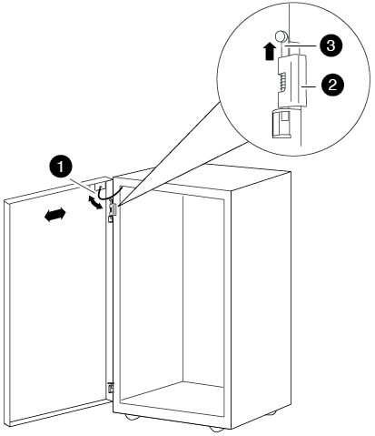

= Installez le kit d'interconnexion de l'armoire
:allow-uri-read: 
:icons: font
:imagesdir: ../media/

[role="lead"]
Vous pouvez connecter les armoires système ensemble en utilisant le kit d'interconnexion d'armoire en option. Il est recommandé d'installer le kit pour éviter que les armoires ne se déséparent et n'endommagent les câbles du système.

. Placez les armoires système à proximité.
+
Les armoires doivent être organisées de la même manière que l'illustration suivante, avec l'armoire dont les modules de contrôleur sont au centre, et les armoires contenant des tiroirs disques supplémentaires de chaque côté. Les côtés des armoires doivent être fermés, mais il n'est pas nécessaire de se toucher les uns les autres pour le moment.

+
image::../media/drw_fcc_cabinet_ordering.png[L'illustration est décrite dans le texte environnant.]

. Si vous installez le kit d'interconnexion avec les panneaux latéraux comme recommandé, réinstallez les panneaux latéraux qui ont été retirés pendant le déballage :
+
.. Soulevez le panneau latéral, inclinez-le à environ 15 degrés du bas de l'armoire système, puis suspendez-le par-dessus la lèvre en haut du cadre de l'armoire système.
.. Poussez doucement le panneau latéral contre le cadre de l'armoire, puis verrouillez-le à l'aide de la clé.
.. Répétez ces sous-étapes pour les autres panneaux latéraux.

. Si vous installez le kit d'interconnexion avec les panneaux latéraux retirés, retirez la porte avant dont les charnières se trouvent sur le bord où les armoires se rencontrent :
+
.. Déverrouillez et ouvrez la porte avant qui est retirée.
.. Reportez-vous à l'illustration suivante pour débrancher l'alimentation du cadre lumineux :
+
image::../media/drw_sys_cab_remove_brimstone_back_banel.png[Comment débrancher l'alimentation du cadre lumineux]

+
|===

 a| 
image:../media/icon_round_1.png["Légende numéro 1"]

 a| 
Carte de circuit imprimé et câble du cadre lumineux

 a| 
image:../media/icon_round_2.png["Légende numéro 2"]

 a| 
Panneau arrière et vis moletées

|===
.. Pour vous reporter à la dépose de la porte avant, reportez-vous à l'illustration suivante :
+

+
|===

 a| 
image:../media/icon_round_1.png["Légende numéro 1"]

 a| 
Câble de mise à la terre de porte

 a| 
image:../media/icon_round_2.png["Légende numéro 2"]

 a| 
Charnière supérieure de porte

 a| 
image:../media/icon_round_3.png["Numéro de légende 3"]

 a| 
Axe de charnière

|===
+
Assurez-vous de placer les portes retirées dans un endroit sûr pour qu'elles ne soient pas endommagées accidentellement.

. Retirez la porte arrière dont les charnières se trouvent sur le bord de la fermeture des armoires :
+
.. Déverrouillez et ouvrez la porte arrière que vous retirez.
.. Soulevez l'axe de charnière supérieur jusqu'à ce qu'il se dégage du fond de la charnière.
.. Inclinez doucement le haut de la porte pour l'éloigner du cadre de l'armoire système, puis libérez la goupille de charnière.
.. Soulevez la porte pour la dégager de la charnière inférieure, puis mettez la porte de côté.

. Déplacez complètement les armoires du système, puis alignez-les et mettez-les de niveau en ajustant les quatre pieds au bas des armoires du système.
. Installez les supports d'interconnexion.
+
** Utilisez l'illustration suivante pour vous référer si vous installez les supports d'interconnexion avec les panneaux latéraux de l'armoire système, comme recommandé : image:../media/drw_syscab_interconnect_bracket_side_panels_on.gif["Comment installer les supports d'interconnexion avec les panneaux latéraux de l'armoire système sur"]

+
|===

 a| 
image:../media/icon_round_1.png["Légende numéro 1"]

 a| 
Rivets à enfoncer en plastique sur le dessus de l'armoire du système

 a| 
image:../media/icon_round_2.png["Légende numéro 2"]

 a| 
Support d'interconnexion supérieur

 a| 
image:../media/icon_round_3.png["Numéro de légende 3"]

 a| 
Support d'interconnexion inférieur

|===
+
** Reportez-vous à l'illustration suivante pour vous référer si vous installez les supports d'interconnexion avec les panneaux latéraux de l'armoire système désactivés : image:../media/drw_syscab_interconnect_bracket_side_panels_off.gif["Comment installer les supports d'interconnexion avec les panneaux latéraux de l'armoire système désactivés"]

. Répétez la procédure pour les autres armoires système.
. Serrer toutes les vis du support d'interconnexion.

