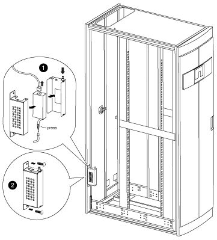

= Déplacez l'alimentation et le câblage du badge
:allow-uri-read: 
:icons: font
:imagesdir: ../media/

[role="lead"]
Vous devez déplacer le bloc d'alimentation et le câblage du badge lumineux sur le côté opposé du cadre de l'armoire système avant de retourner la porte et de réinstaller le badge lumineux.

Vous devez avoir retiré la porte et les panneaux latéraux de l'armoire système.

Vous devez déplacer l'alimentation, le câble d'alimentation et le conduit de câblage du badge lumineux vers l'autre côté de l'armoire système lorsque vous inversez la porte de l'armoire système. L'ensemble est conçu de manière à ce que le câble du badge se trouve sur le côté de l'armoire où est installée la charnière de porte.

. Ouvrez le clip de fixation du câble d'alimentation, puis débranchez le câble d'alimentation du bloc d'alimentation.
. Retirez le boîtier d'alimentation et le bloc d'alimentation en vous référant à l'illustration :
+

+
.. Soulevez la goupille de retenue du carter d'alimentation, puis retirez le couvercle du carter en le faisant pivoter vers le bas et en le soulevant hors du carter d'alimentation arrière.
+

NOTE: Le bloc d'alimentation est fixé au boîtier du bloc d'alimentation avec un crochet et un raccord en boucle.

.. Débranchez le bloc d'alimentation du câble du badge allumé, puis réglez le capot du bloc d'alimentation et du bloc d'alimentation sur le côté.
.. Retirez les vis du haut et du bas du boîtier du bloc d'alimentation qui est fixé au châssis de l'armoire du système, puis retirez le boîtier du bloc d'alimentation.

. Installez le boîtier du bloc d'alimentation et du bloc d'alimentation sur le côté opposé de l'armoire du système :
+
.. Repérez les deux trous de vis situés l'un à côté de l'autre sur le châssis de l'armoire, puis fixez le haut du boîtier du bloc d'alimentation à la partie inférieure la plus large des deux trous de vis.
+

NOTE: Vous devrez peut-être retirer la sangle de retenue du câble inférieure, le cas échéant.

.. Fixez la partie inférieure du boîtier du bloc d'alimentation sur le châssis de l'armoire du système.
.. Installez le couvercle du bloc d'alimentation et le bloc d'alimentation en alignant les crochets du capot avec le bloc d'alimentation, en tirant le plongeur vers le haut sur le couvercle, en faisant tourner le plongeur fermé, puis en relâchant le plongeur.

. Retirez le conduit d'alimentation du cadre en retirant les agrafes de retenue du conduit des clips de fixation, puis faites glisser le conduit hors du câble d'alimentation.
+
Conservez les agrafes et les vis de fixation pour installer le conduit sur le côté opposé de l'armoire.

+
image::../media/drw_sys_cab_bezel_power_conduit_ozeki.gif[Retirez le conduit du bloc d'alimentation du cadre]

. Déplacez le câble d'alimentation du badge de l'autre côté de l'armoire :
+
image::../media/drw_sys_cab_bezel_power_cable_move.gif[Comment déplacer le câble d'alimentation du badge vers l'autre côté de l'armoire]

+
.. Faites pivoter le dispositif de retenue du câble en caoutchouc de l'armoire de 180° vers la droite, retirez-le du cadre de l'armoire du système, puis tirez doucement le câble hors de l'armoire du système.
.. Déplacez le câble de l'autre côté de l'armoire, puis faites-le passer complètement dans le trou situé près du haut de l'armoire.
.. Alignez la retenue du câble en caoutchouc avec le trou du châssis, poussez-la aussi loin que possible, puis faites tourner la retenue du câble de 180° vers la gauche pour la fixer.
.. Faites passer le câble le long du cadre de l'armoire à l'arrière de l'armoire.

. Réinstallez le conduit de câble :
+
.. Faites glisser le conduit sur le câble d'alimentation de l'unité de distribution électrique et acheminez le conduit le long du cadre de l'armoire système vers l'unité de distribution électrique.
.. Installez les agrafes de retenue du conduit de l'autre côté de l'armoire sur le conduit pour le fixer au châssis de l'armoire.

. Rebranchez le câble du badge sur le bloc d'alimentation, mais ne rebranchez pas le bloc d'alimentation.

