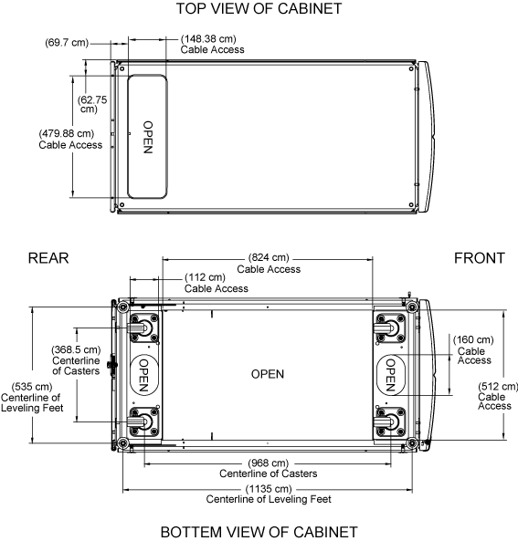

= Espace requis et dimensions de l'armoire du système
:allow-uri-read: 
:icons: font
:imagesdir: ../media/

[role="lead"]
Lors du déballage de votre armoire système, assurez-vous que vous disposez de suffisamment d'espace pour retirer l'armoire système du matériel d'emballage. Assurez-vous également que l'emplacement prévu pour l'armoire système est suffisamment grand pour que vous puissiez déplacer l'armoire en place.

== Espace requis pour le déballage de l'armoire système

Le tableau suivant définit l'espace requis pour le déballage et l'installation de votre armoire système :

[cols="2,1,1"]
|===
| Dimensions | ÉTATS-UNIS | Métrique 

 a| 
Longueur de la rampe d'expédition
 a| 
80 po
 a| 
203.2 cm

 a| 
Dégagement au-delà de la rampe pour la mobilité de l'armoire
 a| 
72 po
 a| 
182.9 cm

 a| 
Profondeur palette d'expédition
 a| 
59 po
 a| 
149.9 cm

 a| 
Largeur de palette d'expédition
 a| 
42 po
 a| 
106.6 cm

 a| 
Palette d'expédition et hauteur d'emballage
 a| 
86 po
 a| 
218.4 cm

 a| 
Espace rack total, 42U
 a| 
73.5 po
 a| 
186.7 cm

 a| 
Capacité de charge du rail
 a| 
Prend en charge tous les systèmes actuels
 a| 
Prend en charge tous les systèmes actuels

 a| 
Poids à vide
 a| 
~400 lb (~181 kg) lb
 a| 
~ 181 kg

 a| 
Poids du navire entièrement chargé
 a| 
Jusqu'à 1,800 lb
 a| 
Jusqu'à 816.5 kg

 a| 
Poids statique entièrement chargé
 a| 
Jusqu'à 2,700 lb
 a| 
Jusqu'à 1,224.7 kg

 a| 
Autorisation d'entretien avant
 a| 
47.2 po
 a| 
120 cm

 a| 
Jeu d'entretien arrière *Remarque :* la porte arrière est divisée. Le jeu arrière minimum réel est d'environ 1/2 recommandations.
 a| 
30 po
 a| 
76.3 cm

 a| 
Jeu latéral minimum pour la dépose du panneau
 a| 
24 po
 a| 
61 cm

 a| 
Jeu minimum sur le dessus
 a| 
12 po
 a| 
30 cm

|===

== Dimensions extérieures de l'armoire du système

L'illustration suivante montre les vues avant, arrière et latérale de l'armoire du système :

image::../media/drw_sys_cab_side_front_dimensions_ozeki.gif[dimensions avant du système drw, côté cabine, ozeki]

Les illustrations suivantes présentent les vues du haut et du bas de l'armoire du système et identifient les ouvertures permettant de faire passer des faisceaux de câbles du plancher de votre centre de données dans l'armoire du système. Les illustrations montrent également l'emplacement des roulettes et des pieds de mise à niveau de l'armoire du système.

AVERTISSEMENT :

Pour éviter que l'armoire du système ne tombe dans le plancher du centre de données, n'essayez pas de faire rouler l'armoire du système au-dessus d'une ouverture au sol plus large que l'ouverture d'accès aux câbles au bas de l'armoire du système.

