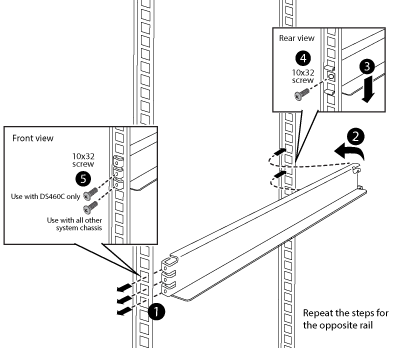
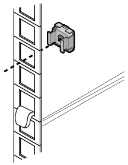

= Installer des rails de support supplémentaires
:allow-uri-read: 
:icons: font
:imagesdir: ../media/

[role="lead"]
Certaines rails de support sont déjà installés dans votre armoire système. Si vous avez besoin de rails de support supplémentaires pour votre système, vous devez les installer avant d'installer les composants de votre système.

Cette tâche s'applique à tous les contrôleurs et tiroirs disques, à l'exception des tiroirs disques DS212C et DE212C. Suivez les instructions fournies dans le prospectus du kit de rails applicables à ces deux tiroirs disques.

https://["Installation d'un étagère DE212C ou DS212C dans un rack à deux ou quatre montants"]

. Déterminez l'espace requis pour votre équipement.
+
Calculez la quantité d'espace en U (1.75 pouces par U) dont l'équipement a besoin, en fonction de la hauteur de l'équipement, puis déterminez l'emplacement de l'équipement à installer dans l'armoire système en fonction de l'espace disponible.

. Localisez l'endroit où vous devez installer les rails de support, puis installez-les à l'aide de l'illustration suivante pour référence :
+

. Si les brides de fixation de votre équipement dépassent des trous de vis du rail de support, installez les écrous de cage au-dessus du rail de support, le cas échéant.
+

