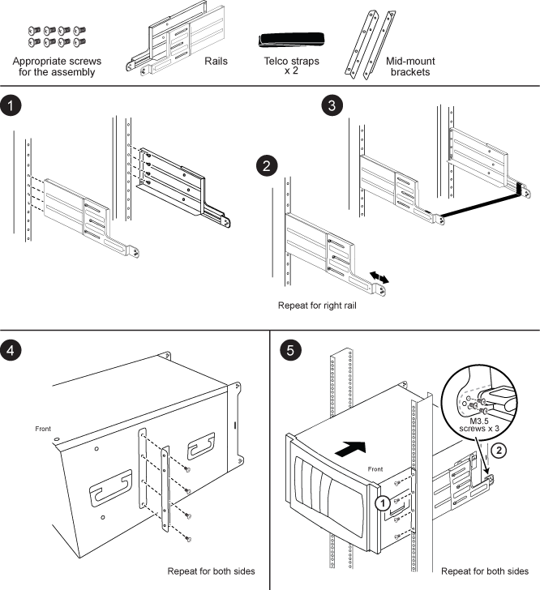

= Instructions d'installation du kit de rails de support à deux montants - AFF A700 et FAS9000
:allow-uri-read: 
:icons: font
:imagesdir: ../media/

[role="lead"]
Deux kits de rails de support à deux montants peuvent être utilisés avec les systèmes FAS9000 et AFF A700. Un kit vous permet de monter votre système dans le rack à deux montants et l'autre vous permet de le monter au milieu du système dans le rack à deux montants.

== Installez le kit de rails centraux à deux montants

== Installez le kit de rails encastrables à deux montants

image::../media/drw_telco_front_mount_1.png[Comment installer le kit de rails à montage encastré à deux montants]
