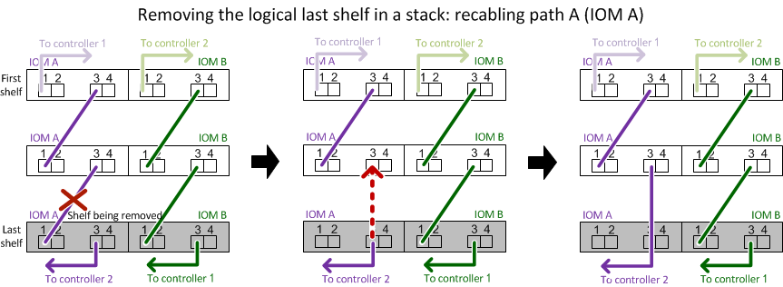

= Retirez à chaud une étagère - étagères avec modules IOM12/IOM12B
:allow-uri-read: 
:icons: font
:imagesdir: ../media/

[role="lead"]
Vous pouvez retirer à chaud un tiroir disque avec des modules IOM12/IOM12B (sans interruption de l'activité, retirer un tiroir disque d'un système sous tension et en E/S) lorsque vous devez déplacer ou remplacer un tiroir disque. Vous pouvez supprimer à chaud un ou plusieurs tiroirs disques n'importe où dans une pile de tiroirs disques ou en supprimer une pile de tiroirs disques.

.Avant de commencer
* Votre système doit être une configuration à chemins d'accès multiples, haute disponibilité à trois chemins, chemins d'accès multiples, quatre chemins d'accès haute disponibilité ou quatre chemins.
+
Dans le cas des plateformes avec stockage interne, le stockage externe doit être câblé en tant que multivoie haute disponibilité, triple chemin ou chemins d'accès multiples.

+

NOTE: Pour un système FAS2600 à contrôleur unique doté du stockage externe câblé avec une connectivité multivoie, le système présente une configuration à chemins d'accès multiples, car le stockage interne utilise la connectivité à chemin unique.

* Votre système ne peut pas comporter de messages d'erreur de câblage SAS.
+
Vous pouvez télécharger et exécuter Active IQ Config Advisor pour afficher tous les messages d'erreur de câblage SAS et les actions correctives que vous devez effectuer.

+
https://mysupport.netapp.com/site/tools["Téléchargement NetApp : Config Advisor"^]

* Les configurations de paires HA ne peuvent pas être dans un état de basculement.
* Vous devez avoir supprimé tous les agrégats des disques (les disques doivent être de rechange) des tiroirs disques que vous supprimez.
+

NOTE: Pour tenter cette procédure avec des agrégats du tiroir disque que vous retirez, le système risque de tomber en panne après une incident de plusieurs disques.

+
Vous pouvez utiliser le `storage aggregate offline -aggregate _aggregate_name_` et ensuite le `storage aggregate delete -aggregate _aggregate_name_` commande.

* Si vous retirez un ou plusieurs tiroirs disques d'une pile, vous devez avoir pris en compte la distance séparant les tiroirs disques que vous retirez. Par conséquent, si les câbles actuels ne sont pas assez longs, vous devez disposer de câbles plus longs.

.Description de la tâche
* *Meilleure pratique :* la meilleure pratique consiste à supprimer les droits de propriété des disques après le retrait des agrégats des disques des tiroirs disques que vous retirez.
+
La suppression des informations de propriété d'un lecteur de disque de réserve permet d'intégrer correctement le lecteur de disque à un autre nœud (si nécessaire).

[NOTE]
====
La procédure de suppression de propriété sur les disques durs exige que vous désactiviez l'affectation automatique de propriété de disque. Vous réactivez l'affectation automatique de la propriété de disque à la fin de cette procédure.

https://docs.netapp.com/us-en/ontap/disks-aggregates/index.html["Présentation des disques et des agrégats"^]

====
* Pour un système clustered ONTAP supérieur à deux nœuds, il est recommandé de réaffectés à une paire haute disponibilité autre que celle qui est en cours de maintenance planifiée.
+
Epsilon reassigning réduit le risque d'erreurs imprévues affectant tous les nœuds d'un système clustered ONTAP. Vous pouvez utiliser les étapes suivantes pour déterminer le nœud qui possède epsilon et reassigner l'epsilon si nécessaire :

+
.. Définissez le niveau de privilège sur avancé : `set -privilege advanced`
.. Déterminer quel nœud contient epsilon : `cluster show`
+
Le nœud qui contient epsilon affiche `true` dans le `Epsilon` colonne. (Les nœuds qui ne contiennent pas epsilon show `false`.)

.. Si le nœud de la paire HA est en cours de maintenance affiche `true` (contient epsilon), puis retirer epsilon du nœud : `cluster modify -node _node_name_ -epsilon false`
.. Assignation d'epsilon à un nœud dans une autre paire haute disponibilité : `cluster modify -node _node_name_ -epsilon true`
.. Retour au niveau de privilège admin : `set -privilege admin`

* Si vous retirez à chaud un tiroir disque d'une pile (mais que vous conservez la pile), vous pouvez le recâter et vérifier un chemin à la fois (chemin A puis chemin B) pour contourner le tiroir disque que vous supprimez afin de maintenir toujours la connectivité à chemin unique des contrôleurs vers la pile.
+

NOTE: Si vous n'maintenez pas la connectivité à chemin unique entre les contrôleurs et la pile lors du retrait de la pile afin de contourner le tiroir disque que vous retirez, vous pouvez tomber en panne du système après un incident comportant plusieurs disques.

* *Dommages possibles aux étagères :* si vous retirez un tiroir DS460C et que vous le déplacez vers une autre partie du centre de données ou le transportez vers un autre emplacement, reportez-vous à la section « déplacement ou transport des étagères DS460C » à la fin de cette procédure.

.Étapes
. Vérifiez que la configuration de votre système est `Multi-Path HA`, `tri-path HA`, `Multi-Path`, `Quad-path HA`, ou `Quad-path` en exécutant le `sysconfig` commande du nodeshell des deux contrôleurs.
+
Une minute peut s'avérer nécessaire pour effectuer la détection par le système.

+
La configuration est répertoriée dans le `System Storage Configuration` légale.

+

NOTE: Pour un système à contrôleur unique de la gamme FAS2600 qui dispose du stockage externe câblé avec une connectivité multivoie, la sortie est affichée comme `mixed-path` car le stockage interne utilise une connectivité à chemin unique.

. Vérifiez que les disques des tiroirs disques que vous supprimez ne disposent d'aucun agrégat (qu'il s'agit de disques de secours) et que la propriété est supprimée :
+
.. Entrez la commande suivante depuis le clustershell de l'un ou l'autre contrôleur : `storage disk show -shelf _shelf_number_`
.. Vérifiez le résultat pour vérifier qu'il n'y a aucun agrégat sur les disques des tiroirs disques que vous supprimez.
+
Les disques sans agrégat possèdent un tiret dans le `Container Name` colonne.

.. Vérifiez que le résultat de la commande est bien retiré des disques des tiroirs disques que vous retirez.
+
Les disques sans propriétaire ont un tiret dans le `Owner` colonne.

+

NOTE: Si des disques défectueux dans le tiroir que vous retirez, ils ont été cassés dans le `Container Type` colonne. (Le disque défectueux n'est pas propriétaire.)

+
Le résultat suivant indique que les disques du tiroir disque en cours de retrait (tiroir disque 3) sont dans un état correct pour le retrait du tiroir disque. Les agrégats sont supprimés sur tous les disques ; un tiret apparaît donc dans la `Container Name` pour chaque lecteur de disque. La propriété est également supprimée sur tous les disques. Par conséquent, un tiret apparaît dans l' `Owner` pour chaque lecteur de disque.

+
[listing]
----
cluster::> storage disk show -shelf 3

           Usable           Disk   Container   Container
Disk         Size Shelf Bay Type   Type        Name       Owner
-------- -------- ----- --- ------ ----------- ---------- ---------
...
1.3.4           -     3   4 SAS    spare                -         -
1.3.5           -     3   5 SAS    spare                -         -
1.3.6           -     3   6 SAS    broken               -         -
1.3.7           -     3   7 SAS    spare                -         -
...
----
. Localisez physiquement les tiroirs disques que vous retirez.
+
Si nécessaire, vous pouvez activer les LED d'emplacement (bleues) du tiroir disque pour faciliter la localisation physique du tiroir disque concerné : `storage shelf location-led modify -shelf-name _shelf_name_ -led-status on`

+

NOTE: Un tiroir disque dispose de trois LED d'emplacement : une sur le panneau d'affichage de l'opérateur et une sur chaque module IOM12. Les LED d'emplacement restent allumées pendant 30 minutes. Vous pouvez les désactiver en entrant la même commande, mais en utilisant l'option Désactivé.

. Si vous supprimez une pile complète de tiroirs disques, procédez comme suit ; sinon, passez à l'étape suivante :
+
.. Retirez tous les câbles SAS du chemin A (IOM A) et du chemin B (IOM B).
+
Cela inclut les câbles entre le contrôleur et le tiroir, ainsi que les câbles entre le tiroir et le tiroir, pour tous les tiroirs disques de la pile que vous retirez.

.. Passez à l'étape 9.

. Si vous retirez un ou plusieurs tiroirs disques d'une pile (mais que vous en gardez la pile), recâble les connexions de la pile de chemin A (IOM A) pour contourner les tiroirs disques que vous supprimez en suivant l'ensemble de sous-étapes applicables :
+
Si vous retirez plusieurs tiroirs disques de la pile, effectuez l'ensemble des sous-étapes applicables à un tiroir disque à la fois.

+

NOTE: Attendez au moins 10 secondes avant de connecter le port. Les connecteurs de câble SAS sont clavetés ; lorsqu'ils sont orientés correctement dans un port SAS, le connecteur s'enclenche et le voyant LNK du port SAS du tiroir disque s'allume en vert. Pour les tiroirs disques, vous insérez un connecteur de câble SAS avec la languette de retrait orientée vers le bas (sous le connecteur).

+
[cols="2*"]
|===
| Si vous supprimez... | Alors... 

 a| 
Tiroir disque depuis l'une des extrémités (premier ou dernier tiroir disque logique) d'une pile
 a| 
.. Retirez tout câblage tiroir à tiroir des ports IOM A du tiroir disque que vous retirez et mettez-les de côté.
.. Débranchez tout câblage du contrôleur à la pile connecté aux ports IOM A du tiroir disque que vous retirez et branchez-les sur les mêmes ports IOM A du tiroir disque suivant de la pile.
+
Le tiroir disque « suivant » peut se trouver au-dessus ou en dessous du tiroir disque que vous supprimez, selon l'extrémité de la pile dont vous retirez le tiroir disque.

 a| 
Un tiroir disque du milieu de la pile, Un tiroir disque du milieu d'une pile, est uniquement connecté aux autres tiroirs disques, et non aux contrôleurs.
 a| 
.. Retirer tout câblage tiroir à tiroir des ports 1 et 2 de l'IOM A ou des ports 3 et 4 du tiroir disque que vous retirez et IOM A du tiroir disque suivant, puis les mettre de côté.
.. Débranchez le câblage restant tiroir à tiroir connecté aux ports IOM A du tiroir disque que vous retirez et branchez-les sur les mêmes ports IOM A du tiroir disque suivant de la pile. Le tiroir disque « suivant » peut se trouver au-dessus ou en dessous du tiroir disque que vous retirez selon les ports IOM A (1 et 2 ou 3 et 4) dont vous avez retiré le câblage.

|===
+
Pour retirer un tiroir disque de l'extrémité d'une pile ou du milieu d'une pile, reportez-vous aux exemples de câblage suivants. Notez les exemples de câblage suivants :

+
** Les modules IOM12/IOM12B sont disposés côte à côte comme dans un tiroir disque DS224C ou DS212C ; si vous disposez d'un DS460C, les modules IOM12/IOM12B sont disposés l'un au-dessus de l'autre.
** Dans chaque exemple, la pile est câblée par un câblage tiroir à tiroir standard, qui est utilisé dans des piles câblées avec une haute disponibilité multivoie, une haute disponibilité à trois chemins ou une connectivité à chemins d'accès multiples.
+
Vous pouvez déduire le câblage de votre pile à l'aide d'une connectivité à quatre chemins haute disponibilité ou à quatre chemins d'accès, qui utilise un câblage à tiroir double.

** Les exemples de câblage montrent la désactivation d'un des chemins : chemin A (IOM A).
+
Vous répétez la désactivation pour le chemin B (IOM B).

** L'exemple de câblage permettant de retirer un tiroir disque de l'extrémité d'une pile illustre la suppression du dernier tiroir disque logique d'une pile câblée par une connectivité haute disponibilité multivoie ou haute disponibilité à trois chemins.
+
Vous pouvez déduire la désactivation si vous supprimez le premier tiroir disque logique d'une pile ou si votre pile dispose d'une connectivité multipath.

+

+
image::../media/drw_hotremove_middle.gif[Retirez à chaud une étagère du milieu d'une pile]

. Vérifiez que vous avez contourné les tiroirs disques que vous retirez et reétablis les connexions de la pile du chemin A (IOM A) correctement : `storage disk show -port`
+
Pour les configurations de paires haute disponibilité, exécutez cette commande depuis le cluster shell de l'un ou l'autre contrôleur. Une minute peut s'avérer nécessaire pour effectuer la détection par le système.

+
Les deux premières lignes de sortie montrent que les disques durs sont dotés d'une connectivité via le chemin A et le chemin B. Les deux dernières lignes de sortie montrent que les disques sont dotés d'une connectivité via un chemin unique, chemin B.

+
[listing]
----
cluster::> storage show disk -port

PRIMARY  PORT SECONDARY      PORT TYPE SHELF BAY
-------- ---- ---------      ---- ---- ----- ---
1.20.0   A    node1:6a.20.0  B    SAS  20    0
1.20.1   A    node1:6a.20.1  B    SAS  20    1
1.21.0   B    -              -    SAS  21    0
1.21.1   B    -              -    SAS  21    1
...
----
. L'étape suivante dépend du `storage disk show -port` sortie de la commande :
+
[cols="2*"]
|===
| Si la sortie affiche... | Alors... 

 a| 
Tous les disques de la pile sont connectés via le chemin A et le chemin B, à l'exception de ceux des tiroirs disques déconnectés, qui ne sont connectés qu'via le chemin B
 a| 
Passez à l'étape suivante.

Vous avez réussi à contourner les tiroirs disques que vous supprimez et reétabli le chemin A sur les disques restants de la pile.

 a| 
Toute autre chose que ce qui précède
 a| 
Répéter les étapes 5 et 6.

Vous devez corriger le câblage.

|===
. Effectuez les sous-étapes suivantes pour les tiroirs disques (dans la pile) que vous supprimez :
+
.. Répétez les étapes 5 à 7 pour le chemin B.
+

NOTE: Lorsque vous répétez l'étape 7 et que vous avez correctement désactivé la pile, vous ne devriez voir que tous les disques restants connectés via les chemins A et B.

.. Répétez l'étape 1 pour vérifier que la configuration de votre système est identique à celle de avant de supprimer un ou plusieurs tiroirs disques d'une pile.
.. Passez à l'étape suivante.

. Si vous avez retiré la propriété des disques (dans le cadre de la préparation de cette procédure), vous avez désactivé l'affectation automatique de propriété du disque, puis la réactivez en entrant la commande suivante ; dans le cas contraire, passez à l'étape suivante : `storage disk option modify -autoassign on`
+
Pour les configurations de paires haute disponibilité, exécutez la commande depuis le clustershell des deux contrôleurs.

. Mettez les tiroirs disques que vous avez déconnectés et débranchez les cordons d'alimentation des tiroirs disques.
. Retirez les tiroirs disques du rack ou de l'armoire.
+
Pour rendre le tiroir disque plus léger et plus facile à manœuvrer, retirez les blocs d'alimentation et les modules d'E/S (IOM).

+
Pour les tiroirs disques DS460C, un tiroir entièrement chargé peut peser environ 112 kg (247 lbs). Soyez donc prudent lors du retrait d'un shelf d'un rack ou d'une armoire.

+

CAUTION: Il est recommandé d'utiliser un lève-personnes mécanisé ou quatre personnes utilisant les poignées de levage pour déplacer en toute sécurité une étagère DS460C.

+
Votre DS460C a été livré avec quatre poignées de levage amovibles (deux pour chaque côté). Pour utiliser les poignées de levage, vous les installez en insérant les languettes des poignées dans les fentes situées sur le côté de la tablette et en poussant jusqu'à ce qu'elles s'enclenchent. Puis, lorsque vous faites glisser le tiroir disque sur les rails, vous détachez un jeu de poignées à la fois à l'aide du loquet. L'illustration suivante montre comment fixer une poignée de levage.

+
image::../media/drw_ds460c_handles.gif[Pose des poignées de levage]

+
Si vous déplacez le tiroir DS460C vers une autre partie du data Center ou si vous le transportez vers un autre emplacement, reportez-vous à la section « déplacement ou transport des tiroirs DS460C ».

.Déplacement ou transport des étagères DS460C
Si vous déplacez un tiroir DS460C vers une autre partie du data Center ou si le tiroir est déplacé à un emplacement différent, il est nécessaire de retirer les disques des tiroirs disques pour éviter d'endommager les tiroirs et les disques.

* Si vous avez installé des étagères DS460C dans le cadre de votre nouvelle installation système ou de votre tiroir d'ajout à chaud, vous avez sauvegardé les matériaux de l'emballage des disques et les utilisez pour reconditionner les disques avant de les déplacer.
+
Si vous n'avez pas enregistré les matériaux d'emballage, vous devez placer les lecteurs sur des surfaces rembourrées ou utiliser un autre emballage amorti. Ne jamais empiler les disques les uns sur les autres.

* Avant de manipuler les lecteurs, portez un bracelet antistatique relié à la terre sur une surface non peinte du châssis de votre boîtier de stockage.
+
Si un bracelet n'est pas disponible, touchez une surface non peinte du châssis de votre boîtier de stockage avant de manipuler un lecteur.

* Vous devez prendre des mesures pour manipuler les lecteurs avec précaution :
+
** Toujours utiliser deux mains lors du retrait, de l'installation ou du transport d'un lecteur pour soutenir son poids.
+

CAUTION: Ne placez pas les mains sur les cartes d'entraînement exposées sur la face inférieure du support d'entraînement.

** Veillez à ne pas heurter les entraînements contre d'autres surfaces.
** Les entraînements doivent être tenus à l'écart des dispositifs magnétiques.
+

CAUTION: Les champs magnétiques peuvent détruire toutes les données d'un lecteur et causer des dommages irréparables au circuit d'entraînement.

