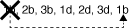

= Règles et concepts de câblage SAS - tiroirs avec modules IOM12/IOM12B
:allow-uri-read: 
:icons: font
:imagesdir: ../media/

[role="lead"]
Les tiroirs disques dotés de modules IOM12/IOM12B peuvent être câblés dans des paires haute disponibilité et des configurations à un seul contrôleur (pour les plateformes prises en charge) en appliquant les règles de câblage SAS : règles de configuration, règles de numérotation des connecteurs de contrôleur, règles de connexion entre tiroirs et tiroirs, règles de connexion entre contrôleurs et SAS HD Mini-SAS, le cas échéant.

NOTE: Les règles de câblage SAS relatives aux règles de numérotation des connecteurs du contrôleur, aux règles de connexion entre tiroirs et tiroirs et aux règles de connexion entre le contrôleur et la pile décrites dans ce guide sont les mêmes règles qui s'appliquent à tous les tiroirs disques SAS, qu'ils disposent de modules IOM12/IOM12B, IOM6 ou IOM3. Toutefois, les informations de ce guide sont spécifiques aux caractéristiques uniques des tiroirs disques avec modules IOM12/IOM12B et à leur utilisation dans les configurations prises en charge.

Les règles de câblage SAS relatives aux règles de configuration et aux règles de câblage optique SAS HD Mini-SAS décrites dans ce guide sont spécifiques aux tiroirs disques dotés de modules IOM12/IOM12B.

Les règles de câblage SAS décrites dans ce guide équilibrent le câblage SAS entre les ports SAS intégrés et les ports SAS d'adaptateur de bus hôte pour fournir des configurations de contrôleurs de stockage haute disponibilité et atteindre les objectifs suivants :

* Fournissez un algorithme universel unique et facile à comprendre pour tous les produits et configurations SAS
* Effectuez le même câblage physique lors de la génération de la nomenclature, suivie en usine et sur le terrain
* Sont vérifiables par ses outils et logiciels de vérification de la configuration
* Offrir une résilience maximale possible pour maintenir la disponibilité et minimiser la dépendance aux prises de contrôle

Vous devez éviter de vous écarter des règles ; les écarts pourraient réduire la fiabilité, l'universalité et la commune.

== Règles de configuration

Les tiroirs disques avec modules IOM12/IOM12B sont pris en charge sur des types spécifiques de configurations à paires haute disponibilité et à un seul contrôleur.

NOTE: Les plateformes FAS250 ne sont pas traitées dans ce contenu.

[NOTE]
====
Pour plus d'informations sur les configurations de câblage prises en charge par votre modèle de plate-forme, consultez le Hardware Universe.

https://hwu.netapp.com["NetApp Hardware Universe"^]

====
* Les configurations des paires HAUTE DISPONIBILITÉ doivent être câblées en tant que configurations haute disponibilité à chemins d'accès multiples ou à quatre chemins, à l'exception des cas suivants :
+
** Les plateformes avec stockage interne ne prennent pas en charge la connectivité haute disponibilité à quatre chemins.
** Une paire haute disponibilité FAS2820 peut être câblée sous forme de haute disponibilité à trois chemins.
+
Vous trouverez des informations sur la connectivité FAS2820 dans la <<Connectivité haute disponibilité à trois chemins d'accès>> section.

** Les plateformes avec stockage interne peuvent être câblées en tant que configurations haute disponibilité à chemin unique (du port 0b/0b1 aux tiroirs externes) pour prendre en charge la connectivité à un périphérique de sauvegarde sur bande SAS externe (à partir du port 0a).

[NOTE]
====
Pour les paires haute disponibilité FAS2820, bien que le câblage à des tiroirs externes soit à chemin unique, la haute disponibilité est due à la connexion interne de chaque contrôleur du port 0b à son expandeur local (IOM12G) et du port 0C au expandeur de son partenaire, la configuration des paires haute disponibilité est multivoie.

====
* Les configurations à un contrôleur unique doivent être câblées en tant que configurations à chemins d'accès multiples ou à quatre chemins, à l'exception des cas suivants :
+
** Les configurations à un contrôleur de la gamme FAS2600 peuvent être câblées en tant que configurations à voie unique.
+
Du fait que le stockage interne utilise la connectivité à chemin unique, ONTAP émet occasionnellement des avertissements indiquant que des chemins mixtes sont détectés. Pour éviter ces avertissements, vous pouvez utiliser la connectivité à chemin unique vers les tiroirs disques externes. En outre, vous pouvez utiliser la connectivité à chemin unique lorsqu'un périphérique de sauvegarde sur bande SAS externe est utilisé.

** Les configurations à contrôleur unique de la gamme FAS2600 ne prennent pas en charge la connectivité à quatre chemins d'accès.

== Règles de numérotation des slots du contrôleur

Pour appliquer des règles de câblage à toutes les paires haute disponibilité et configurations à contrôleur unique prises en charge, nous appliquons une convention de numérotation des connecteurs de contrôleur.

* Pour toutes les paires haute disponibilité et les configurations à un seul contrôleur, les conditions suivantes s'appliquent :
+
** Une carte HBA SAS dans un slot PCI physique est définie comme occupant le slot PCI 1, 2, 3, etc. Quel que soit l'étiquette physique du slot sur un contrôleur.
+
Par exemple, si des HBA SAS occupaient les connecteurs PCI physiques 3, 5 et 7, ils seront désignés comme connecteurs 1, 2 et 3 pour appliquer les règles de câblage SAS.

** Une carte HBA SAS intégrée est définie comme occupant le slot PCI 0, comme il est indiqué sur un contrôleur.
** Chaque port de chaque slot est défini comme indiqué sur un contrôleur. Par exemple, l'emplacement 0 avec deux ports est appelé 0a et 0b. L'emplacement 1 avec quatre ports est appelé 1a, 1b, 1c et 1D.
+
Dans ce document, les logements et les ports de logement sont représentés comme suit :

+
image::../media/slot0_rules.png[slot et slot [congressions de port]

== Règles de connexion du tiroir à tiroir

Lorsque vous disposez de plusieurs tiroirs disques dans une pile de tiroirs disques, ils se connectent par l'intermédiaire de chaque domaine SAS (IOM A et IOM B) en utilisant le câblage « standard » ou « à tous les niveaux » applicable. Votre utilisation du câblage « standard » ou « tablette à tiroir » dépend de votre configuration.

=== Connectivité standard tiroir à tiroir

* La connectivité standard tiroir à tiroir est utilisée dans n'importe quelle pile de tiroirs disques dotés de plusieurs tiroirs disques.
+
Une connexion de câble est nécessaire entre les tiroirs disques de chaque domaine--domaine A (IOM A) et domaine B (IOM B).

* Il est recommandé d'utiliser les ports IOM 3 et 1 pour la connectivité standard tiroir à tiroir.
+
Du premier tiroir logique au dernier tiroir logique d'une pile, vous connectez le port IOM 3 au port IOM 1 du tiroir suivant dans le domaine A, puis le domaine B.

image::../media/drw_shelf_to_shelf_standard.gif[connectivité tiroir à tiroir standard]

=== Connectivité tiroir à tiroir double

* La connectivité tiroir à tiroir double est utilisée dans les configurations à quatre ports (quatre chemins d'accès haute disponibilité et quatre chemins d'accès).
* La connectivité du tiroir à tiroir à double échelle requiert deux connexions de câble entre les tiroirs disques de chaque domaine (IOM A) et domaine B (IOM B).
+
Le premier câble est câblé en tant que connectivité standard du tiroir au tiroir (en utilisant les ports IOM 3 et 1). Le second câble est relié au câble sous forme de connectivité double tiroir à tiroir (en utilisant les ports IOM 4 et 2).

+
Du premier tiroir logique au dernier tiroir logique d'une pile, vous connectez le port IOM 3 au port IOM 1 du tiroir suivant dans le domaine A, puis le domaine B. Du premier tiroir logique au dernier tiroir logique d'une pile, vous connectez le port IOM 4 au port IOM 2 du tiroir suivant dans le domaine A, puis le domaine B. (Les ports IOM câblés sous forme de connectivité double largeur sont bleus.)

image::../media/drw_shelf_to_shelf_double_wide.gif[connectivité tiroir à tiroir double largeur]

== Règles de connexion contrôleur à pile

Vous pouvez correctement connecter les câbles SAS de chaque contrôleur à chaque pile d'une paire haute disponibilité ou dans une configuration à un contrôleur unique en déterminant que les tiroirs disques SAS utilisent la propriété des disques logicielle, la façon dont les ports de contrôleur A/C et B/D sont connectés aux piles, Comment les ports A/C et B/D du contrôleur sont organisés en paires de ports et comment les plateformes avec stockage interne disposent de leurs ports de contrôleur connectés aux piles.

=== Règle de propriété logicielle des disques avec tiroir disque SAS

Les tiroirs disques SAS utilisent une propriété de disque logicielle (ils ne sont pas basés sur le matériel). Cela signifie que la propriété du lecteur de disque est stockée sur le disque au lieu d'être déterminée par la topologie des connexions physiques du système de stockage (comme c'est le cas pour la propriété matérielle des disques). Plus précisément, la propriété du disque est attribuée par ONTAP (automatiquement ou par les commandes de l'interface de ligne de commande), pas par le câblage des connexions contrôleur à pile.

Les tiroirs disques SAS ne doivent jamais être câblés à l'aide du schéma de propriété des disques matériels.

=== Règles de connexion des ports a et C des contrôleurs (pour les plateformes sans stockage interne)

* Les ports a et C sont toujours les chemins principaux vers une pile.
* Les ports a et C se connectent toujours au premier tiroir disque logique d'une pile.
* Les ports a et C se connectent toujours aux ports 1 et 2 du module d'E/S du tiroir disque.
+
Le port 2 du module d'E/S est utilisé uniquement pour les configurations à quatre chemins d'accès haute disponibilité et à quatre chemins d'accès.

* Les ports a et C du contrôleur 1 se connectent toujours à l'IOM A (domaine A).
* Les ports a et C du contrôleur 2 se connectent toujours à l'IOM B (domaine B).

L'illustration suivante montre comment les ports a et C du contrôleur se connectent dans une configuration haute disponibilité multivoie avec une carte HBA à quatre ports et deux piles de tiroirs disques. Les connexions à la pile 1 sont indiquées en bleu. Les connexions à la pile 2 sont indiquées en orange.

image::../media/drw_controller_to_stack_rules_ports_a_and_c_example.gif[Règles de connexion des ports des contrôleurs A et C pour les plates-formes sans stockage interne]

=== Règles de connexion des ports B et D des contrôleurs (pour les plateformes sans stockage interne)

* Les ports B et D sont toujours les chemins secondaires vers une pile.
* Les ports B et D se connectent toujours au dernier tiroir disque logique d'une pile.
* Les ports B et D se connectent toujours aux ports 3 et 4 du module d'E/S du tiroir disque.
+
Le port 4 du module d'E/S est utilisé uniquement pour les configurations à quatre chemins d'accès haute disponibilité et à quatre chemins d'accès.

* Les ports B et D du contrôleur 1 se connectent toujours à l'IOM B (domaine B).
* Les ports B et D du contrôleur 2 se connectent toujours à l'IOM A (domaine A).
* Les ports B et D sont connectés aux piles en décalant l'ordre des emplacements PCI d'un emplacement pour que le premier port du premier emplacement soit câblé en dernier.

L'illustration suivante montre comment les ports B et D du contrôleur se connectent dans une configuration haute disponibilité multivoie avec une carte HBA à quatre ports et deux piles de tiroirs disques. Les connexions à la pile 1 sont indiquées en bleu. Les connexions à la pile 2 sont indiquées en orange.

image::../media/drw_controller_to_stack_rules_ports_b_and_d_example.gif[Règles de connexion des ports des contrôleurs B et D pour les plates-formes sans stockage interne]

=== Règles de connexion de paires de ports (pour les plateformes sans stockage interne)

Les ports SAS des contrôleurs A, B, C et D sont organisés en paires de ports selon une méthode qui exploite tous les ports SAS pour la résilience et la cohérence du système lors du câblage des connexions contrôleur à pile dans les paires haute disponibilité et les configurations à contrôleur unique.

* Les paires de ports comprennent un port SAS du contrôleur A ou C et un port SAS du contrôleur B ou D.
+
Les ports SAS a et C se connectent au premier tiroir logique d'une pile. Les ports B et D SAS se connectent au dernier tiroir logique d'une pile.

* Les paires de ports utilisent l'ensemble des ports SAS de chaque contrôleur du système.
+
Pour améliorer la résilience du système, tous les ports SAS (sur un HBA dans un slot PCI physique [slot 1-N] et intégrés au contrôleur [slot 0]) sont intégrés aux paires de ports. N'excluant pas de port SAS.

* Les paires de ports sont identifiées et organisées comme suit :
+
.. Énumérer Les ports A, puis C dans l'ordre des emplacements (0,1, 2, 3, etc.).
+
Par exemple : 1a, 2a, 3a, 1c, 2c, 3c

.. Énumérer les ports B, puis D dans l'ordre des emplacements (0,1, 2, 3, etc.).
+
Par exemple : 1b, 2b, 3b, 1D, 2d, 3d

.. Réécrire la liste des ports D et B de sorte que le premier port de la liste soit déplacé à la fin de la liste.
+
Par exemple : 

+
Le décalage de l'ordre des connecteurs par un équilibre les paires de ports sur plusieurs emplacements (emplacements PCI physiques et connecteurs intégrés) lorsque plusieurs emplacements de ports SAS sont disponibles, ce qui empêche le câblage d'une pile vers une seule carte HBA SAS.

.. Couplez les ports A et C (répertoriés à l'étape 1) aux ports D et B (répertoriés à l'étape 2) dans l'ordre indiqué.
+
Par exemple : 1a/2b, 2a/3b, 3a/1D,1c/2d, 2c/3d, 3c/1b.

+

NOTE: Dans le cas d'une paire haute disponibilité, la liste des paires de ports que vous identifiez pour le premier contrôleur est également applicable au second contrôleur.

* Lors du câblage du système, vous pouvez utiliser des paires de ports dans l'ordre dans lequel vous les avez identifiés ou ignorer les paires de ports :
+
** Utilisez les paires de ports dans l'ordre dans lequel vous les avez identifiées (répertoriées) lorsque toutes les paires de ports sont requises pour câbler les piles du système.
+
Par exemple, si vous avez identifié six paires de ports pour votre système et que vous avez six piles à connecter comme chemins d'accès multiples, vous connectez les câbles aux paires de ports dans l'ordre dans lequel vous les avez répertoriés :

+
1a/2b, 2a/3b, 3a/1d, 1c/2d, 2c/3d, 3c/1b

** Ignorer les paires de ports (utiliser toutes les autres paires de ports) lorsque toutes les paires de ports ne sont pas nécessaires pour raccorder les piles de votre système.
+
Par exemple, si vous avez identifié six paires de ports pour votre système et que vous disposez de trois piles à connecter comme chemins d'accès multiples, vous connectez les deux autres paires de ports de votre liste :

+
image::../media/drw_portpair_connection_rules_list_skip.gif[Option pour ignorer les paires de ports]

+

NOTE: Lorsque vous avez plus de paires de ports que nécessaire pour connecter les piles du système, il est recommandé d'ignorer les paires de ports pour optimiser les ports SAS de votre système. Grâce à l'optimisation des ports SAS, vous optimisez les performances de votre système.

Les fiches de câblage contrôleur à pile sont des outils pratiques pour identifier et organiser les paires de ports de sorte que vous puissiez câbler les connexions contrôleur à pile pour une paire haute disponibilité ou une configuration à un contrôleur unique.

link:install-cabling-worksheet-template-multipath.html["Modèle de fiche de câblage contrôleur à pile pour la connectivité multipathed"]

link:install-cabling-worksheet-template-quadpath.html["Modèle de fiche de câblage contrôleur à pile pour la connectivité à quatre chemins d'accès"]

=== Règles de connexion des ports des contrôleurs 0b/0b1 et 0a pour les plateformes avec stockage interne

Les plates-formes avec stockage interne disposent d'un ensemble unique de règles de connexion car chaque contrôleur doit maintenir la même connectivité de domaine entre le stockage interne (port 0b/0b1) et la pile. Cela signifie que lorsqu'un contrôleur se trouve dans le slot A du châssis (contrôleur 1), il se trouve dans le domaine A (IOM A) et que le port 0b/0b1 doit donc se connecter au module d'E/S A de la pile. Lorsqu'un contrôleur se trouve dans le slot B du châssis (contrôleur 2), il se trouve dans le domaine B (IOM B) et par conséquent le port 0b/0b1 doit se connecter au module d'E/S B de la pile.

NOTE: Les plateformes FAS25XX ne sont pas traitées dans ce contenu.

NOTE: Si vous ne connectez pas le port 0b/0b1 au domaine approprié (domaines à connexion croisée), vous exposez votre système à des problèmes de résilience qui vous empêchent d'effectuer des procédures sans interruption en toute sécurité.

* Port du contrôleur 0b/0b1 (port de stockage interne) :
+
** Le port 0b/0b1 du contrôleur 1 se connecte toujours au module d'E/S A (domaine A).
** Le port 0b/0b1 du contrôleur 2 se connecte toujours au module d'E/S B (domaine B).
** Le port 0b/0b1 est toujours le chemin principal.
** Le port 0b/0b1 se connecte toujours au dernier tiroir disque logique d'une pile.
** Le port 0b/0b1 est toujours connecté au port IOM 3 du tiroir disque.

* Port 0a de contrôleur (port HBA interne) :
+
** Le port 0a du contrôleur 1 se connecte toujours au module d'E/S B (domaine B).
** Le port 0a du contrôleur 2 se connecte toujours au module d'E/S A (domaine A).
** Le port 0a est toujours le chemin secondaire.
** Le port 0a se connecte toujours au premier tiroir disque logique d'une pile.
** Le port 0a se connecte toujours au port 1 du module d'E/S du tiroir disque.

L'illustration suivante met en évidence la connectivité de domaine du port de stockage interne (0b/0b1) à une pile de tiroirs externe :

image::../media/drw_fas2600_mpha_domain_example_IEOPS-1172.svg[Connectivité de domaine 0b 0b1 du port de stockage interne]

=== Connectivité haute disponibilité à trois chemins d'accès

La connectivité haute disponibilité à trois chemins est disponible sur les paires haute disponibilité FAS2820. La connectivité haute disponibilité à trois chemins d'accès existe entre chaque contrôleur et les tiroirs internes (IOM12G) et externes :

* La connexion interne de chaque contrôleur du port 0b à son IOM12G local et du port 0C à l'IOM12G de son partenaire assure une connectivité haute disponibilité multivoie par paire haute disponibilité.
* Le câblage des ports de stockage externes de chaque contrôleur, 0a et 0b1, assure une connectivité haute disponibilité à trois chemins par paire haute disponibilité.
+
Les ports 0a et 0b1 sont câblés sur les deux contrôleurs en l'absence de tiroirs externes ou sur des tiroirs externes pour assurer une connectivité haute disponibilité à chemins d'accès triple.

La figure suivante présente les connexions internes et le câblage externe du contrôleur permettant une connectivité haute disponibilité à trois chemins :

image::../media/drw_fas2800_concept_tpha_IEOPS-950.svg[Connectivité haute disponibilité à trois chemins]

Ports SAS externes FAS2820 :

* Le port 0a provient de l'adaptateur HBA interne (comme les autres plateformes avec un tiroir interne).
* Le port 0b1 provient du shelf interne (comme les ports 0b sur d'autres plateformes avec un shelf interne).
* Le port 0b2 n'est pas utilisé. Il est désactivé. Si un câble y est connecté, un message d'erreur est généré.

image::../media/drw_sas3_ports_on_fas2800_IEOPS-946.svg[Ports sas externes FAS2820]

Des exemples de câblage des paires haute disponibilité FAS2820 sont disponibles dans la link:install-cabling-worksheets-examples-fas2600.html["Feuilles de câblage contrôleur à pile et exemples de câblage pour les plateformes avec stockage interne"] section.

== Règles du câble optique SAS HD Mini-SAS

Vous pouvez utiliser des câbles optiques mini-SAS HD SAS (câble optique actif multimode) avec des connecteurs HD à mini-SAS HD et des câbles d'dérivation multimode (OM4) avec des connecteurs mini-SAS HD à LC pour obtenir une connectivité SAS longue distance pour certaines configurations dotées de tiroirs disques avec des modules IOM12.

* Votre plate-forme et votre version de ONTAP doivent prendre en charge l'utilisation de câbles optiques mini-SAS HD : câbles optiques multimodes (AOC) avec connecteurs HD mini-SAS HD-mini-SAS et câbles de dérivation multimodes (OM4) avec connecteurs mini-SAS HD-LC.
+
https://hwu.netapp.com["NetApp Hardware Universe"]

* Les câbles AOC optiques multimodes avec connecteurs HD Mini-SAS HD-to-mini-SAS peuvent être utilisés pour les connexions contrôleur à pile et tiroir à tiroir. Ils sont disponibles dans des longueurs allant jusqu'à 50 mètres.
* Si vous utilisez des câbles de dérivation SAS optiques multimodes (OM4) avec des connecteurs mini-SAS HD-to-LC (pour les panneaux de brassage), les règles suivantes s'appliquent :
+
** Vous pouvez utiliser ces câbles pour les connexions contrôleur à pile et tiroir à tiroir.
+
Si vous utilisez des câbles de séparation multimode pour les connexions de tiroir à tiroir, vous ne pouvez les utiliser qu'une seule fois dans une pile de tiroirs disques. Vous devez utiliser des câbles AOC multimode pour connecter les connexions restantes du tiroir à la baie.

+
Pour les configurations à quatre chemins haute disponibilité et à quatre chemins, si vous utilisez des câbles multimode pour les connexions à double largeur entre deux tiroirs disques, il est recommandé d'utiliser des câbles de dérivation identiques.

** Vous devez connecter les huit (quatre paires) connecteurs de dérivation LC au panneau de raccordement.
** Vous devez fournir les panneaux de raccordement et les câbles inter-panneaux.
+
Les câbles inter-panneaux doivent être du même mode que le câble de dérivation : multimode OM4.

** Vous pouvez utiliser jusqu'à une paire de panneaux de brassage dans un chemin.
** Le chemin point à point (HD mini-SAS vers mini-SAS) d'un câble multimode ne peut pas dépasser 100 mètres.
+
Le chemin comprend le jeu de câbles de dérivation, de panneaux de raccordement et de câbles inter-panneaux.

** Le chemin total d'accès de bout en bout (somme des chemins point à point du contrôleur au dernier tiroir) ne peut pas dépasser 300 mètres.
+
Le chemin total inclut le jeu de câbles de dérivation, de panneaux de raccordement et de câbles inter-panneaux.

* Les câbles SAS peuvent être du cuivre SAS, de l'optique SAS ou bien encore de la combinaison des deux.
+
Si vous utilisez plusieurs câbles en cuivre SAS et câbles optiques SAS, les règles suivantes s'appliquent :

+
** Les connexions tiroir à tiroir d'une pile doivent être tous des câbles en cuivre SAS ou tous les câbles optiques SAS.
** Si les connexions du tiroir à tiroir sont des câbles optiques SAS, les connexions du contrôleur à la pile doivent également être des câbles optiques SAS.
** Si les connexions du tiroir à tiroir sont des câbles en cuivre SAS, les connexions du contrôleur à la pile peuvent être des câbles optiques SAS ou des câbles en cuivre SAS.

