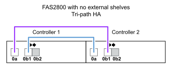

= Fiches de câblage pour stockage interne - DS212C, DS224C ou DS460C
:allow-uri-read: 
:icons: font
:imagesdir: ../media/

[role="lead"]
Vous pouvez utiliser les fiches de câblage contrôleur-pile complétées et les exemples de câblage pour câbler les plateformes avec stockage interne. Ceci s'applique aux étagères équipées de modules IOM12/IOM12B.

NOTE: Ces informations ne s'appliquent pas aux plateformes FAS250.

* Si nécessaire, vous pouvez vous reporter à link:install-cabling-rules.html["Concepts et règles de câblage SAS"] pour plus d'informations sur les configurations prises en charge, la connectivité tiroir à tiroir et la connectivité contrôleur à tiroir.
* Les exemples de câblage montrent que les câbles reliant le contrôleur à la pile sont continus ou en pointillés pour distinguer les connexions des ports 0b/0b1 du contrôleur des connexions des ports 0a du contrôleur.
+
image::../media/drw_fas2600_controller_to_stack_cable_type_key_IEOPS-947.svg[Clé de type de câble pour plates-formes avec stockage intégré]

* Des exemples de câblage montrent les connexions du contrôleur à la pile et des connexions tiroir à tiroir dans deux couleurs différentes pour distinguer la connectivité via l'IOM A (domaine A) et l'IOM B (domaine B).
+
image::../media/drw_fas2600_cable_color_key.png[Clé de couleur de câble pour les plateformes avec stockage intégré]

== Plateforme FAS2820 dans une configuration haute disponibilité multivoie sans tiroirs externes

L'exemple suivant montre qu'aucun câblage n'est nécessaire pour obtenir la connectivité haute disponibilité multivoie :

image::../media/drw_fas2800_noshelf_mpha_IEOPS-954.svg[Multivoie haute disponibilité FAS2820 sans tiroirs externes]

== Plateforme FAS2820 dans une configuration haute disponibilité à trois chemins sans tiroirs externes

L'exemple de câblage suivant montre le câblage requis entre les deux contrôleurs pour obtenir une connectivité à trois chemins :

== Plateforme FAS2820 dans une configuration haute disponibilité à trois chemins avec une pile à plusieurs tiroirs

La feuille de calcul et l'exemple de câblage suivants utilisent la paire de ports 0a/0b1 :

image::../media/drw_fas2800_worksheet_IEOPS-948.svg[Fiche de câblage haute disponibilité à trois chemins FAS2820 montrant les paires de ports pour la pile 1]

image::../media/drw_fas2800_withshelves_tpha_IEOPS-949.svg[Exemple de câblage haute disponibilité à trois chemins FAS2820 pour une seule pile]

== Plateformes avec stockage interne dans une configuration haute disponibilité à chemins d'accès multiples avec une pile à plusieurs tiroirs

Les exemples de fiche et de câblage suivants utilisent la paire de ports 0a/0b :

NOTE: Cette section ne s'applique pas aux systèmes FAS2820 ou FAS25XX.

image::../media/drw_fas2600_mpha_worksheet_IEOPS-1255.svg[Fiche de câblage haute disponibilité multivoie pour les plateformes avec stockage interne et une seule pile]

image::../media/drw_fas2600_mpha_IEOPS-1256.svg[Exemple de câblage haute disponibilité multivoie pour les plateformes avec stockage interne]

== La gamme FAS2600 offre une configuration à chemins d'accès multiples avec une pile à tiroirs multiples

Les feuilles de calcul et exemples de câblage suivants utilisent la paire de ports 0a/0b.

Dans cet exemple, le contrôleur est installé dans le slot A du châssis. Lorsqu'un contrôleur se trouve dans le slot A du châssis, son port de stockage interne (0b) se trouve dans le domaine A (IOM A). Par conséquent, le port 0b doit se connecter au domaine A (IOM A) de la pile.

image::../media/drw_fas2600_mp_slot_a_worksheet.png[Fiche de câblage des FAS2600 montrant la paire de ports pour une configuration multivoie]

image::../media/drw_fas2600_mp_slot_a.png[Exemple de câblage multivoie FAS2600 avec le contrôleur dans le slot de châssis 1]

Dans cet exemple, le contrôleur est installé dans le slot B du châssis. Lorsqu'un contrôleur se trouve dans le slot B du châssis, son port de stockage interne (0b) se trouve dans le domaine B (IOM B). Par conséquent, le port 0b doit se connecter au domaine B (IOM B) de la pile.

image::../media/drw_fas2600_mp_slot_b_worksheet.png[Fiche de câblage des FAS2600 montrant la paire de ports pour une configuration multivoie]

image::../media/drw_fas2600_mp_slot_b.png[Exemple de câblage multivoie FAS2600 avec le contrôleur dans le slot 2 du châssis]
