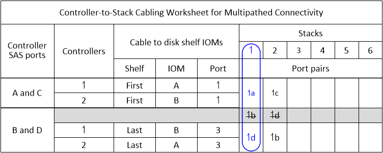

= Feuilles de calcul de câblage contrôleur à pile et exemples de câblage pour les configurations haute disponibilité multivoie (tiroirs avec modules IOM12/IOM12B)
:allow-uri-read: 
:icons: font
:imagesdir: ../media/

[role="lead"]
Vous pouvez utiliser les fiches de câblage du contrôleur à la pile et des exemples de câblage pour câbler votre paire haute disponibilité comme une configuration haute disponibilité multivoie.

NOTE: Ces informations s'appliquent aux plates-formes sans stockage interne.

* Si nécessaire, vous pouvez vous reporter à link:install-cabling-rules.html["Concepts et règles de câblage SAS"] pour plus d'informations sur les configurations prises en charge, la convention de numérotation des connecteurs du contrôleur, la connectivité tiroir à tiroir et la connectivité contrôleur à tiroir (notamment l'utilisation de paires de ports).
* Si nécessaire, vous pouvez vous reporter à link:install-cabling-worksheets-how-to-read-multipath.html["Comment lire une fiche technique pour relier les connexions du contrôleur à la pile pour assurer une connectivité multipathed"].
* Les exemples de câblage montrent que les câbles du contrôleur à la pile sont en continu ou en pointillés afin de distinguer les connexions des ports a et C des connexions des ports B et D.
+
image::../media/drw_controller_to_stack_cable_type_key.gif[Clé de type de câble de configuration haute disponibilité multivoie]

* Les câbles dans les exemples de câblage et les paires de ports correspondantes dans les feuilles de calcul sont codés par couleur pour distinguer la connectivité sur chaque pile de la paire haute disponibilité.
+
image::../media/drw_controller_to_stack_cable_color_key_non2600_4stackcolors.gif[Clé de couleur du câble de configuration haute disponibilité multivoie]

* Les feuilles de calcul et des exemples de câblage présentent les paires de ports de câblage dans l'ordre dans lequel elles sont répertoriées dans la fiche.

== Feuilles de câblage contrôleur à pile et exemples de câblage pour les configurations haute disponibilité multivoie avec des HBA SAS à quatre ports

Vous pouvez utiliser les fiches de câblage entre le contrôleur et la pile, ainsi que des exemples de câblage pour câbler les configurations haute disponibilité multivoie courantes qui disposent de HBA SAS à quatre ports. Ces contrôleurs ne possèdent pas de ports SAS intégrés.

=== Haute disponibilité multivoie avec un adaptateur HBA SAS à quatre ports et une pile de tiroir unique

La fiche de travail et l'exemple de câblage suivants utilisent la paire de ports 1a/1D :

image::../media/drw_mpha_slot_1_one_4porthba_one_singleshelf_stack.gif[Exemple de câblage haute disponibilité multivoie pour une carte HBA SAS à quatre ports et une seule pile de tiroirs]

=== Multivoie haute disponibilité avec un adaptateur HBA SAS à quatre ports et deux piles de tiroirs uniques

La fiche technique et l'exemple de câblage suivants utilisent les paires de ports 1a/1D et 1c/1b :

image::../media/drw_worksheet_mpha_slot_1_one_4porthba_two_singleshelf_stacks.gif[Fiche technique de câblage haute disponibilité multivoie pour une carte HBA SAS à quatre ports et deux piles à un seul tiroir]

image::../media/drw_mpha_slot_1_one_4porthba_two_singleshelf_stacks.gif[Exemple de câblage haute disponibilité multivoie pour une carte HBA SAS à quatre ports et deux piles à un seul tiroir]

=== Multivoie haute disponibilité avec deux adaptateurs HBA SAS à quatre ports et deux piles à plusieurs tiroirs

Quatre paires de ports sont disponibles pour cette configuration : 1a/2b, 2a/1D, 1c/2d et 2c/1b. Vous pouvez câbler les paires de ports dans l'ordre dans lequel elles sont identifiées (répertoriées dans la fiche) ou vous pouvez câbler toutes les autres paires de ports (ignorer les paires de ports).

NOTE: Lorsque vous avez plus de paires de ports que nécessaire pour connecter les piles du système, il est recommandé d'ignorer les paires de ports pour optimiser les ports SAS de votre système. Grâce à l'optimisation des ports SAS, vous optimisez les performances de votre système.

La fiche de travail et l'exemple de câblage suivants montrent les paires de ports utilisées dans l'ordre dans lequel elles sont répertoriées dans la fiche de travail : 1a/2b, 2a/1D, 1c/2d et 2c/1b.

image::../media/drw_worksheet_mpha_slots_1_and_2_two_4porthbas_two_stacks.gif[Fiche technique de câblage haute disponibilité multivoie pour deux adaptateurs HBA SAS à quatre ports et deux piles à plusieurs tiroirs]

image::../media/drw_mpha_slots_1_and_2_4porthbas_4_stacks.gif[Exemple de câblage haute disponibilité multivoie pour deux adaptateurs HBA SAS à quatre ports et deux piles à plusieurs tiroirs]

La fiche de travail et l'exemple de câblage ci-dessous montrent que les paires de ports sont ignorées pour être utilisées les unes des autres dans la liste : 1a/2b et 1c/2d.

NOTE: Si une troisième pile est ajoutée ultérieurement, vous utilisez la paire de ports qui a été ignorée.

image::../media/drw_worksheet_mpha_slots_1_and_2_two_4porthbas_two_stacks_skipped.gif[Fiche technique de câblage haute disponibilité multivoie pour deux adaptateurs HBA SAS à quatre ports et deux piles à plusieurs tiroirs utilisant des paires de ports ignorées]

image::../media/drw_mpha_slots_1_and_2_two_4porthbas_two_stacks_skipped.gif[Exemple de câblage haute disponibilité multivoie pour deux cartes HBA SAS à quatre ports et deux piles à plusieurs tiroirs utilisant des paires de ports ignorées]

== Feuilles de câblage contrôleur à pile et exemples de câblage pour les configurations haute disponibilité multivoie avec quatre ports SAS intégrés

Vous pouvez utiliser les fiches de câblage entre le contrôleur et la pile, ainsi que des exemples de câblage pour câbler les configurations haute disponibilité multivoie courantes possédant quatre ports SAS intégrés.

=== Haute disponibilité multivoie avec quatre ports SAS intégrés et une pile à tiroir unique

L'exemple de fiche et de câblage suivant utilise la paire de ports 0a/0d :

image::../media/drw_mpha_slot_0_4ports_one_singleshelf_stack.gif[Exemple de câblage haute disponibilité multivoie pour quatre ports intégrés et une seule pile de tiroirs]

=== Haute disponibilité multivoie avec quatre ports SAS intégrés et deux piles de tiroirs uniques

La fiche suivante et l'exemple de câblage utilisent les paires de ports 0a/0d et 0C/0b :

image::../media/drw_worksheet_mpha_slot_0_4ports_two_singleshelf_stacks.gif[Fiche technique de câblage haute disponibilité multivoie pour quatre ports intégrés et deux piles à un seul tiroir]

image::../media/drw_mpha_slot_0_4ports_two_singleshelf_stacks.gif[Exemple de câblage haute disponibilité multivoie pour quatre ports intégrés et deux piles à un seul tiroir]

=== Haute disponibilité multivoie avec quatre ports SAS intégrés, un HBA SAS à quatre ports et deux piles à tiroirs multiples

Quatre paires de ports sont disponibles pour cette configuration : 0a/1b, 1a/0d, 0C/1D et 1c/0b. Vous pouvez câbler les paires de ports dans l'ordre dans lequel elles sont identifiées (répertoriées dans la fiche) ou vous pouvez câbler toutes les autres paires de ports (ignorer les paires de ports).

NOTE: Lorsque vous avez plus de paires de ports que nécessaire pour connecter les piles du système, il est recommandé d'ignorer les paires de ports pour optimiser les ports SAS de votre système. Grâce à l'optimisation des ports SAS, vous optimisez les performances de votre système.

La fiche suivante et l'exemple de câblage présentent les paires de ports utilisées dans l'ordre dans lequel elles sont répertoriées dans la fiche : 0a/1b, 1a/0d, 0C/1D et 1c/0b.

image::../media/drw_worksheet_mpha_slots_0_and_1_8ports_4stacks.gif[Fiche technique de câblage haute disponibilité des chemins d'accès multiples pour quatre ports SAS intégrés, une carte HBA SAS à quatre ports et deux piles à plusieurs tiroirs]

image::../media/drw_mpha_slots_0_and_1_8ports_4_stacks.gif[Exemple de câblage haute disponibilité multivoie pour quatre ports SAS intégrés, une carte HBA SAS à quatre ports et deux piles à plusieurs tiroirs]

La fiche technique et l'exemple de câblage suivants montrent que les paires de ports ne sont pas utilisées les unes des autres dans la liste : 0a/1b et 0C/1D.

NOTE: Si une troisième pile est ajoutée ultérieurement, vous utilisez la paire de ports qui a été ignorée.

image::../media/drw_worksheet_mpha_slots_0_and_1_8ports_two_stacks_skipped.gif[Fiche technique de câblage haute disponibilité des chemins d'accès multiples pour quatre ports intégrés, une carte HBA SAS à quatre ports et deux piles de tiroirs multiples utilisant des paires de ports ignorées]

image::../media/drw_mpha_slots_0_and_1_8ports_two_stacks_skipped.gif[Exemple de câblage haute disponibilité multivoie pour quatre ports intégrés, une carte HBA SAS à quatre ports et deux piles à plusieurs tiroirs utilisant des paires de ports ignorées]
