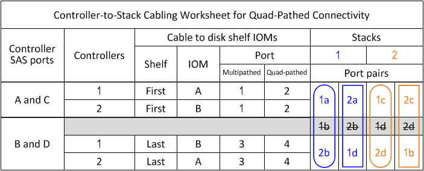

= Fiche de câblage contrôleur à pile et exemple de câblage pour une configuration HA à quatre chemins d'accès avec deux HBA SAS à quatre ports - tiroirs avec modules IOM12/IOM12B
:allow-uri-read: 
:icons: font
:imagesdir: ../media/

[role="lead"]
Vous pouvez utiliser la fiche de câblage reliant le contrôleur et la pile, ainsi que l'exemple de câblage pour connecter une configuration haute disponibilité à quatre chemins d'accès possédant deux HBA SAS à quatre ports.

* Si nécessaire, vous pouvez vous reporter à link:install-cabling-rules.html["Règles de câblage SAS"] pour plus d'informations sur les configurations prises en charge, la convention de numérotation des connecteurs du contrôleur, la connectivité tiroir à tiroir et la connectivité contrôleur à tiroir (notamment l'utilisation de paires de ports).
* Si nécessaire, vous pouvez vous reporter à link:install-cabling-worksheets-how-to-read-quadpath.html["Comment lire une fiche technique pour relier les connexions du contrôleur à la pile pour assurer une connectivité à quatre chemins d'accès"].
* L'exemple de câblage montre les câbles du contrôleur à la pile en continu ou en pointillés afin de distinguer les connexions des ports a et C des connexions des ports B et D.
+
image::../media/drw_controller_to_stack_cable_type_key.gif[touche de type contrôleur drw vers câble de pile]

* Les câbles dans les exemples de câblage et les paires de ports correspondantes dans les feuilles de calcul sont codés par couleur pour distinguer la connectivité sur chaque pile de la paire haute disponibilité.
+
image::../media/drw_controller_to_stack_cable_color_key_non2600.gif[clé couleur du contrôleur drw pour pile non 2600]

* L'exemple de câblage distingue visuellement les deux jeux de câbles multipathés nécessaires pour assurer la connectivité à 4 chemins d'accès pour chaque pile de contrôleur dans une paire haute disponibilité ou dans une configuration à un seul contrôleur.
+
Le premier jeu de câbles multipathed est appelé "multiple pathed". Le deuxième jeu de câbles multipathés est appelé « Quad-pathed ». Le deuxième jeu de câbles est appelé « quadruple pathed », car cette mise en place permet de bénéficier d'une connectivité à quatre ports.

+
image::../media/drw_controller_to_stack_quad_pathed_connectivity_key.gif[contrôleur drw pour empiler la clé de connectivité à quatre ports]

* L'exemple de feuille de calcul montre les paires de ports désignées pour un câblage multipathed ou un câblage à quatre chemins d'accès à la pile concernée.
+
Chaque paire de ports désignée pour le câblage multipathed est encerclée par un ovale qui est la couleur associée à la pile à laquelle elle est reliée. Chaque paire de ports désignée pour un câblage à quatre chemins d'accès est entourée d'un rectangle de la couleur associée à la pile à laquelle elle est câblée.

== Quatre chemins d'accès haute disponibilité avec deux HBA SAS à quatre ports et deux piles à tiroirs multiples

La fiche de travail et l'exemple de câblage suivants utilisent les paires de ports 1a/2b (multipathed) et 2a/1D (quad-pathed) pour la pile 1, et les paires de ports 1c/2d (multipathed) et 2c/1b (quad-pathed) pour la stack2.

image::../media/drw_qpha_slots_1_and_2_two_4porthbas_two_stacks_nau.gif[drw qpha fentes 1 et 2 deux 4porthbas deux piles nau]
