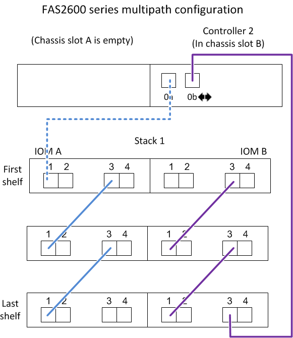

= Feuilles de câblage contrôleur à pile et exemples de câblage pour les plateformes avec stockage interne - tiroirs avec modules IOM12/IOM12B
:allow-uri-read: 
:icons: font
:imagesdir: ../media/

[role="lead"]
Vous pouvez utiliser les fiches de câblage contrôleur-pile et des exemples de câblage pour connecter les plateformes à un système de stockage interne, notamment les gammes FAS2600, AFF A200, FAS2700 Series, AFF A220, et plus tard.

NOTE: Ces informations ne s'appliquent pas aux plateformes FAS250.

* Si nécessaire, vous pouvez vous reporter à link:install-cabling-rules.html["Règles de câblage SAS"] pour plus d'informations sur les configurations prises en charge, la connectivité tiroir à tiroir et la connectivité contrôleur à tiroir.
* Des exemples de câblage montrent que les câbles du contrôleur à la pile sont en continu ou en pointillé pour distinguer les connexions du port 0b du contrôleur des connexions du port 0a.
+
image::../media/drw_fas2600_controller_to_stack_cable_type_key.png[clé de type de câble entre contrôleur drw fas2600 et pile]

* Des exemples de câblage montrent les connexions du contrôleur à la pile et des connexions tiroir à tiroir dans deux couleurs différentes pour distinguer la connectivité via l'IOM A (domaine A) et l'IOM B (domaine B).
+
image::../media/drw_fas2600_cable_color_key.png[clé couleur du câble drw fas2600]

== Plateformes avec stockage interne dans une configuration haute disponibilité à chemins d'accès multiples avec une pile à plusieurs tiroirs

Les exemples de fiche et de câblage suivants utilisent la paire de ports 0a/0b :

image::../media/drw_fas2600_mpha_worksheet.png[fiche technique de mpha drw fas2600]

image::../media/drw_fas2600_mpha.png[mpha drw fas2600]

== La gamme FAS2600 offre une configuration à chemins d'accès multiples avec une pile à tiroirs multiples

Les feuilles de calcul et exemples de câblage suivants utilisent la paire de ports 0a/0b.

Dans cet exemple, le contrôleur est installé dans le slot A du châssis. Lorsqu'un contrôleur se trouve dans le slot A du châssis, son port de stockage interne (0b) se trouve dans le domaine A (IOM A). Par conséquent, le port 0b doit se connecter au domaine A (IOM A) de la pile.

image::../media/drw_fas2600_mp_slot_a_worksheet.png[fiche de travail de l'emplacement a drw fas2600 mp]

image::../media/drw_fas2600_mp_slot_a.png[emplacement a du module drw fas2600 mp]

Dans cet exemple, le contrôleur est installé dans le slot B du châssis. Lorsqu'un contrôleur se trouve dans le slot B du châssis, son port de stockage interne (0b) se trouve dans le domaine B (IOM B). Par conséquent, le port 0b doit se connecter au domaine B (IOM B) de la pile.

image::../media/drw_fas2600_mp_slot_b_worksheet.png[fiche de travail de l'emplacement b drw fas2600 mp]

