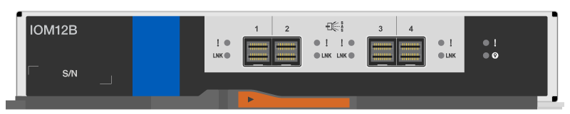

= Échange à chaud ou remplacement d'un module IOM - DS212C, DS224C ou DS460C
:allow-uri-read: 
:icons: font
:imagesdir: ../media/

[role="lead"]
La configuration de votre système détermine si vous pouvez effectuer un remplacement à chaud d'un module IOM d'étagère sans interruption ou un remplacement d'un module IOM d'étagère avec interruption lorsqu'un module IOM d'étagère IOM12 ou IOM12B tombe en panne.

.Description de la tâche
* Cette procédure s'applique aux étagères dotées de modules IOM12 ou IOM12B.
+

NOTE: Cette procédure concerne les remplacements à chaud ou les échanges de modules IOM identiques. Cela signifie que vous ne pouvez remplacer qu'un module IOM12 par un autre module IOM12 ou un module IOM12B par un autre module IOM12B.

* Les modules IOM12 ou IOM12B se distinguent par leur apparence :
+
Les modules IOM12 se distinguent par une étiquette « IOM12 » :

+
image::../media/drw_iom12.gif[Avant de IOM12]

+
Les modules IOM12B se distinguent par une bande bleue et une étiquette « IOM12B » :

+

* Pour les configurations comportant plusieurs chemins d'accès multiples (HA ou multivoie), trois chemins d'accès haute disponibilité et quatre chemins d'accès (HA à quatre chemins ou à quatre chemins), vous pouvez remplacer à chaud un module d'E/S de tiroir (sans interruption, remplacer un module d'E/S dans un système sous tension et qui assure le service des données).
* Pour les configurations HA à chemin unique des gammes FAS2600 et FAS2700, vous devez effectuer une opération de basculement et de rétablissement pour remplacer un module d'E/S de tiroir dans un système sous tension et où il assure l'accès aux données.
* Pour les configurations à chemin unique de la gamme FAS2600, vous devez arrêter le système pour remplacer un IOM de tiroir.
+

CAUTION: Si vous tentez de remplacer à chaud un module d'E/S de tiroir sur un tiroir disque avec une connexion à un seul chemin, vous perdez tout accès aux disques du tiroir disque, ainsi qu'aux tiroirs disques en dessous. Vous pouvez également arrêter l'ensemble de votre système.

* Le firmware du tiroir disque (IOM) est automatiquement mis à jour (sans interruption) sur un nouveau module d'E/S de tiroir avec une version de firmware non à jour.
+
Les vérifications du firmware du module d'E/S du tiroir se font toutes les dix minutes. Une mise à jour du firmware du module d'E/S peut prendre jusqu'à 30 minutes.

* Si nécessaire, vous pouvez activer les LED d'emplacement (bleues) du tiroir disque pour faciliter la localisation physique du tiroir disque concerné : `storage shelf location-led modify -shelf-name _shelf_name_ -led-status on`
+
Un tiroir disque dispose de trois LED d'emplacement : une sur le panneau d'affichage de l'opérateur et une sur chaque IOM de tiroir. Les LED d'emplacement restent allumées pendant 30 minutes. Vous pouvez les désactiver en entrant la même commande, mais en utilisant l'option Désactivé.

* Si besoin, vous pouvez vous référer au link:/sas3/service-monitor-leds.html#operator-display-panel-leds["Surveillance des voyants du plateau de disque"] guide d'information sur la signification et l'emplacement des voyants LED de l'étagère de disque sur le panneau d'affichage de l'opérateur et les composants FRU.

.Avant de commencer
* Tous les autres composants du système, y compris l'autre module IOM12/IOM12B, doivent fonctionner correctement.
* *Bonne pratique* : Assurez-vous que votre système dispose des versions actuelles du micrologiciel du module d'E/S (IOM) et du micrologiciel du lecteur de disque avant d'ajouter de nouveaux modules, composants FRU ou câbles SAS. Vous pouvez consulter le site de support NetApp pour  https://mysupport.netapp.com/site/downloads/firmware/disk-shelf-firmware["télécharger le firmware du disque dur"] et  https://mysupport.netapp.com/site/downloads/firmware/disk-drive-firmware["télécharger le micrologiciel du lecteur de disque"] .

.Étapes
. Mettez-vous à la terre.
. Déballez le nouveau module d'E/S et mettez-le sur une surface plane à proximité du tiroir disque.
+
Conservez tous les matériaux d'emballage à utiliser lors de l'affichage du module d'E/S des tiroirs défectueux.

. Identifiez physiquement le module d'E/S de tiroir défectueux dans le message d'avertissement de la console du système et la LED d'avertissement allumée (orange) sur le module d'E/S du tiroir défectueux.
. Effectuez l'une des actions suivantes en fonction du type de configuration dont vous disposez :
+
[cols="2*"]
|===
| Si vous avez un... | Alors... 

 a| 
Haute disponibilité multivoie, haute disponibilité à trois voies, chemins d'accès multiples, haute disponibilité à quatre voies ou configuration à quatre voies
 a| 
Passez à l'étape suivante.

 a| 
Les gammes FAS2600 et FAS2700 Series à chemin unique
 a| 
.. Déterminez le nœud cible (le nœud auquel appartient l'IOM de tiroir défaillant).
+
L'E/S A appartient au contrôleur 1. L'IOM B appartient au contrôleur 2.

.. Reprendre le nœud cible : `storage failover takeover -bynode _partner HA node_`

 a| 
Configuration à chemin unique de la gamme FAS2600
 a| 
.. Arrêter le système depuis la console du système : `halt`
.. Vérifiez que votre système est arrêté en vérifiant la console du système de stockage.

|===
. Débranchez le câblage du module d'E/S du tiroir que vous retirez.
+
Notez les ports IOM du tiroir. Chaque câble est connecté à.

. Appuyez sur le loquet orange sur la poignée de came du module d'E/S du tiroir jusqu'à ce qu'elle se libère, puis ouvrez entièrement la poignée de came pour libérer le module d'E/S du plan central.
+
image::../media/drw_iom_latch.png[Relâcher le loquet de la poignée de came]

+
image::../media/drw_iom_open.png[Poignée de came en position ouverte]

. A l'aide du levier de came, faites glisser le module d'E/S du tiroir hors du tiroir disque.
+
Lors de la manipulation d'un module d'E/S de tiroir, toujours utiliser deux mains pour soutenir son poids.

. Attendez au moins 70 secondes après le retrait du module d'E/S de tiroir avant d'installer le nouveau module d'E/S de tiroir.
+
Une attente d'au moins 70 secondes permet au pilote d'enregistrer correctement l'ID de tiroir.

. À deux mains, avec la poignée de came du nouveau module d'E/S de tiroir en position ouverte, soutenez et alignez les bords du nouveau module d'E/S de tiroir sur l'ouverture du tiroir disque, puis poussez fermement le nouveau module d'E/S de tiroir jusqu'à ce qu'il atteigne le plan milieu.
+

NOTE: N'utilisez pas de force excessive lors de l'insertion du module d'E/S du tiroir dans le tiroir disque ; vous pouvez endommager les connecteurs.

. Fermez la poignée de came de façon à ce que le loquet s'enclenche en position verrouillée et que l'IOM du shelf soit complètement en place.
. Rebranchez le câblage.
+
Les connecteurs de câble SAS sont clavetés ; lorsqu'ils sont orientés correctement dans un port IOM, le connecteur s'enclenche et la LED LNK du port IOM s'allume en vert. Vous insérez un connecteur de câble SAS dans un port IOM, avec la languette de retrait orientée vers le bas (sur la face inférieure du connecteur).

. Effectuez l'une des actions suivantes en fonction du type de configuration dont vous disposez :
+
[cols="2*"]
|===
| Si vous avez un... | Alors... 

 a| 
Haute disponibilité multivoie, haute disponibilité à trois voies, chemins d'accès multiples, haute disponibilité à quatre voies ou configuration à quatre voies
 a| 
Passez à l'étape suivante.

 a| 
Les gammes FAS2600 et FAS2700 Series à chemin unique
 a| 
Renvoyer le nœud cible : `storage failover giveback -fromnode partner_HA_node`

 a| 
Configuration à chemin unique de la gamme FAS2600
 a| 
Redémarrez votre système.

|===
. Vérifiez que les liaisons du port IOM du tiroir ont été établies.
+
Pour chaque port de module câblé, le voyant LNK (vert) s'allume lorsqu'une ou plusieurs voies SAS ont établi une liaison (avec un adaptateur ou un autre tiroir disque).

. Retournez la pièce défectueuse à NetApp, tel que décrit dans les instructions RMA (retour de matériel) fournies avec le kit.
+
Contactez l'assistance technique à l'adresse https://mysupport.netapp.com/site/global/dashboard["Support NetApp"], 888-463-8277 (Amérique du Nord), 00-800-44-638277 (Europe) ou +800-800-80-800 (Asie/Pacifique) si vous avez besoin du numéro RMA ou de l'aide supplémentaire pour la procédure de remplacement.

