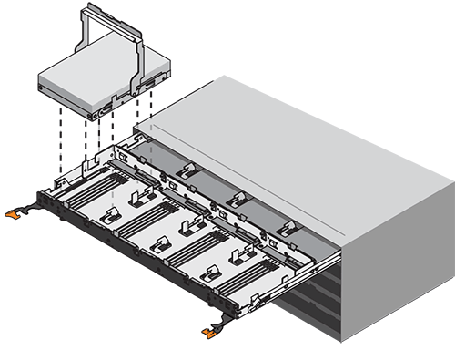
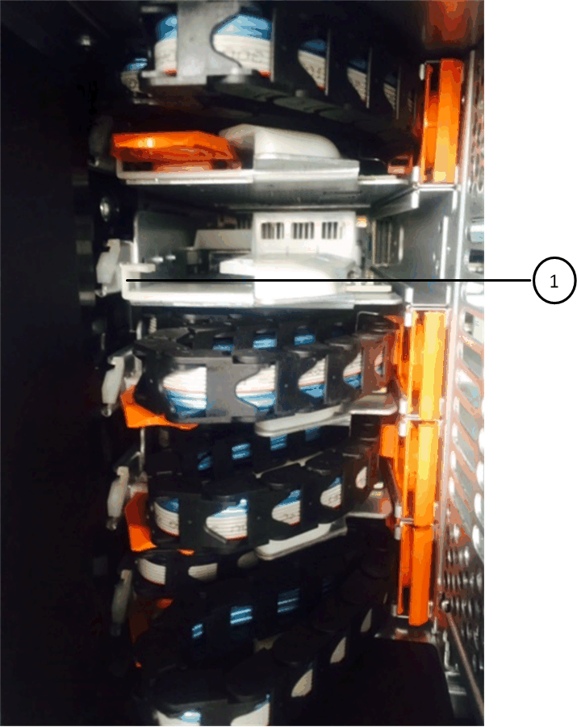

= Remplacer un tiroir de lecteur - DS460C
:allow-uri-read: 
:icons: font
:imagesdir: ../media/

[role="lead"]
Pour remplacer un tiroir de disque dur dans une étagère, vous pouvez arrêter l'ensemble du système de stockage (paire HA), ce qui vous permet de conserver les agrégats de données sur l'étagère. Vous pouvez également maintenir la paire HA opérationnelle, ce qui nécessite de déplacer toutes les données des agrégats de données sur les disques de l'étagère, puis de les mettre hors ligne et de les supprimer. Si l'étagère contient un agrégat racine, vous devez arrêter la paire HA.

Cette procédure s'applique aux étagères avec modules IOM12 ou IOM12B.

.Avant de commencer
Vous avez besoin de ces éléments pour cette procédure :

* Protection antistatique
+

NOTE: *Dommages matériels possibles:* pour éviter d'endommager les décharges électrostatiques sur le plateau du lecteur, utilisez une protection antistatique adéquate pour manipuler les composants du plateau du lecteur.

* Remplacement du tiroir disque
* Remplacement des câbles gauche et droit
* Lampe de poche

.Description de la tâche
* Cette procédure s'applique aux étagères équipées de tiroirs pour disques DCM et/ou DCM2 ou DCM3. (Les étagères peuvent également être équipées de deux modules IOM12 ou IOM12B.)
+
Lorsqu'un tiroir de lecteur DCM, DCM2 ou DCM3 tombe en panne, vous recevez un tiroir de lecteur DCM, DCM2 ou DCM3 pour le remplacer.

[NOTE]
====
Lorsque vous remplacez un tiroir de lecteur défectueux par un tiroir de lecteur DCM2 ou DCM3 plus récent, assurez-vous que le logiciel ONTAP et le micrologiciel du module IOM12 ou IOM12B exécutent les versions minimales requises pour prendre en charge les tiroirs DCM2 ou DCM3.

La mise à niveau du microprogramme IOM12 peut être effectuée avant ou après le remplacement d'un tiroir de disque. Cette procédure permet de mettre à niveau le micrologiciel dans le cadre de la procédure de préparation au remplacement du tiroir.

====
* Les tiroirs de disques DCM, DCM2 et DCM3 se distinguent par leur apparence :
+
Les tiroirs d'entraînement DCM se présentent comme suit :

+
image::../media/28_dwg_e2860_de460c_front_no_callouts.gif[Vue avant d'une étagère de lecteur DCM]

+
Les tiroirs d'entraînement DCM2 se distinguent par une bande bleue et une étiquette « DCM2 » :

+
image::../media/dcm2.png[Vue avant d'un tiroir disque DCM2]

+
Les tiroirs de lecteur DCM3 se distinguent par une bande bleue et grise et une étiquette « DCM3 » :

+

== Étape 1 : Préparez-vous à remplacer un tiroir de lecteur

Avant de remplacer un tiroir de disque, vous devez mettre à jour le micrologiciel IOM et ONTAP si nécessaire, puis arrêter la paire HA, ce qui vous permet de conserver les agrégats de données sur le tiroir, ou la maintenir opérationnelle, ce qui nécessite de déplacer toutes les données des agrégats de données résidant sur les disques. Vous devez ensuite mettre hors ligne et supprimer les agrégats de données. Cependant, si le tiroir contient un agrégat racine, vous devez arrêter la paire HA. Enfin, vous devez mettre le tiroir hors tension.

.Étapes
. Déterminez si vous remplacez le tiroir disque défectueux, le tiroir se combinant des modules IOM12 et des tiroirs disques DCM2.
. Déterminez si vous devez mettre à niveau le micrologiciel de votre IOM :
+
** Si le tiroir est doté d'une combinaison de modules IOM12 et d'un certain nombre de tiroirs de lecteur DCM2, vous devez mettre à niveau le micrologiciel IOM12 vers la version 0300 ou ultérieure ; sinon, passez à l'étape suivante.
** Si l'étagère doit comporter une combinaison de modules IOM12 et un nombre quelconque de tiroirs de lecteur DCM3, vous devez mettre à niveau le micrologiciel IOM12 vers la version 0401 ou ultérieure.
** Si l'étagère doit comporter une combinaison de modules IOM12B et un nombre quelconque de tiroirs de lecteur DCM3, vous devez mettre à niveau le micrologiciel IOM12B vers la version 0202 ou ultérieure.

+
Si nécessaire, vous pouvez vous rendre sur le site de support NetApp pour  https://mysupport.netapp.com/site/downloads/firmware/disk-shelf-firmware["télécharger les versions actuelles du micrologiciel du plateau de disque"] Sinon , passez à l’étape suivante.

. Si votre étagère comporte une combinaison de modules IOM12 ou IOM12B avec un nombre quelconque de tiroirs de lecteur DCM3, votre système doit exécuter les versions minimales suivantes d' ONTAP:
+
** ONTAP 9.17.1RC1
** ONTAP 9.16.1P3
** ONTAP 9.15.1P11
** ONTAP 9.14.1P13
** ONTAP 9.13.1P16
** ONTAP 9.12.1P18

. Si le tiroir contient l'agrégat racine d'un des contrôleurs de la paire HA, ou si vous choisissez d'arrêter la paire HA (au lieu de maintenir la paire HA en service), procédez comme suit ; dans le cas contraire, passez à l'étape suivante.
+

NOTE: Les agrégats de données peuvent rester dans le tiroir lors de l'arrêt de la paire haute disponibilité.

+
.. Arrêtez les deux contrôleurs de la paire haute disponibilité.
.. Vérifiez que votre paire haute disponibilité est stoppée en vérifiant la console du système de stockage.
.. Mettre le shelf hors tension.
.. Accédez à la section, <<remove_cable_chains,Déposer les chaînes de câbles>> .

. Si vous choisissez de maintenir le fonctionnement de la paire HA, procédez comme suit :
+

NOTE: Pour remplacer un tiroir par des agrégats du tiroir disque, le système risque de perturbation après plusieurs disques.

+
.. Déplacez toutes les données des agrégats de données situés sur tous les lecteurs de disque de l'étagère.
+
Les données incluent, sans s'y limiter, les volumes et les LUN.

.. Déprocédez et supprimez les agrégats pour que les disques puissent devenir des disques de secours :
+
Il est possible de saisir des commandes depuis le clustershell de n'importe quel contrôleur.

+
`storage aggregate offline -aggregate _aggregate_name_`

+
`storage aggregate delete -aggregate _aggregate_name_`

.. Vérifier que les disques ne disposent d'aucun agrégat (sont des disques de secours) :
+
... Entrez la commande suivante depuis le clustershell de l'un ou l'autre contrôleur : `storage disk show -shelf _shelf_number_`
... Vérifiez la sortie pour vérifier que les disques durs sont des disques de rechange.
+
Les disques de secours affichent `spare` dans le `Container Type` colonne.

+

NOTE: Si des disques défectueux dans le tiroir, `broken` s'affiche dans le `Container Type` colonne.

.. Mettre le shelf hors tension.

== Étape 2 : Retirez les chaînes porte-câbles

Les chaînes de câbles gauche et droite de chaque tiroir d'entraînement du DS460C permettent aux tiroirs de glisser vers l'intérieur et l'extérieur. Avant de pouvoir retirer un tiroir disque, vous devez retirer les deux chaînes de câble.

.Description de la tâche
Chaque tiroir disque comporte des câbles en forme de chaîne gauche et droite. Les extrémités métalliques des chaînes de câbles coulissent dans les supports verticaux et horizontaux correspondants à l'intérieur du boîtier, comme suit :

* Les supports verticaux gauche et droit relient la chaîne de câbles au fond de panier central du boîtier.
* Les supports horizontaux gauche et droit relient la chaîne de câbles au tiroir individuel.

.Avant de commencer
* Vous avez terminé le <<prepare_to_replace_drive_drawer,Préparez-vous à remplacer un tiroir>> étapes pour que votre paire HA soit arrêtée ou que vous ayez déplacé toutes les données des agrégats de données résidant sur les lecteurs de disque, et mis hors ligne et supprimé les agrégats de données pour permettre aux lecteurs de disque de devenir des disques de secours.
* Vous avez éteint les tablettes.
* Vous avez obtenu les éléments suivants :
+
** Protection antistatique
+

NOTE: *Dommages matériels possibles:* pour éviter d'endommager les décharges électrostatiques sur la tablette, utilisez une protection antistatique appropriée lors de la manipulation des composants de la tablette.

** Lampe de poche

.Étapes
. Mettre en place une protection antistatique.
. Depuis l'arrière du shelf disque, retirez le module de ventilateur droit, comme suit :
+
.. Appuyez sur la languette orange pour libérer la poignée du module de ventilation.
+
La figure montre la poignée du module de ventilation déployée et libérée de la languette orange à gauche.

+
image::../media/28_dwg_e2860_de460c_fan_canister_handle_with_callout.gif[Poignée du module de ventilateur étendu]

+
[cols="10,90"]
|===

 a| 
image:../media/icon_round_1.png["Légende numéro 1"]
| Poignée du module de ventilateur 
|===
.. A l'aide de la poignée, tirez le module de ventilateur hors de l'étagère du lecteur et mettez-le de côté.

. Déterminer manuellement les cinq chaînes à débrancher.
+
La figure représente le côté droit du tiroir disque, le module de ventilateur étant retiré. Une fois le module de ventilation retiré, vous pouvez voir les cinq chaînes de câbles et les connecteurs verticaux et horizontaux de chaque tiroir. Les légendes du tiroir de disque 1 sont fournies.

+
image::../media/2860_dwg_full_back_view_chain_connectors.gif[Vue des cinq chaînes de câbles et des connecteurs verticaux et horizontaux de chaque tiroir]

+
[cols="10,90"]
|===

 a| 
image:../media/icon_round_1.png["Légende numéro 1"]
| Chaîne de câble 

 a| 
image:../media/icon_round_2.png["Légende numéro 2"]
 a| 
Connecteur vertical (connecté au fond de panier central)

 a| 
image:../media/icon_round_3.png["Numéro de légende 3"]
 a| 
Connecteur horizontal (connecté au tiroir d'entraînement)

|===
+
La chaîne de câbles supérieure est fixée au tiroir d'entraînement 1. La chaîne de câbles inférieure est fixée au tiroir d'entraînement 5.

. A l'aide de votre doigt, déplacez la chaîne de câbles du côté droit vers la gauche.
. Procédez comme suit pour déconnecter l'une des chaînes de câble droite de son support vertical correspondant.
+
.. À l'aide d'une lampe de poche, repérez l'anneau orange à l'extrémité de la chaîne de câbles qui est connectée au support vertical dans le boîtier.
+
image::../media/2860_dwg_vertical_ring_for_chain.gif[Anneau orange à l'extrémité de la chaîne de câbles]

+
[cols="10,90"]
|===

 a| 
image:../media/icon_round_1.png["Légende numéro 1"]
| Bague orange sur le support vertical 
|===
.. Débranchez le connecteur vertical (connecté au fond de panier central) en appuyant doucement sur le centre de l'anneau orange et en tirant le côté gauche du câble hors du boîtier.
.. Pour débrancher la chaîne de câbles, tirez avec précaution votre doigt vers vous d'environ 2.5 cm (1 po), mais laissez le connecteur de la chaîne de câbles dans le support vertical.

. Procédez comme suit pour déconnecter l'autre extrémité de la chaîne de câbles :
+
.. À l'aide d'une lampe de poche, repérez l'anneau orange à l'extrémité de la chaîne de câbles fixée au support horizontal du boîtier.
+
La figure montre le connecteur horizontal sur la droite et la chaîne de câbles déconnectée et partiellement tirée sur le côté gauche.

+
image::../media/2860_dwg_horiz_ring_for_chain.gif[Chaîne de câbles et anneau orange]

+
[cols="10,90"]
|===

 a| 
image:../media/icon_round_1.png["Légende numéro 1"]
| Bague orange sur le support horizontal 

 a| 
image:../media/icon_round_2.png["Légende numéro 2"]
 a| 
Chaîne de câble

|===
.. Insérez délicatement votre doigt dans l'anneau orange.
+
La figure montre que l'anneau orange du support horizontal est poussé vers le bas de manière à ce que le reste de la chaîne de câbles puisse être tiré hors du boîtier.

.. Tirez votre doigt vers vous pour débrancher la chaîne de câbles.

. Tirez avec précaution sur toute la chaîne de câbles pour la sortir du shelf d'entraînement.
. Depuis l'arrière du shelf de disque, retirez le module de ventilateur gauche.
. Procédez comme suit pour déconnecter la chaîne de câbles gauche de son support vertical :
+
.. A l'aide d'une lampe de poche, repérez l'anneau orange à l'extrémité de la chaîne de câbles fixée au support vertical.
.. Insérez votre doigt dans l'anneau orange.
.. Pour débrancher la chaîne de câbles, tirez votre doigt vers vous d'environ 2.5 cm (1 po), mais laissez le connecteur de la chaîne de câbles dans le support vertical.

. Déconnectez la chaîne de câbles gauche du support horizontal et tirez la chaîne de câbles entière hors de la tablette d'entraînement.

== Étape 3 : Retirer un tiroir de lecteur

Après avoir retiré les chaînes de câbles droite et gauche, vous pouvez retirer le tiroir disque du tiroir. Le retrait d'un tiroir de lecteur implique le déplacement de la partie tiroir vers l'extérieur, le retrait des lecteurs et le retrait du tiroir.

.Avant de commencer
* Vous avez retiré les chaînes de câbles droite et gauche du tiroir d'entraînement.
* Vous avez remplacé les modules de ventilation droit et gauche.

.Étapes
. Retirez le panneau de l'avant du tiroir disque.
. Déverrouillez le tiroir d'entraînement en tirant sur les deux leviers.
. A l'aide des leviers étendus, tirez doucement le tiroir d'entraînement vers l'extérieur jusqu'à ce qu'il s'arrête. Ne retirez pas complètement le tiroir disque.
. Retirez les lecteurs du tiroir :
+
.. Tirez doucement le loquet de déverrouillage orange qui est visible sur le centre avant de chaque lecteur. L'image suivante montre le loquet de déblocage orange pour chacun des disques.
+
image::../media/28_dwg_e2860_drive_latches_top_view.gif[Loquets de dégagement du lecteur]

.. Relever la poignée d'entraînement à la verticale.
.. Utilisez la poignée pour soulever le lecteur du tiroir.
+

.. Placez le lecteur sur une surface plane et exempte d'électricité statique et à l'écart des dispositifs magnétiques.
+

NOTE: *Perte possible d'accès aux données:* les champs magnétiques peuvent détruire toutes les données sur le lecteur et causer des dommages irréparables au circuit de l'entraînement. Pour éviter tout accès aux données et tout endommagement des disques, éloignez toujours les disques des dispositifs magnétiques.

. Procédez comme suit pour retirer le tiroir disque :
+
.. Repérez le levier de déverrouillage en plastique de chaque côté du tiroir d'entraînement.
+
image::../media/92_pht_de6600_drive_drawer_release_lever.gif[Levier de déverrouillage du tiroir]

+
[cols="10,90"]
|===

 a| 
image:../media/icon_round_1.png["Légende numéro 1"]
| Levier de déverrouillage du tiroir d'entraînement 
|===
.. Ouvrez les deux leviers de déverrouillage en tirant les loquets vers vous.
.. Tout en maintenant les deux leviers de déverrouillage, tirez le tiroir d'entraînement vers vous.
.. Retirez le tiroir disque du tiroir.

== Étape 4 : Installer un tiroir de lecteur

L'installation d'un tiroir disque dans un tiroir disque consiste à faire glisser le tiroir dans le slot vide, à installer les disques et à remettre en place le cadre avant.

.Avant de commencer
* Vous avez obtenu les éléments suivants :
+
** Remplacement du tiroir disque
** Lampe de poche

.Étapes
. De l'avant de la tablette d'entraînement, faites briller une lampe de poche dans la fente de tiroir vide, puis repérez la clé à molette de verrouillage pour cet emplacement.
+
L'ensemble à bascule de verrouillage est une fonction de sécurité qui vous empêche d'ouvrir plusieurs tiroirs d'entraînement à la fois.

+
image::../media/92_pht_de6600_lock_out_tumbler_detail.gif[Emplacement du gobelet de verrouillage et du guide de tiroir]

+
[cols="10,90"]
|===

 a| 
image:../media/icon_round_1.png["Légende numéro 1"]
| Bascule de verrouillage 

 a| 
image:../media/icon_round_2.png["Légende numéro 2"]
 a| 
Guide de tiroir

|===
. Placez le tiroir d'entraînement de remplacement devant la fente vide et légèrement à droite du centre.
+
Le positionnement du tiroir légèrement à droite du centre permet de s'assurer que le verre à bascule et le guide du tiroir sont correctement engagés.

. Faites glisser le tiroir d'entraînement dans la fente et assurez-vous que le guide de tiroir coulisse sous le verre à bascule.
+

NOTE: *Risque de détérioration de l'équipement:* des dommages se produisent si le guide du tiroir ne glisse pas sous le gobelet de verrouillage.

. Poussez avec précaution le tiroir d'entraînement jusqu'à ce que le loquet s'engage complètement.
+

NOTE: *Risque de détérioration de l'équipement:* cessez de pousser le tiroir d'entraînement si vous sentez une résistance ou un grippage excessifs. Utilisez les leviers de déverrouillage à l'avant du tiroir pour le faire glisser vers l'arrière. Réinsérez ensuite le tiroir dans la fente et assurez-vous qu'il coulisse librement.

. Procédez comme suit pour réinstaller les disques dans le tiroir :
+
.. Déverrouillez le tiroir d'entraînement en tirant sur les deux leviers situés à l'avant du tiroir.
.. A l'aide des leviers étendus, tirez doucement le tiroir d'entraînement vers l'extérieur jusqu'à ce qu'il s'arrête. Ne retirez pas complètement le tiroir disque.
.. Sur le lecteur que vous installez, relevez la poignée à la verticale.
.. Alignez les deux boutons en relief de chaque côté du lecteur avec les encoches du tiroir.
+
La figure montre la vue du côté droit d'un lecteur, indiquant l'emplacement des boutons relevés.

+
image::../media/28_dwg_e2860_de460c_drive_cru.gif[Emplacement des boutons relevés sur l'entraînement]

+
[cols="10,90"]
|===

 a| 
image:../media/icon_round_1.png["Légende numéro 1"]
| Bouton relevé sur le côté droit de l'entraînement. 
|===
.. Abaissez le lecteur tout droit, puis tournez la poignée du lecteur vers le bas jusqu'à ce qu'il s'enclenche.
+
Si vous disposez d'un tiroir partiellement rempli, ce qui signifie que le tiroir dans lequel vous réinstallez les disques est inférieur à celui qu'il prend en charge, installez les quatre premiers disques dans les emplacements avant (0, 3, 6 et 12 9).

+

NOTE: *Risque de dysfonctionnement de l'équipement:* pour permettre un débit d'air correct et empêcher la surchauffe, toujours installer les quatre premiers disques dans les fentes avant (0, 3, 6 et 9).

+

.. Répétez ces sous-étapes pour réinstaller tous les lecteurs.

. Faites glisser le tiroir dans la tablette en le poussant du centre et en fermant les deux leviers.
+

NOTE: *Risque de dysfonctionnement de l'équipement:* Assurez-vous de fermer complètement le tiroir d'entraînement en poussant les deux leviers. Vous devez fermer complètement le tiroir d'entraînement pour permettre un débit d'air correct et éviter toute surchauffe.

. Fixez le panneau à l'avant du tiroir disque.

== Étape 5 : Fixez les chaînes porte-câbles

La dernière étape de la pose d'un tiroir de transmission consiste à fixer les chaînes de câbles gauche et droite de rechange à la tablette de transmission. Lors de la fixation d'une chaîne de câbles, inverser l'ordre utilisé lors du débranchement de la chaîne de câbles. Vous devez insérer le connecteur horizontal de la chaîne dans le support horizontal du boîtier avant d'insérer le connecteur vertical de la chaîne dans le support vertical du boîtier.

.Avant de commencer
* Vous avez remplacé le tiroir disque et tous les lecteurs.
* Vous avez deux chaînes de câble de rechange, marquées COMME GAUCHE et DROITE (sur le connecteur horizontal à côté du tiroir d'entraînement).

image::../media/28_dwg_e2860_de460c_cable_chain_left.gif[Chaîne de câble de remplacement gauche]

[cols="4*"]
|===
| Légende | Chaîne de câble | Connecteur | Se connecte à 

 a| 
image:../media/icon_round_1.png["Légende numéro 1"]
| À gauche  a| 
Verticale
 a| 
Fond de panier central

 a| 
image:../media/icon_round_2.png["Légende numéro 2"]
 a| 
À gauche
 a| 
Horizontale
 a| 
Tiroir d'entraînement

|===
image:../media/28_dwg_e2860_de460c_cable_chain_right.gif["Chaîne de câble de rechange droite"]

[cols="4*"]
|===
| Légende | Chaîne de câble | Connecteur | Se connecte à 

 a| 
image:../media/icon_round_1.png["Légende numéro 1"]
| C'est ça  a| 
Horizontale
 a| 
Tiroir d'entraînement

 a| 
image:../media/icon_round_2.png["Légende numéro 2"]
 a| 
C'est ça
 a| 
Verticale
 a| 
Fond de panier central

|===
.Étapes
. Procédez comme suit pour fixer la chaîne de câbles gauche :
+
.. Localisez les connecteurs horizontaux et verticaux sur la chaîne de câble gauche et les supports horizontaux et verticaux correspondants à l'intérieur du boîtier.
.. Aligner les deux connecteurs de la chaîne de câbles avec les supports correspondants.
.. Faites glisser le connecteur horizontal de la chaîne de câbles sous le rail de guidage sur le support horizontal et poussez-le aussi loin que possible.
+
La figure montre le rail de guidage sur le côté gauche du second tiroir de disque dans le boîtier.

+

+
[cols="10,90"]
|===

 a| 
image:../media/icon_round_1.png["Légende numéro 1"]
| Rail de guidage 
|===
+
[NOTE]
====
*Risque de dysfonctionnement de l'équipement:* Assurez-vous de faire glisser le connecteur sous le rail de guidage sur le support. Si le connecteur repose sur la partie supérieure du rail de guidage, des problèmes peuvent survenir lorsque le système fonctionne.

====
.. Faites glisser le connecteur vertical de la chaîne de câbles gauche dans le support vertical.
.. Après avoir rebranché les deux extrémités de la chaîne de câbles, tirez avec précaution sur la chaîne de câbles pour vérifier que les deux connecteurs sont verrouillés.
+
[NOTE]
====
*Risque de dysfonctionnement de l'équipement :* si les connecteurs ne sont pas verrouillés, la chaîne de câbles risque de se desserrer pendant le fonctionnement du tiroir.

====

. Réinstallez le module de ventilateur gauche.
. Procédez comme suit pour remettre en place la chaîne de câbles droite :
+
.. Localisez les connecteurs horizontaux et verticaux sur la chaîne de câbles et leurs supports verticaux et horizontaux correspondants à l'intérieur du boîtier.
.. Aligner les deux connecteurs de la chaîne de câbles avec les supports correspondants.
.. Faites glisser le connecteur horizontal de la chaîne de câbles sous le rail de guidage sur le support horizontal et poussez-le aussi loin que possible.
+
[NOTE]
====
*Risque de dysfonctionnement de l'équipement:* Assurez-vous de faire glisser le connecteur sous le rail de guidage sur le support. Si le connecteur repose sur la partie supérieure du rail de guidage, des problèmes peuvent survenir lorsque le système fonctionne.

====
.. Faites glisser le connecteur vertical de la chaîne de câbles droite dans le support vertical.
.. Après avoir rebranché les deux extrémités de la chaîne de câbles, tirez avec précaution sur la chaîne de câbles pour vérifier que les deux connecteurs sont verrouillés.
+
[NOTE]
====
*Risque de dysfonctionnement de l'équipement :* si les connecteurs ne sont pas verrouillés, la chaîne de câbles risque de se desserrer pendant le fonctionnement du tiroir.

====

. Réinstallez le module de ventilateur droit.
. Réappliquer l'alimentation :
+
.. Allumer les deux boutons marche/arrêt sur le tiroir disque.
.. Vérifiez que les deux ventilateurs s'allument et que le voyant orange à l'arrière des ventilateurs est éteint.

. Si vous aviez arrêté la paire haute disponibilité, démarrez ONTAP sur les deux contrôleurs ; sinon, passez à l'étape suivante.
. Si vous avez déplacé des données de l'étagère et supprimé les agrégats de données, vous pouvez désormais utiliser les disques de réserve de l'étagère pour créer ou étendre des agrégats. Pour en savoir plus sur ces procédures, consultez la section  https://docs.netapp.com/us-en/ontap/disks-aggregates/aggregate-creation-workflow-concept.html["Flux de production de création d'agrégats"] et  https://docs.netapp.com/us-en/ontap/disks-aggregates/aggregate-expansion-workflow-concept.html["Flux de travail d'extension d'agrégats"] .

